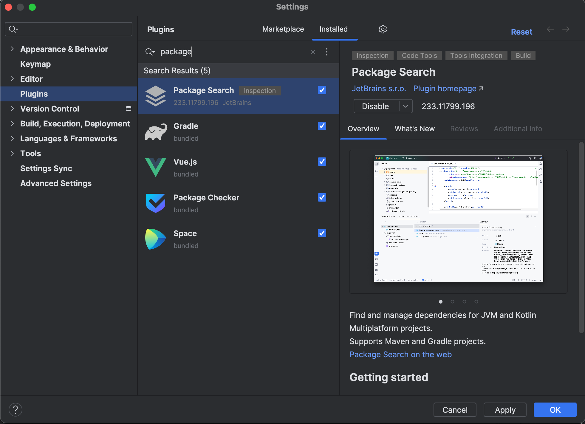

In this tutorial, we're going to take a look at managing dependencies. We'll look at different ways to add dependencies to your project, and how to add, upgrade and remove dependencies using Package Search.

**Note:** For this tutorial, make sure the [Package Search](https://plugins.jetbrains.com/plugin/12507-package-search) plugin is installed. To do so, open Preferences
<kbd>⌘,</kbd> (macOS) / <kbd>Ctrl+Alt+S</kbd> (Windows/Linux), go to **Plugins** and check to see whether the Package Search plugin is installed. If not, go to the _Marketplace_ tab to install it.

