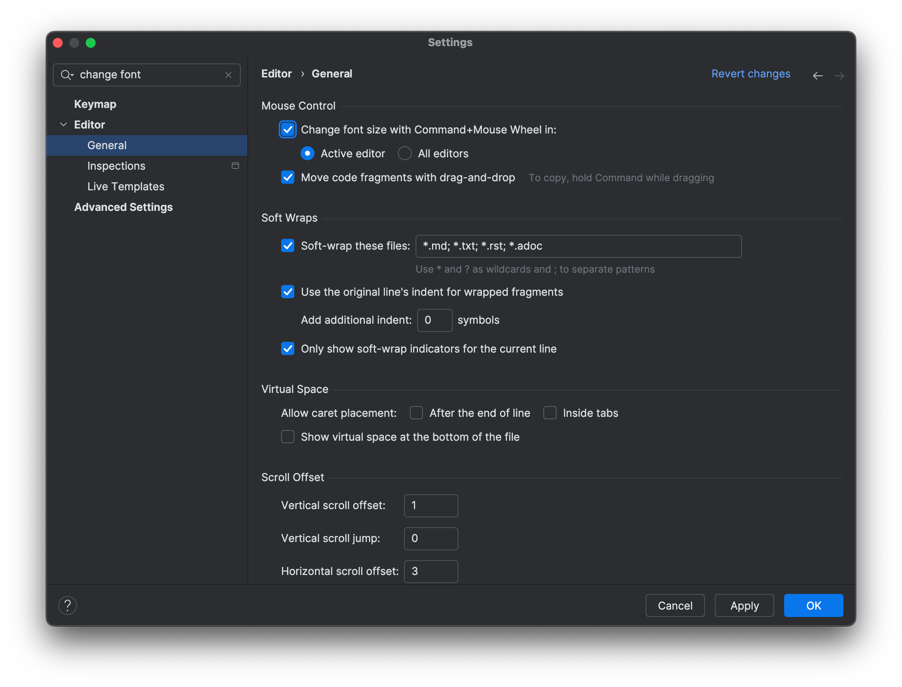

To enable mouse zoom, you need to turn it on explicitly. Go to your Preferences with <kbd>⌘,</kbd> (macOS) / <kbd>Ctrl+Alt+S</kbd> (Windows/Linux) and select **Editor | General** and select **Change font size with Command+Mouse Wheel** (on Mac) or **Change font size with Control+Mouse** (on Windows/Linux). Click **OK** to apply the changes and close the dialog.

Now we can use <kbd>⌘</kbd> (macOS) / <kbd>Ctrl</kbd> (Windows/Linux) with the mouse wheel to zoom in or out. While we are using mouse zoom, a popup appears containing in the middle-bottom screen with the current font size on the left and a link to reset to the original font size on the right. Click the link to reset the font size.

