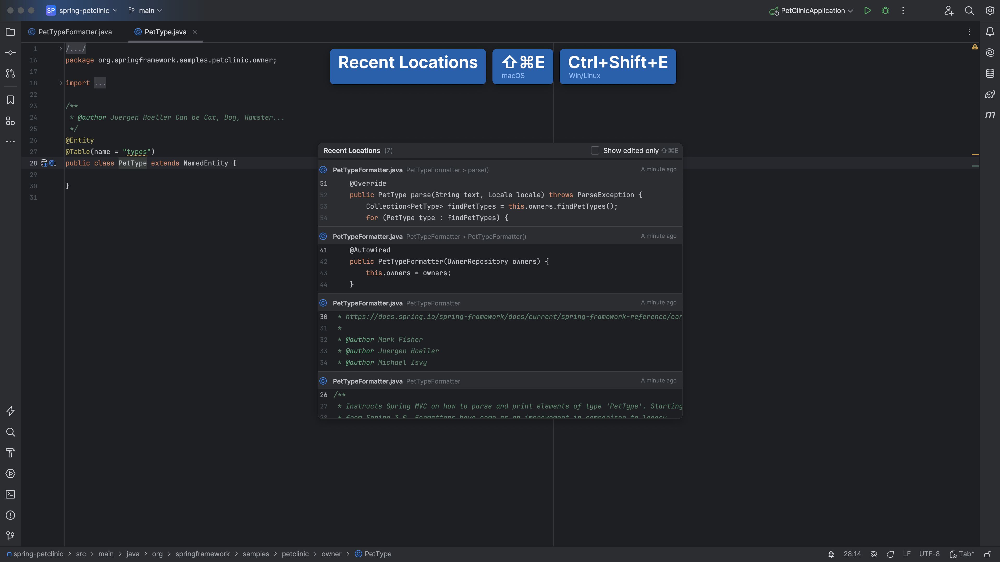
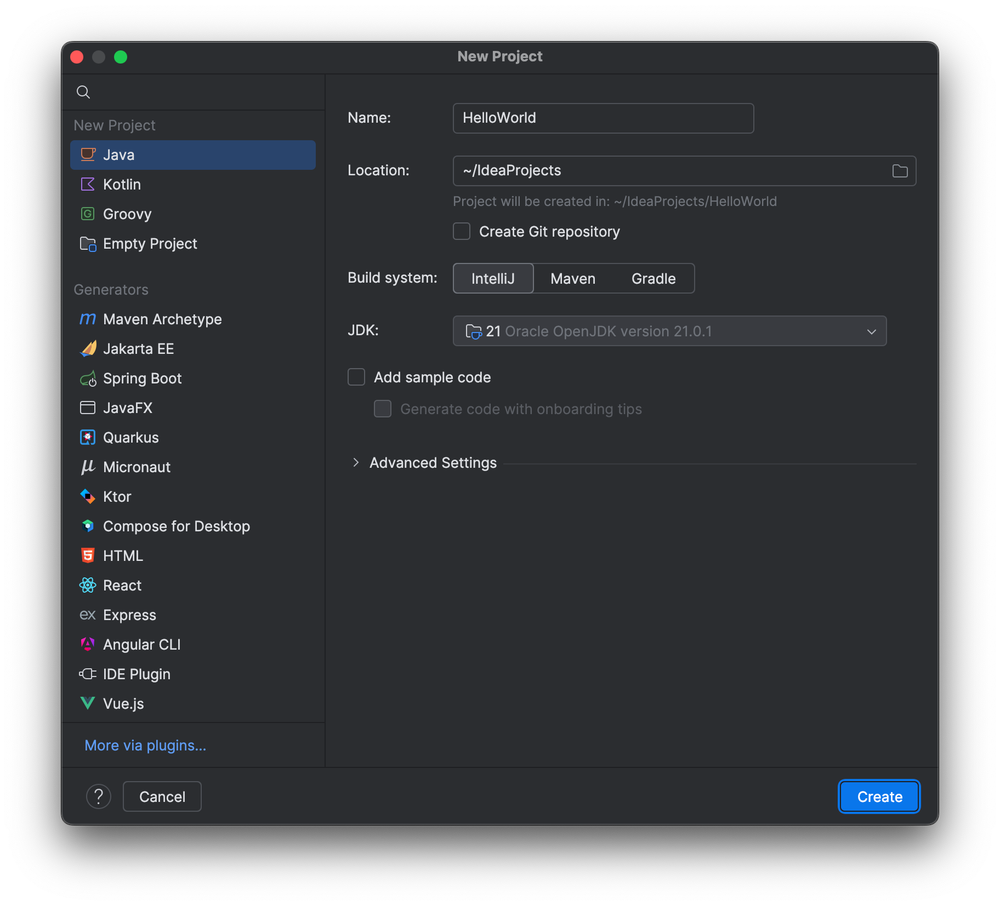

We can use several shortcuts to navigate around a project:

We can **Find a class** using <kbd>⌘O</kbd> (macOS) / <kbd>Ctrl+N</kbd> (Windows/Linux).

We can move the caret to a method and use <kbd>⌘B</kbd> (macOS) / <kbd>Ctrl+B</kbd> (Windows/Linux) to go to the declaration or usages.

We can also navigate backwards by using <kbd>⌘\[</kbd> (macOS) / <kbd>Ctrl+Alt+Left Arrow</kbd> (Windows/Linux), or navigate forward: <kbd>⌘\]</kbd> (macOS) / <kbd>Ctrl+Alt+Right Arrow</kbd> (Windows/Linux).

Use <kbd>⌘⇧E</kbd> (macOS) / <kbd>Ctrl+Shift+E</kbd> (Windows/Linux) to find **Recent Locations**.

Or find **Last edited location** with <kbd>⇧⌘⌫</kbd> (macOS) / <kbd>Ctrl+Shift+Backspace</kbd> (Windows/Linux).

Finally, we can find <kbd>⌘E</kbd> (macOS) / <kbd>Ctrl+E</kbd> (Windows/Linux).

