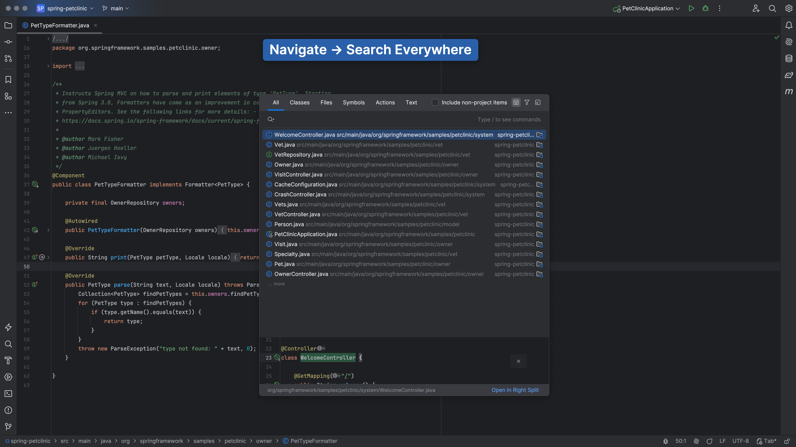
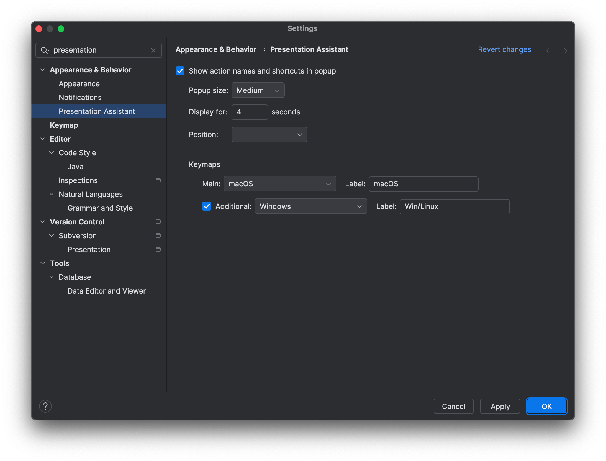

Our first tip is to use the Presentation Assistant plugin. The Presentation Assistant plugin will show which shortcuts are being used. You can configure this plugin in several ways, as we will show you in the section below.

This plugin is bundled with IntelliJ IDEA, as of version 2023.3. If you are still using an older version, you'll need to install the plugin yourself.

To install the plugin, open **Preferences** using <kbd>⌘,</kbd> (macOS) / <kbd>Ctrl+Alt+S</kbd> (Windows/Linux). Go to Plugins and search for "Presentation assistant" on the Marketplace tab. Click **Install** and when it's done, click **OK** to apply the changes and close the dialog or click **Apply** to keep the dialog open.

## Configuring the Presentation Assistant plugin

To configure the Presentation Assistant plugin, go back to **Preferences** and go to **Appearance & Behavior > Presentation Assistant**.

Here we can configure font size, duration, alignment, and which keymaps to show. We are using macOS, with Windows as the alternative keymap. We have also configured the Presentation Assistant plugin to show the shortcuts at the top of the screen. This is what we recommend if you are recording videos that will have subtitles at the bottom, so the subtitles and shortcuts won't overlap.
