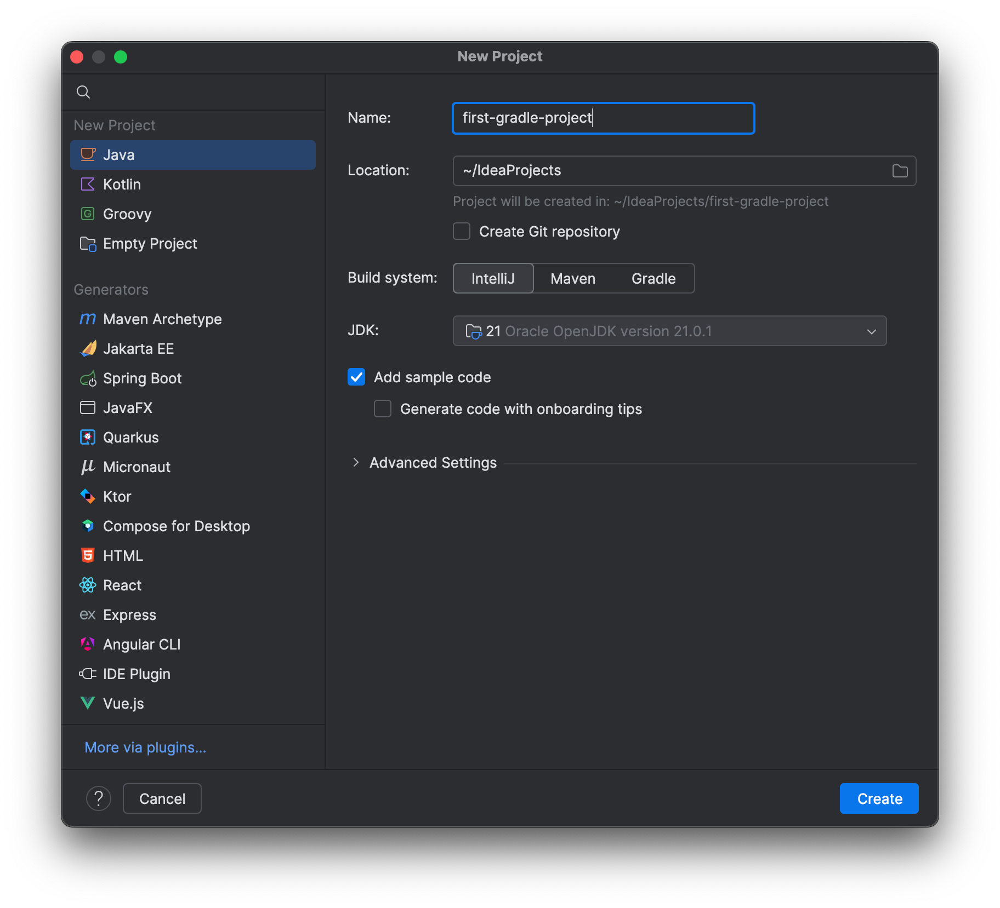
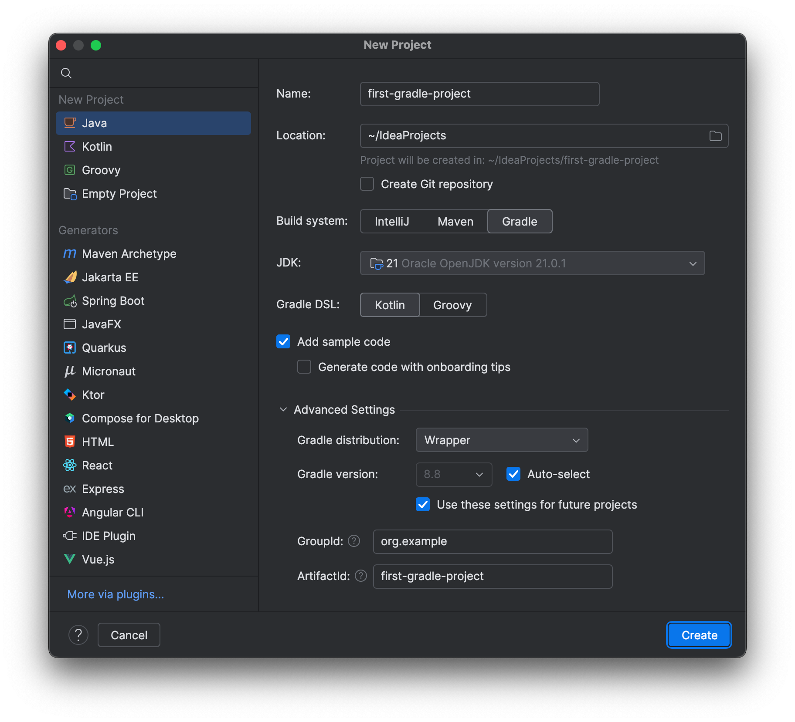

First, let's look at creating a new Gradle project. We can choose ["New Project" from the Welcome Screen](https://www.jetbrains.com/help/idea/new-project-wizard.html), or choose **New Project** from the File menu if we already have an IntelliJ IDEA project open, either will bring up the New Project window.

Here we enter the name of the project, and we can change the location if we need to. Let's call it "first-gradle-project". If we want to keep things as simple as possible, we can just press **Create** here.

From here, we want to keep the default selection of **Java** on the left-hand side and select **Gradle** as the Build system on the right. The project will need a JDK to run Gradle builds, the JDK dropdown shows all the JDKs that have been configured in IntelliJ IDEA, but also all the JDKs detected on this computer. We can also download a new JDK from any of a number of different vendors if we need to. For this video, I'm going to select JDK 21 as this is the current Long Term Support release.

We can optionally choose to add some sample code either as a [Kotlin DSL](https://docs.gradle.org/current/userguide/kotlin_dsl.html) build file or [Groovy](https://groovy-lang.org/) for this tutorial. Ensure **Add sample code** is selected and choose Kotlin for your Gradle DSL.

The Advanced Settings will be configured for you based on the name you give your project such as "first-gradle-project" so you don't need to change any of these.

These settings will create us a basic Java project with a Kotlin `build.gradle.kts` file, so let's move on to the next step.

IntelliJ IDEA creates the basic project structure, with a minimal `build.gradle.kts` file, and you'll see Gradle is building the project. Once this finishes, the project window will show the structure of the project, with the standard Gradle directory structure.

We'll look at the project in more detail in the next section.
