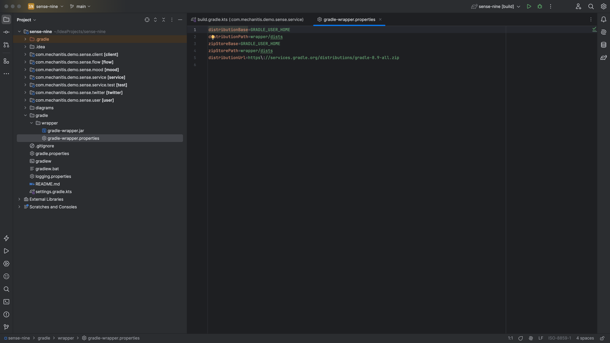
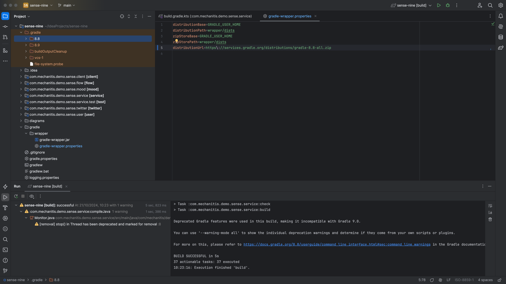

In this last step, we'll look at how to configure the [Gradle Wrapper](https://docs.gradle.org/current/userguide/gradle_wrapper.html).

We saw how to tell IntelliJ IDEA where to get the [settings of the Gradle Wrapper](https://www.jetbrains.com/help/idea/gradle-settings.html) from. Projects generated using IntelliJ IDEA's [Gradle wizard](https://www.jetbrains.com/help/idea/gradle.html#project_create_gradle) will usually have a `gradle-wrapper.properties` file which contains the details of the version of Gradle to use for this project. Ideally we want this to use the [latest version of Gradle](https://gradle.org/releases/), where possible, so that we get the most up-to-date support and features. The current version of Gradle at the time of writing is [8.9](https://docs.gradle.org/8.9/release-notes.html).

If you update the `gradle-wrapper.properties` file to have a different version number, IntelliJ IDEA will detect the changes and asks us to reload these changes. The IDE will download this new version of Gradle, and then you can rebuild the project using it.

The ".gradle" folder in your project has folders for all the versions of Gradle that you've used. We can safely delete the versions we're not using any more if we want to reclaim some space.

In our last step we'll summarise some of the shortcuts used and other tips.
