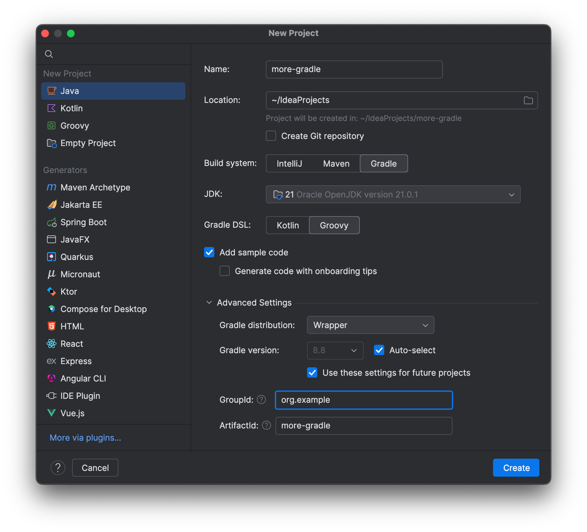

Now we've covered the basics of a new Gradle project, let's go back and look at how you can configure the [groupID and version](https://maven.apache.org/guides/mini/guide-naming-conventions.html) of a new project.

Let's follow the same steps we took earlier, creating a new Gradle project with Java and the Kotlin DSL.

After we've entered the project name, e.g. "more-gradle", we can click on "artifact coordinates" to configure more settings for the project. By default, your ArtifactId will be the same as your project name.



We can optionally enter a new GroupId, which is usually the company domain. If we try to change the ArtifactId, IntelliJ IDEA warns us that this should be the same as the project name

When we create the project, we can see the groupID and version number are set in the `build.gradle.kts` file.

```kotlin
group 'com.jetbrains'
version '1.0-SNAPSHOT'
```

Next, we'll look at how to open an existing Gradle project, and how IntelliJ IDEA helps us here.
