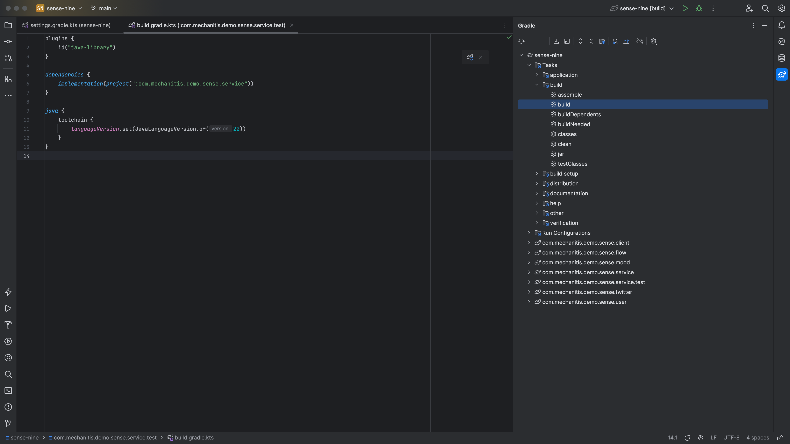
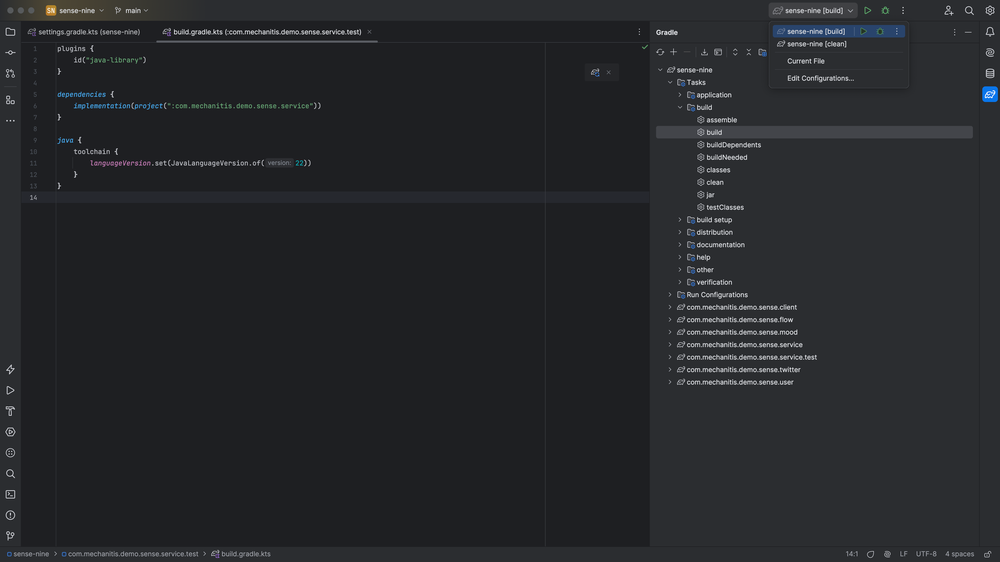
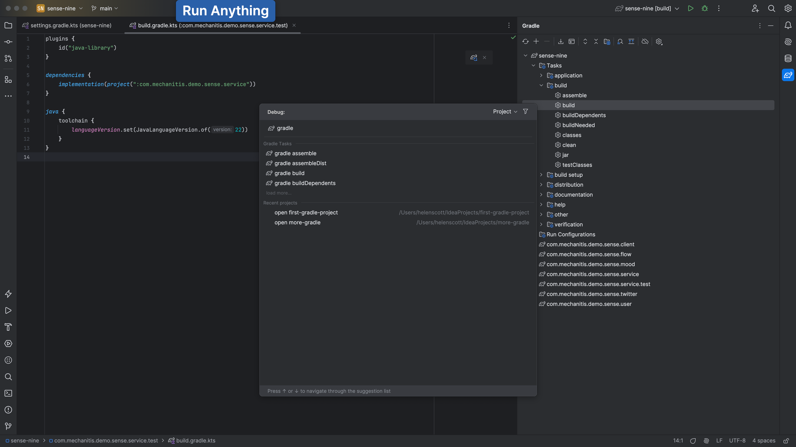

We saw earlier that we can navigate to a specific [Gradle task](https://docs.gradle.org/current/userguide/more_about_tasks.html) in a specific Gradle project in the [Gradle Tool Window](https://www.jetbrains.com/help/idea/jetgradle-tool-window.html), and we can double-click that task to get IntelliJ IDEA to run it.

We can also click on the elephant at the top of the Gradle tool window to run any Gradle task.

We can also use Run Anything with <kbd>⌃⌃</kbd> (macOS) / <kbd>Ctrl+Ctrl</kbd> (Windows/Linux) and search for _gradle_.

This can be a good way to run multiple gradle tasks, like you would from the command line. For example, running `gradle clean build` to make sure everything is working as expected before committing changes.

We can, of course, run Gradle commands from the terminal window inside IntelliJ IDEA. Open this with <kbd>⌥F12</kbd> (macOS) / <kbd>Alt+F12</kbd> (Windows/Linux).

Next, let's look at some tips for working with Gradle in IntelliJ IDEA.
