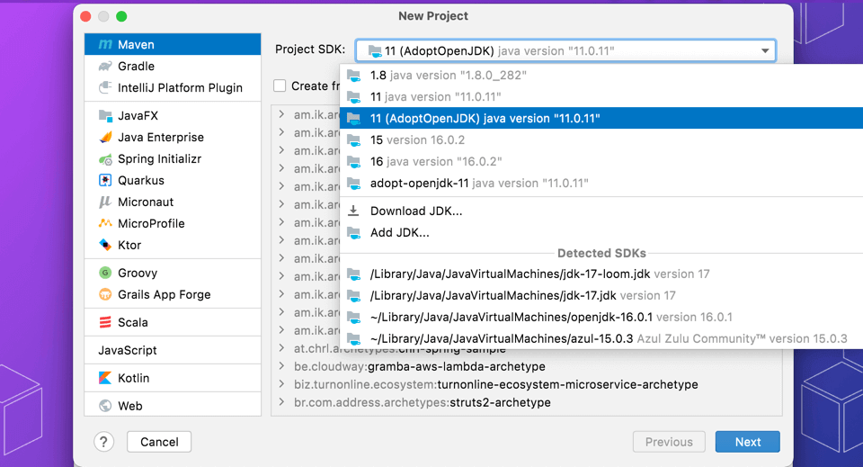

Let's create a brand-new Maven project. From the Welcome Screen select New Project, or if you already have an IntelliJ IDEA project open, select File -> New -> Project...

Choose a name for your project such as "mavenexample" and then keeping the default of Java on the left, select **Maven** as the Build system on the right. We also need to choose a JDK for our project.

We can optionally choose a maven archetype to use to create the project. If you're creating a simple project, you don't need to select an archetype.

If you click on **Artifact Coordinates** you'll see more Maven settings. You can declare a group id, and the artifact id of the application itself.

Press **Create**, and IntelliJ IDEA will generate the basic `pom.xml` file as well as the default directory structure for a Maven project with the source and test folders defined.

You can use <kbd>⌘E</kbd> (macOS) / <kbd>Ctrl+E</kbd> (Windows/Linux) and then type i<kbd>⌘E</kbd> (macOS) / <kbd>Ctrl+E</kbd> (Windows/Linux)n _Maven_ to open the Maven Projects window, where you can see the standard Maven lifecycle phases, as well as the goals defined by various Maven plugins.
