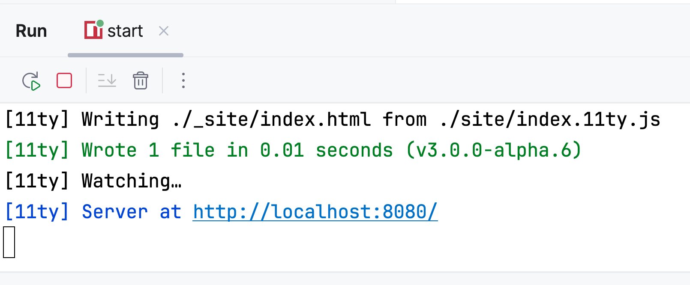
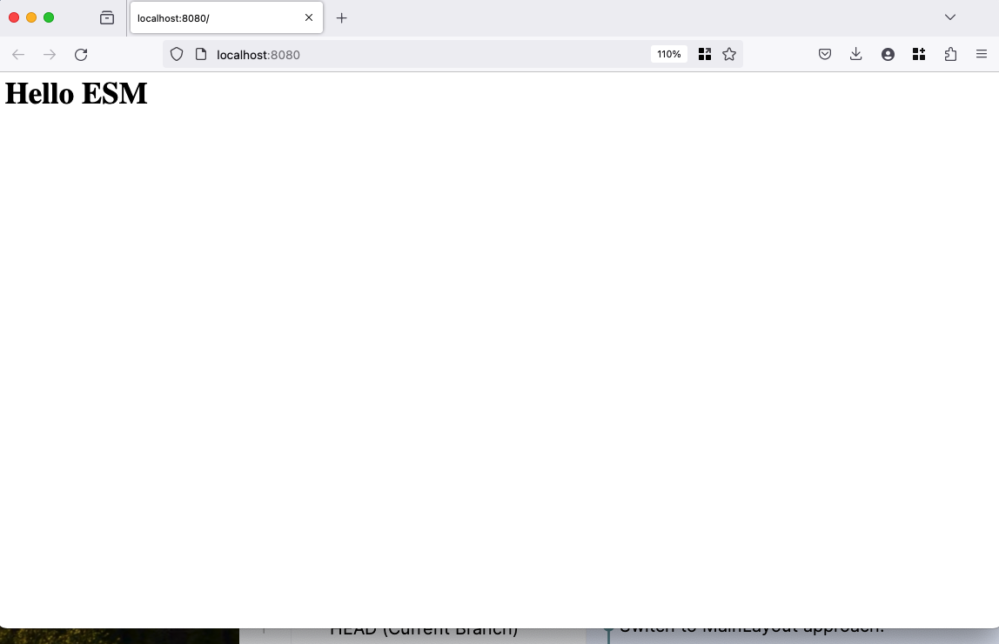

First things first. We'll start by creating a new 11ty project, which means adding some packages and files.

In a mostly-empty `package.json`, we'll add the 11ty dependency and -- crucially -- indicate that this is an ESM
project. As [Zach explains](https://www.11ty.dev/blog/canary-eleventy-v3/#new-features-and-a-short-upgrade-guide), `"type": "module"` flips the switch:

```
  "scripts": {
    "build": "npx @11ty/eleventy",
    "start": "npx @11ty/eleventy --serve --incremental"
  },
  "type": "module",
  "dependencies": {
    "@11ty/eleventy": "^3.0.0-alpha.6"
  },
```

We add a minimal `eleventy.config.js` file in the root directory. See: this is already ESM, no more `module.exports`!

```javascript
export default function () {
	return {
		dir: {
			input: "site",
			output: "_site",
		},
	};
}
```

Finally, we'll start the content for our site in `site/index.11ty.js`. This is
a [JavaScript template](https://www.11ty.dev/docs/languages/javascript/) which exports a specially-named `render`
function. This `render` function is what 11ty "JavaScript Templates" looks for:

```javascript
export function render() {
	return "<h1>Hello ESM</h1>";
}
```

## Running 11ty dev server

When we run the `start` script, 11ty does an incremental build using the dev server:



We can click the link in the output to open in a browser:



The build also generated an `_site` directory at the root with the build output. You can tell the IDE not to index this
directory by right-clicking, choosing `Mark directory as...` and choosing `Excluded`.

There's our start: a very simple 11ty setup and site. In the next step, we'll look at introducing TypeScript to our project.

## Full Listings

### `package.json`

```json

```

### `site/index.11ty.js`

```javascript

```
