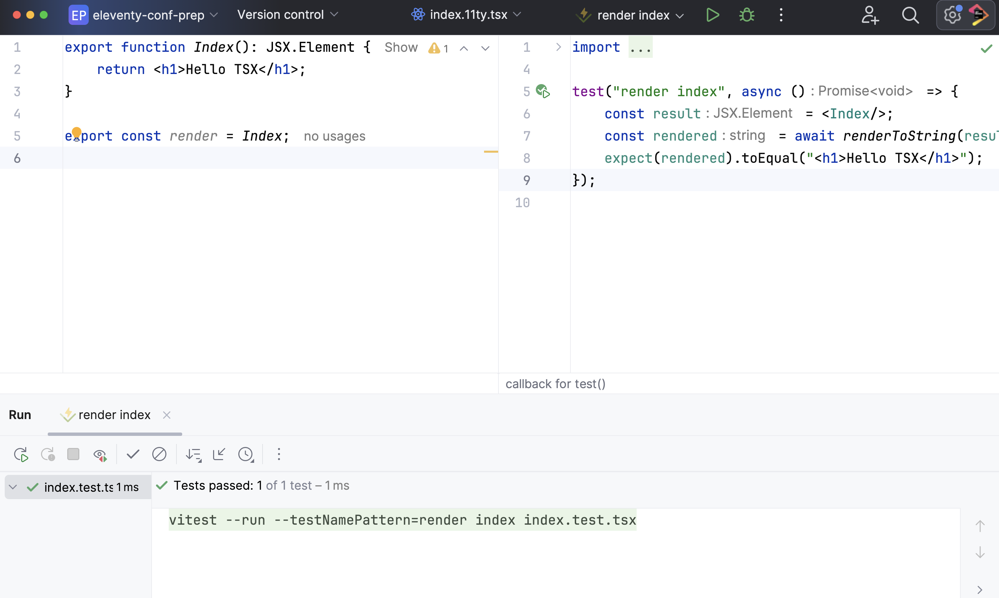

We now have TypeScript for Eleventy with TSX as a template language. This lets us use component-driven development in
11ty. This also opens up the possibility to write tests for our components, validating they behave (and keep behaving) as expected.

For example, we can work on small chunks -- in isolation -- and work happily in tests, using Vitest. We'll start by
adding a dependency and a script:

```json

```

We need to wire up Vitest in a `vitest.config.js` file at the root:

```javascript

```

This overrides the same settings used by `tsx` for running Eleventy builds. Vitest uses `esbuild` (as does `tsx`) but
for whatever reason, doesn't respect the `tsconfig.json` settings without help. Big shoutout
to [Joaquín Sánchez](https://github.com/userquin) from Vite/Vitest fame
for [figuring this out for me](https://github.com/privatenumber/tsx/discussions/453#discussioncomment-8194275).

Next, let's rewrite `index.11ty.tsx` to have a named-export component, which we then re-export for Eleventy's `render`
protocol for templates. This is for convenience, so you don't have all of your components named `render`:

```javascript

```

Now we can write a test of the `Index` component, using Vitest. Save this in `site/index.test.tsx`:

```javascript

```

This test passes when we run `npm test`. Even better, we get full integration into the IDE's Vitest support:


