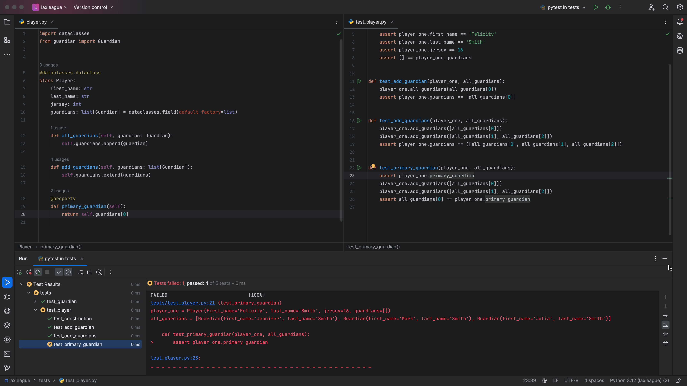
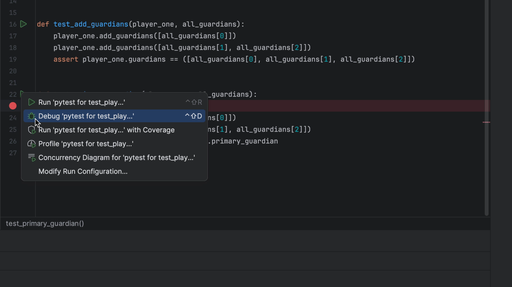
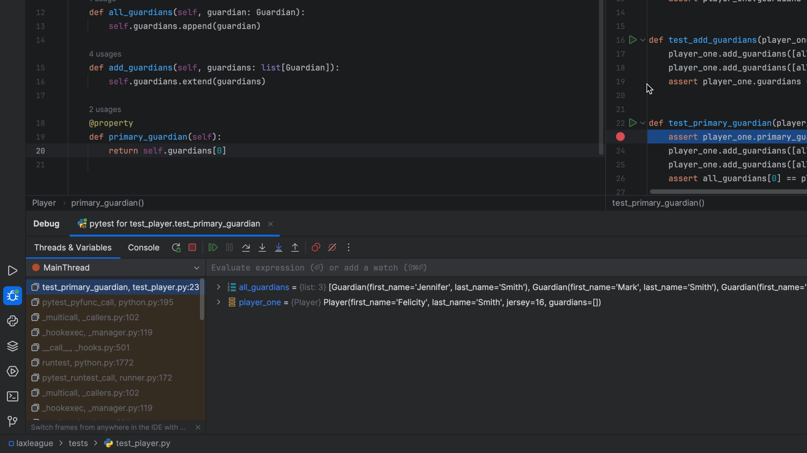
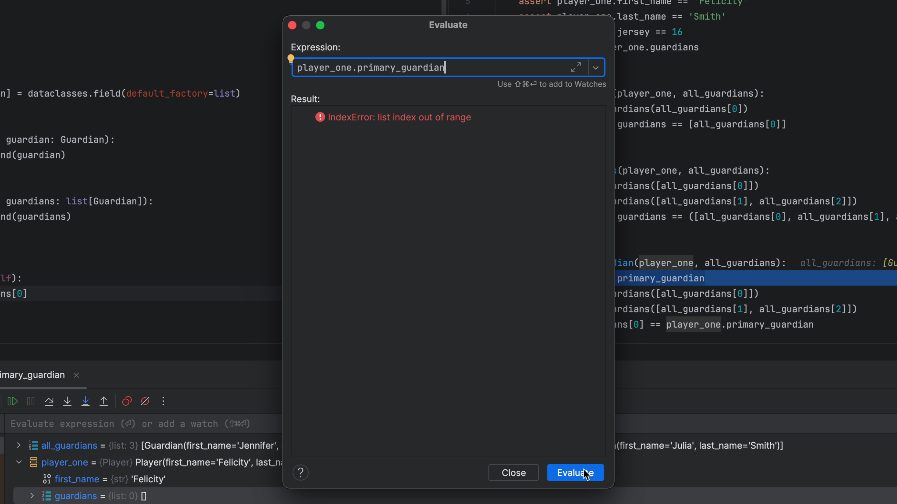

Primary guardian, great! But what happens if there are no guardians yet? In this step we tackle that problem by combining two great features: visual _testing_ with visual _debugging_.

## Creating an error

Let's imagine we were working in `test_primary_guardian.py` on our `test_primary_guardian` test and did something like this:

```python
def test_primary_guardian(player_one):
    assert player_one.primary_guardian
    player_one.add_guardians([all_guardians[0]])
    player_one.add_guardians([all_guardians[1], all_guardians[2]])
    assert all_guardians[0]
```

It raises an error:



This error message is quite helpful, but let's imagine you're confused about it. "What do you mean, there's no primary guardian?" You'd like to explore a little to see what's going wrong.

## Your `print()` Will Not Help You Here

What's the number one debugger in Python? Alas, the humble `print` statement. You thus reach for the "easiest" (wrong!) tool:

```python
def test_primary_guardian(player_one):
    print(player_one.guardians)
    assert player_one.primary_guardian
    player_one.add_guardians([all_guardians[0]])
    player_one.add_guardians([all_guardians[1], all_guardians[2]])
    assert all_guardians[0]
```

Your tests run, but...nada. `pytest` is capturing output. Besides, you've now changed your _code_ as part of investigating a problem. You could learn how to generate console output in `pytest`, but that would be the same issue -- writing debugging statements into your code which you might accidentally check in.

The debugger was meant for this. Fortunately PyCharm has a great "visual" debugger, tightly integrated with "visual testing." Let's use that.

## Breakpoint, Step...Cha-Cha-Cha

Remove the `print` statement and instead, click in the gutter beside the first line in that test function.
This adds a red circle to indicate a breakpoint at `assert player_one.primary_guardian`:



Let's now run that _one_ test, but under the debugger, which itself will then run `pytest`. Click the green triangle in the gutter to the right of `test_primary_guardian` and choose `Debug 'pytest for test_play...'. This brings up a new tool window in the bottom, running the debugger:



Our test execution has stopped on the line with the assertion. Our _Threads & Variables_ pane shows that `player_one` exists in the scope and we can take a look at it:


Aha, that's the problem! But let's say we _still_ couldn't spot it. We want to poke around interactively. Highlight `player_one.primary_guardian` in that line of code -- the one triggering the error -- then right click and choose **Evaluate Expression**. When you click **Evaluate** button, you se the output:



You can now poke around interactively in the state at that point by typing in the **Expression:** field. You can even overwrite the value of a variable in the scope or create new variables.

You're currently poking around in the code for the test, but perhaps you want to poke around in the implementation. Click **Step Into** and the debugger will put you on the `return self.guardians[0]` line in the `primary_guardian` property/method.

With this we quickly see what is the problem: there is no item zero in `self.guardians`. Finish up by removing the `assert player_one.primary_guardian` line and clearing the breakpoint by clicking on the red circle. Close the debugger tool window by clicking on its `(x)`.

The debugger is a fantastic tool when doing TDD -- not just when you have a problem, but whenever you want to explore.
