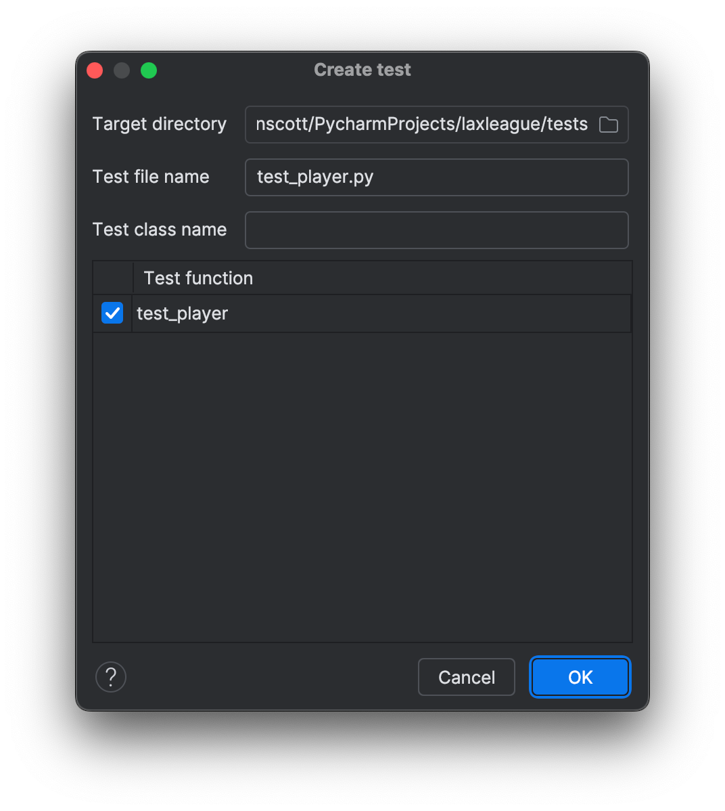
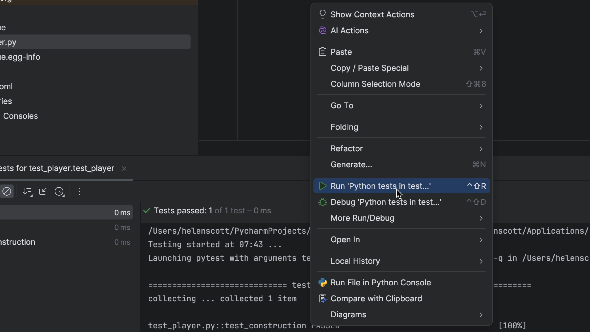

Getting started with pytest is quite easy.
Let's write a test with a simple assert, then show the various ways to run this test.

## Create a Player class

Let's create a simple Player class that we can use to write our first test. It will have three variables, two of type `str` and one of type `int`:

```python
class Player:
    first_name: str
    last_name: str
    jersey: int
```

## Write and run your first test

We can now get PyCharm to create a basic test for us from that code. Put your caret over it and then use Navigate to Test <kbd>⌘⇧T</kbd> (macOS) / <kbd>Ctrl+Shift+T</kbd> (Windows/Linux):


Check that PyCharm is putting your test in your tests folder and change it if you need to then click **OK**:



PyCharm has now created a basic test for us which includes the line `assert False`, meaning that it should fail:

```python
def test_player():
    assert False
```

You can run your tests in PyCharm in a variety of ways, let's start with the gutter icons:


As we expect the test fails. You can see this in the _Run_ tool window:


Change the line to read `assert True` instead of `assert False` and then try running it again. This time we will run it with our keyboard shortcuts <kbd>⌃R</kbd> (macOS) / <kbd>Shift+F10</kbd> (Windows/Linux):


This Python `pytest` file has one function, `test_player`. In `pytest`, tests [are discovered](https://docs.pytest.org/en/latest/goodpractices.html#conventions-for-python-test-discovery) by default in filenames starting with `test_` and functions/methods with that same prefix.

## Test our constructor

Lacrosse teams have, of course, players. We are first implementing a `Player` class and writing tests as we implement features. This is known as "test-driven development" (TDD).

We aren't asserting anything about the instance. Simply: the import works, it's callable, and can be called. Let's change that to check our construction. Change your code to:

```python
def test_construction():
    assert Player()
```

Remember that PyCharm can help you [generate the import of `Player` as you type](../../../../python/tips/generate-imports-while-typing). You don't need to stop your flow, go to the top, and write the import. Instead, type `Pla` and use <kbd>Ctrl+Space+Space</kbd> to autocomplete _and_ add the import line at the top, in the correctly-sorted location, combined with any existing import of the module.

Let's run everything in the file (currently one test) by right-clicking in the editor and choosing _Run Python tests in test..._.
Our test passes again:


