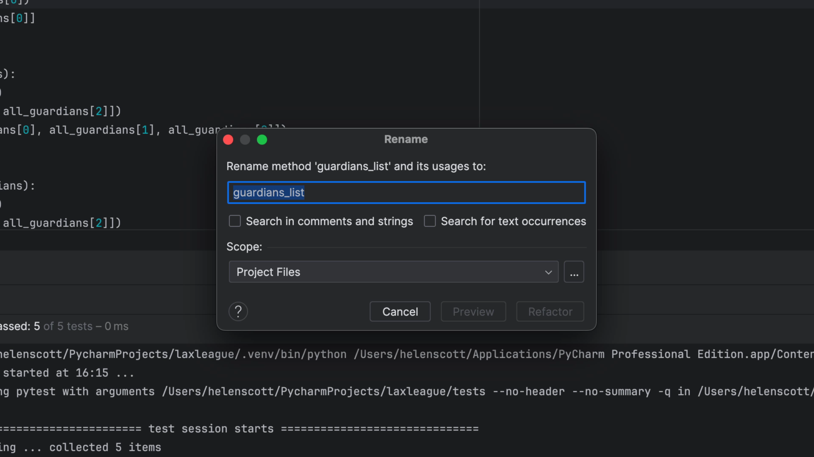
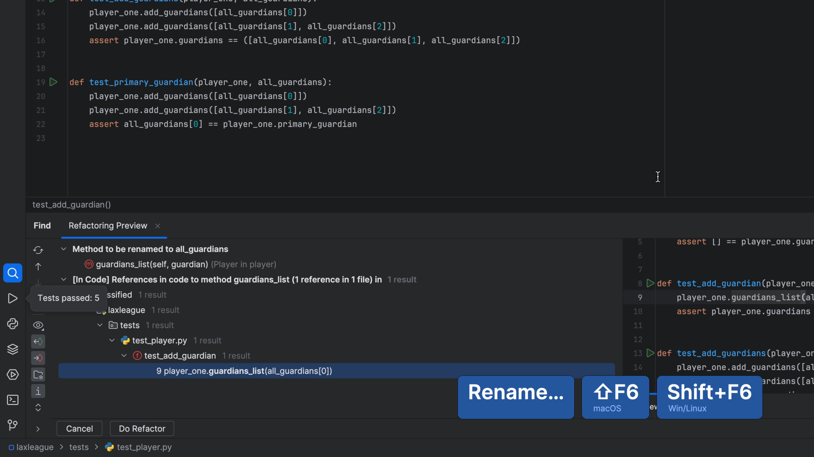

Each test recreates `Player` and `Guardian` instances, which is repetitive and distracts from the test's purpose. [pytest fixtures](https://docs.pytest.org/en/latest/fixture.html) give a rich infrastructure for your test data. In this tutorial step we convert our tests to use fixtures, which we then share between files using `conftest.py`.

## Confirm PyCharm is in TDD-mode

Once again, check that your code is on the left, your test is on the right, your _Run_ tool window is at the bottom and your tests are automatically running when there is a change to your code or tests.

## Create a new fixture for `player` and refactor `test_player.py`

In `test_player.py` class we will make a new fixture for the player object:

```python
@pytest.fixture
def player_one() -> Player:
    return Player('Felicity', 'Smith', 16)
```

We now need to refactor our test code to use this fixture. Test functions request fixtures by declaring them as arguments. First, let's refactor our `test_construction` method to use the fixture:

```python
def test_construction(player_one):
    assert player_one.first_name == 'Felicity'
    assert player_one.last_name == 'Smith'
    assert player_one.jersey == 16
    assert [] == player_one.guardians
```

Same again for `test_add_guardian`:

```python
def test_add_guardian(player_one):
    g = Guardian('Jennifer', 'Smith')
    player_one.add_guardian(g)
    assert player_one.guardians == [g]
```

And again for `test_add_guardians`:

```python
def test_add_guardians(player_one):
    g1 = Guardian('Jennifer', 'Smith')
    player_one.add_guardians([g1])
    g2 = Guardian('Mark', 'Smith')
    g3 = Guardian('Julia', 'Smith')
    player_one.add_guardians([g2, g3])
    assert player_one.guardians == ([g1, g2, g3])
```

Last but not least, for `test_primary_guardian`:

```python
def test_primary_guardian(player_one):
    g1 = Guardian('Jennifer', 'Smith')
    player_one.add_guardians([g1])
    g2 = Guardian('Mark', 'Smith')
    g3 = Guardian('Julia', 'Smith')
    player_one.add_guardians([g2, g3])
    assert g1 == player_one.primary_guardian
```

Pause and check that all your tests are passing after this refactor:


## Create a new fixture for `guardian` and refactor `test_player`

Now we have a fixture for the player object, it's time to make another for the guardian object in `test_player.py`:

```python
@pytest.fixture
def guardians_list() -> list[Guardian]:
    g1 = Guardian('Jennifer', 'Smith')
    g2 = Guardian('Mark', 'Smith')
    g3 = Guardian('Julia', 'Smith')
    return [g1, g2, g3]
```

Next, refactor the tests that use the guardian object, starting with `test_add_guardian` to use the new guardians list:

```python
def test_add_guardian(player_one, guardians_list):
    player_one.add_guardian(guardians_list[0])
    assert player_one.guardians == [guardians_list[0]]
```

Next up, `test_primary_guardian`:

```python
def test_primary_guardian(player_one):
    player_one.add_guardians([guardians_list[0]])
    player_one.add_guardians([guardians_list[1], guardians_list[2]])
    assert guardians_list[0] == player_one.primary_guardian
```

Once again, check all your tests are still passing:


## Use `guardian` fixture in our `test_guardian.py` class

Copy your `guardians_list()` fixture from `test_player.py` and then use Recent Files <kbd>⌘E</kbd> (macOS) / <kbd>Ctrl+E</kbd> (Windows/Linux) to switch to `test_guardian.py` and paste the `guardians_list()` fixture there too. Let PyCharm handle the import for `pytest` as before:

```python
@pytest.fixture
def guardians_list() -> list[Guardian]:
    g1 = Guardian('Jennifer', 'Smith')
    g2 = Guardian('Mark', 'Smith')
    g3 = Guardian('Julia', 'Smith')
    return [g1, g2, g3]
```

Finally, refactor your `test_construction()` method use the guardian fixture:

```python
def test_construction(guardians_list):
    assert guardians_list[0].first_name == 'Jennifer'
    assert guardians_list[0].last_name == 'Smith'
```

Check that your tests all still pass:


You've probably noticed at this point that we have duplication. Don't worry, we're going to fix that in the next step!

## Create a `conftest.py` file

A `conftest.py` file is used in pytest to share fixtures across multiple files. We're going to refactor our code to remove the fixtures from both our `test_guardian.py` and `test_player.py` files and move it into a single `conftest.py` file.

Since you're still in `test_guardian.py`, delete the guardians fixture `guardians_list()` from your code and then use Optimize Imports <kbd>⌃⌥O</kbd> (macOS) / <kbd>Ctrl+Alt+O</kbd> (Windows/Linux) to remove any unused imports. Next use Reformat Code <kbd>⌘⌥L</kbd> (macOS) / <kbd>Ctrl+Alt+L</kbd> (Windows/Linux) to tidy up an errant spacing issues. Don't worry - this will momentarily break your code but we will fix it!

Use Recent Files <kbd>⌘E</kbd> (macOS) / <kbd>Ctrl+E</kbd> (Windows/Linux) to switch to `test_player.py` and cut both `guardians_list()` and `player_one()` fixtures from the file. Again, use Optimize Imports <kbd>⌃⌥O</kbd> (macOS) / <kbd>Ctrl+Alt+O</kbd> (Windows/Linux) to remove any unused imports and Reformat Code <kbd>⌘⌥L</kbd> (macOS) / <kbd>Ctrl+Alt+L</kbd> (Windows/Linux) to tidy up an errant spacing issues.

Go to your Project tool window <kbd>⌘1</kbd> (macOS) / <kbd>Alt+1</kbd> (Windows/Linux) and at the root of your project, right-click and select **New** > **File**. You can filter the list by python by typing in "python" and then press <kbd>⏎</kbd> (macOS) / <kbd>Enter</kbd> (Windows/Linux). Call the file `conftest` (PyCharm will add the `.py` if you selected a python file) and press <kbd>⏎</kbd> (macOS) / <kbd>Enter</kbd> (Windows/Linux) again. PyCharm will create your new `conftest.py` file at the root of your directory.

Use PyCharm's Clipboard History <kbd>⌘⇧V</kbd> (macOS) / <kbd>Ctrl+Shift+V</kbd> (Windows/Linux) and select the entry in the history that is both the fixtures you cut from your `test_player.py` file and paste them into the new `conftest.py` file. Let PyCharm handle the imports for you and use Reformat Code <kbd>⌘⌥L</kbd> (macOS) / <kbd>Ctrl+Alt+L</kbd> (Windows/Linux) to keep everything tidy.

That's the end of the refactoring for `conftest.py` so now is a good time to check that all your tests are still passing.


## Naming is hard

Before I leave you, naming is hard. I don't like the name `guardians_list` for my `guardians` fixture so in `test_player.py` I will select it, then use Refactor Rename <kbd>⇧F6</kbd> (macOS) / <kbd>Shift+F6</kbd> (Windows/Linux) to choose a better name.



I'll go with `all_guardians` and then press Refactor:


PyCharm now gives you a preview of which files will change and we can see that both our usages and the definition in `conftest.py` will be correctly updated:



Once you click **Do Refactor**, PyCharm, will update all of your code.

Final tip here, if you want to toggle between your usage and definition, you can hold down <kbd>⌘</kbd> or <kbd>Ctrl</kbd> and click in your editor.
