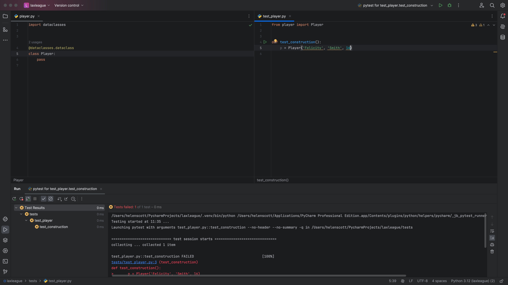
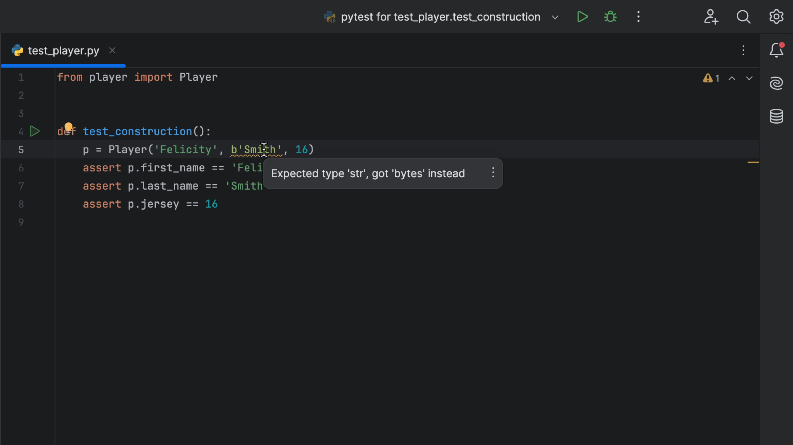
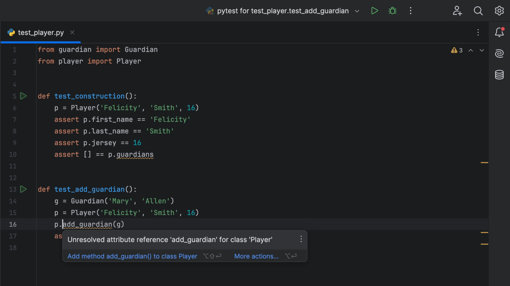
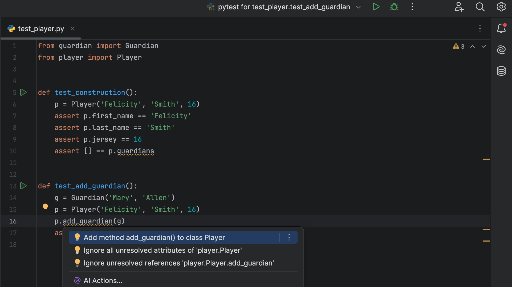
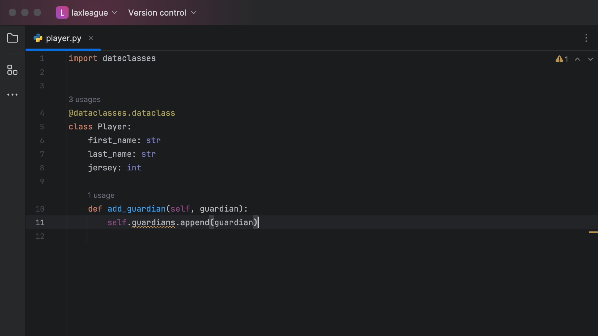
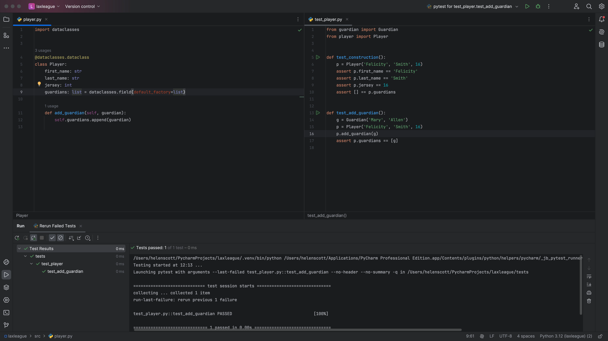

## Testing our constructor

Set your PyCharm display into _TDD-mode_ with your `player` class on the left and your `test_player` class on the right.

Let's make our `player` class a dataclass before we go any further:

```python
import dataclasses


@dataclasses.dataclass
class Player:
    pass
```

Now we will <kbd>^⇥</kbd> (macOS) / <kbd>Ctrl+Tab</kbd> (Windows/Linux) over to our `test_player` class and add a constructor:

```python
from player import Player


def test_construction():
    p = Player('Felicity', 'Smith', 16)
```

Almost immediately, we can see that our test has failed because we have not implemented the constructor yet:



You can now <kbd>^⇥</kbd> (macOS) / <kbd>Ctrl+Tab</kbd> (Windows/Linux) back to your `player` class and implement the constructor:

```python
class Player:
    first_name: str
    last_name: str
    jersey: int
```

Take advantage of PyCharm's completion by pressing <kbd>⇥</kbd> (macOS) / <kbd>Tab</kbd> (Windows/Linux) to accept the suggestion. After a brief pause, your tests will pass again.

Now let's go back to our tests with <kbd>^⇥</kbd> (macOS) / <kbd>Ctrl+Tab</kbd> (Windows/Linux) and add assert statements:

```python
def test_construction():
    p = Player('Felicity', 'Smith', 16)
    assert p.first_name == 'Felicity'
    assert p.last_name == 'Smith'
    assert p.jersey == 16
```

After a brief pause, the tests should now pass again:


## Type errors in PyCharm

PyCharm will always try and show you errors as you go along meaning you can fix them faster. For example, if PyCharm is expecting you to pass in something of type `str` and you pass in something of type `byte`, it will flag it immediately for you:



There are lots of benefits to type hints in your tests, but primarily we want to surface mistakes before they appear in production!

## Implementing plays with guardians

Let's go ahead and create some more tests in a TDD workflow. Update your `test_construction` method to:

```python
def test_construction():
    p = Player('Felicity', 'Smith', 16)
    assert p.first_name == 'Felicity'
    assert p.last_name == 'Smith'
    assert p.jersey == 16
```

And add a new test called `test_add_guardian`:

```python
def test_add_guardian():
    g = Guardian('Mary', 'Allen')
    p = Player('Felicity', 'Smith', 16)
    p. add_guardian(g)
    assert p.guardians == [g]
```

PyCharm has underlined some of this code so we can see that the implementation is missing. We can use <kbd>⌥⏎</kbd> (macOS) / <kbd>Alt+Enter</kbd> (Windows/Linux) to see why the code is underlined:



PyCharm doesn't yet know what `add_guardian(g)` is, so let's fix that now. We can select **Add method add_guardian() to class Player**:



PyCharm will create the method over in our `guardian` class and we can then add the implementation:

```python
def add_guardian(self, guardian):
    self.guardians.append(guardian)
```

But wait, there's still a problem. PyCharm has underlined our code again:



This time, move your caret up to your class definition and take advantage of local code completion to add the guardians list to our constructor:

```python
class Player:
    first_name: str
    last_name: str
    jersey: int
    guardians: list = dataclasses.field(default_factory=list)
```

Our tests now pass again:



## Checking your tests are still auto re-running

You can always validate that your tests are still running automatically at any time by introducing an error into your code (or test), checking that the test for that code fails, and then fixing it. This helps you to have confidence in the code that you're creating.
