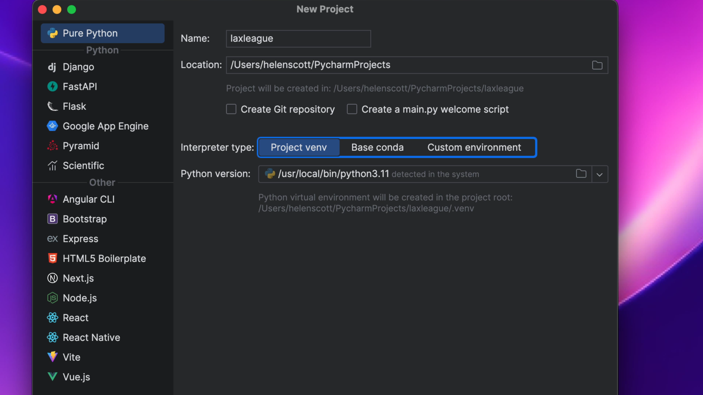
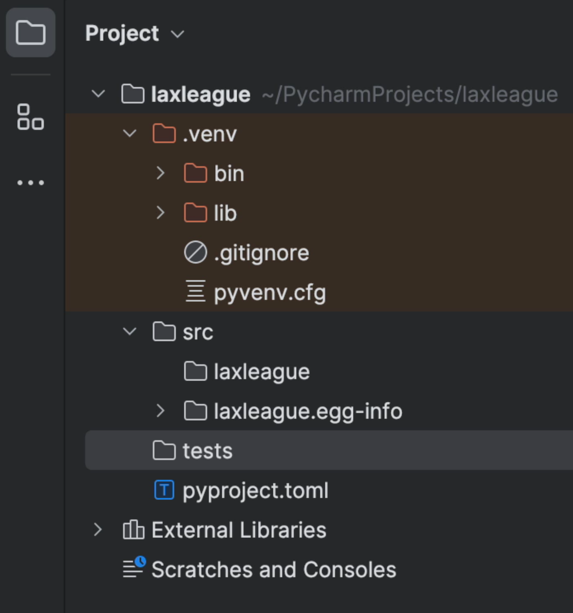
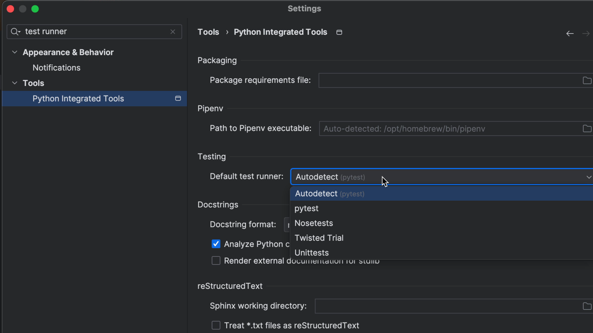

Python has projects and PyCharm does as well. In this tutorial step, let's make both, with a virtual environment, and set the project up to use `pytest`.

## New Project

We'll let the IDE guide us through the process. First, we use `File -> New Project` to make a new project, in a directory:



Make sure `Project Interpreter` is set up to configure a new virtual environment. Expand the triangle if needed to set this up.

After clicking `Create`, tell PyCharm to open the project in a new window.

## Create a pyproject.toml

A `pyproject.toml` is a configuration file you can us to tell Python (and PyCharm) information about your package. We'll populate ours with:

```markdown
[project]
name = "laxleague"
version = "2024.0.0"
dependencies = [
"pytest"
]
```

We can then use <kbd>⌥F12</kbd> (macOS) / <kbd>Alt+F12</kbd> (Windows/Linux) to open the terminal and run `pip install -e .` so that others know how the package is built, what Python version it uses and what the dependencies are (`pytest` in our case).

## As an alternative - a requirements file

You can use a `requirements.txt` file instead of a `pyproject.toml` file to manage your dependencies if you prefer. PyCharm will give you code suggestions and completions for both file types.

## Test directory

In your Project Structure tool window <kbd>⌘1</kbd> (macOS) / <kbd>Alt+1</kbd> (Windows/Linux), right-click and select **New** > **Directory** and call it `tests`. When done, your directory structure should look like this:



## Check PyCharm's Test Runner

PyCharm knows that we're using `pytest` as our test runner because we added it as a dependency, however, if you ever want to check what test runner PyCharm is using, you can do so in the Settings <kbd>⌘,</kbd> (macOS) / <kbd>Ctrl+Alt+S</kbd> (Windows/Linux) and search for "test runner" to check the settings.


