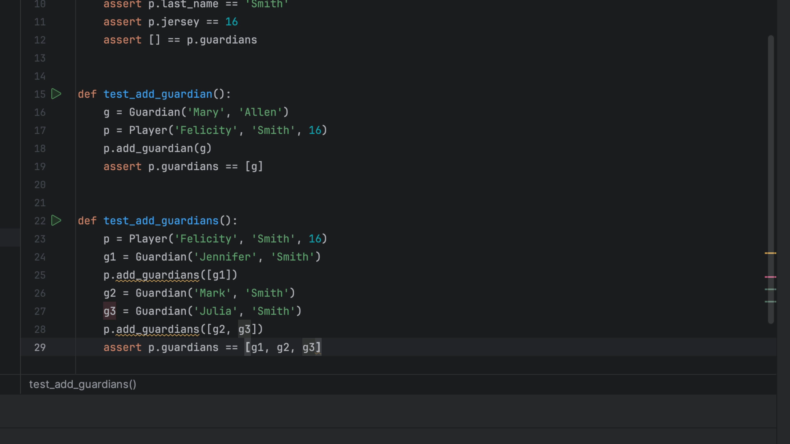
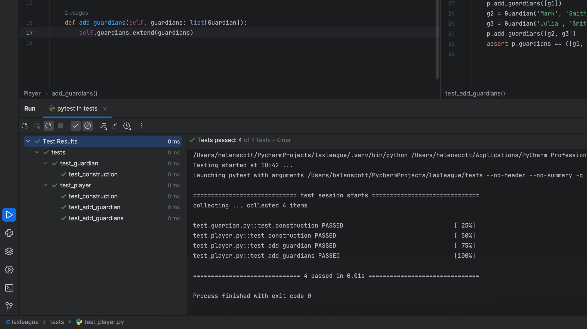
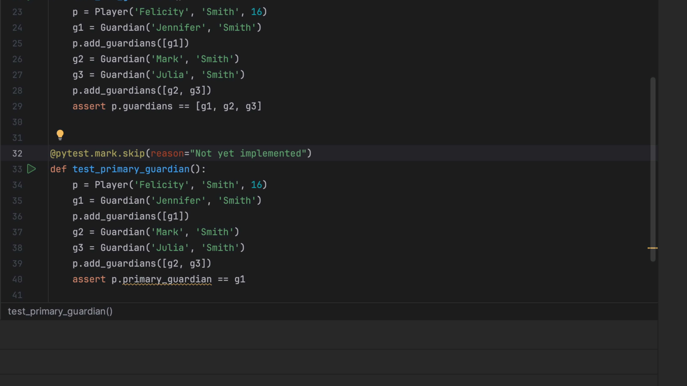

Sometimes you want to overhaul a chunk of code and don't want to stare at a broken test. You could comment it out. But `pytest` provides an easier (and more feature-ful) alternative for skipping tests.

## Sanity check of TDD mode

Once again, make sure you have PyCharm set up to automatically rerun your tests when something in your code or your test changes. You can validate if its switched on by either checking in the _Run_ tool window, or just make a change to your code / test to introduce an error and check that your tests fail correctly. Of course, remember to fix the deliberate error before you move on!

## Skip the failing test

There are a number of reasons that you might want to skip a failing test and pytest has excellent support for it. Let's add a new test to our `test_player` module:

```python
def test_add_guardians():
    p = Player('Felicity', 'Smith', 16)
    g1 = Guardian('Jennifer', 'Smith')
    p.add_guardians([g1])
    g2 = Guardian('Mark', 'Smith')
    g3 = Guardian('Julia', 'Smith')
    p.add_guardians([g2, g3])
    assert p.guardians == [g1, g2, g3]
```

PyCharm has highlighted some of this code because it hasn't been implemented yet so the IDE doesn't know what it is:



Of course, this test will fail, but instead of having it fail constantly while you craft the implementation, you can use the `@pytest.mark.skip` annotation to tell pytest to skip that test. Once again, let PyCharm handle the import for `pytest`:

```python
@pytest.mark.skip(reason="Not implemented")
def test_add_guardians():
    p = Player('Felicity', 'Smith', 16)
    g1 = Guardian('Jennifer', 'Smith')
    p.add_guardians([g1])
    g2 = Guardian('Mark', 'Smith')
    g3 = Guardian('Julia', 'Smith')
    p.add_guardians([g2, g3])
    assert p.guardians == [g1, g2, g3]
```

## Implement the code

Let's use <kbd>^⇥</kbd> (macOS) / <kbd>Ctrl+Tab</kbd> (Windows/Linux) over to our `Player` class and create the implementation next:

```python
def add_guardians(self, guardians: list[Guardian]):
    self.guardians.extend(guardians)
```

Now we need to use <kbd>^⇥</kbd> (macOS) / <kbd>Ctrl+Tab</kbd> (Windows/Linux) to go back to our `player_test` class and delete the `@pytest.mark.skip(reason="Not implemented")` line so that our test is no longer skipped by pytest.

Your tests should now run and pass:



## Skipping tests from start to finish

Once again, we will create a new test and mark it with `@pytest.mark.skip(reason="Not implemented")`:

```python
@pytest.mark.skip(reason="Not implemented")
def test_primary_guardian():
    p = Player('Felicity', 'Smith', 16)
    g1 = Guardian('Jennifer', 'Smith')
    p.add_guardians([g1])
    g2 = Guardian('Mark', 'Smith')
    g3 = Guardian('Julia', 'Smith')
    p.add_guardians([g2, g3])
    assert p.gprimary_guardian == [g1]
```

PyCharm has highlighted the code that it doesn't understand:



Let's <kbd>^⇥</kbd> (macOS) / <kbd>Ctrl+Tab</kbd> (Windows/Linux) over to our `Player` class to craft the implementation:

```python
@property
def primary_guardian(self):
    return self.guardians[0]
```

We can now remove the `@pytest.mark.skip(reason="Not implemented")` from our test and our tests will run successfully:
