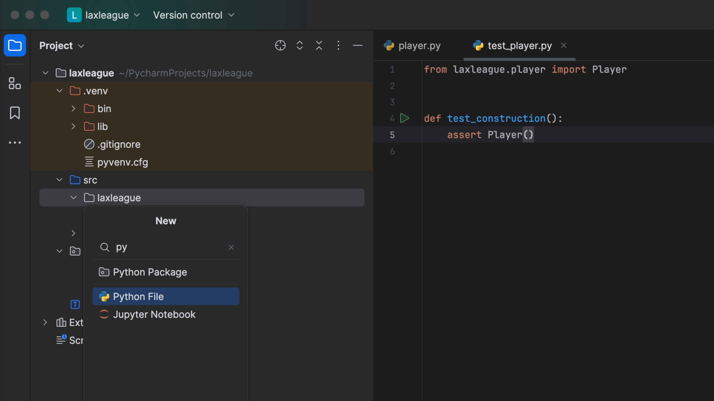
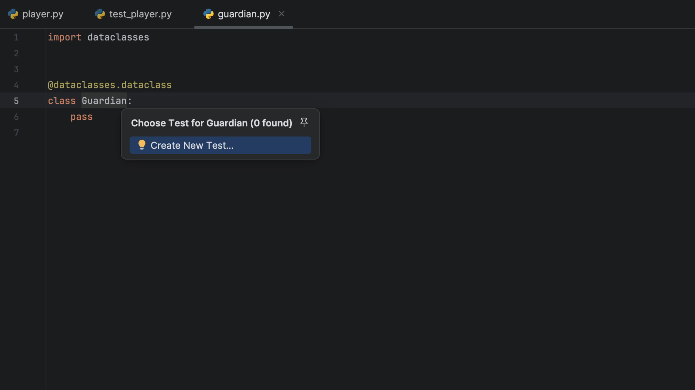
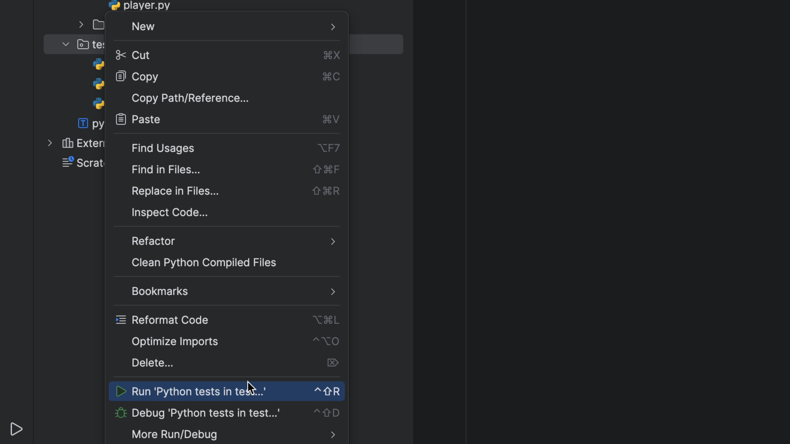
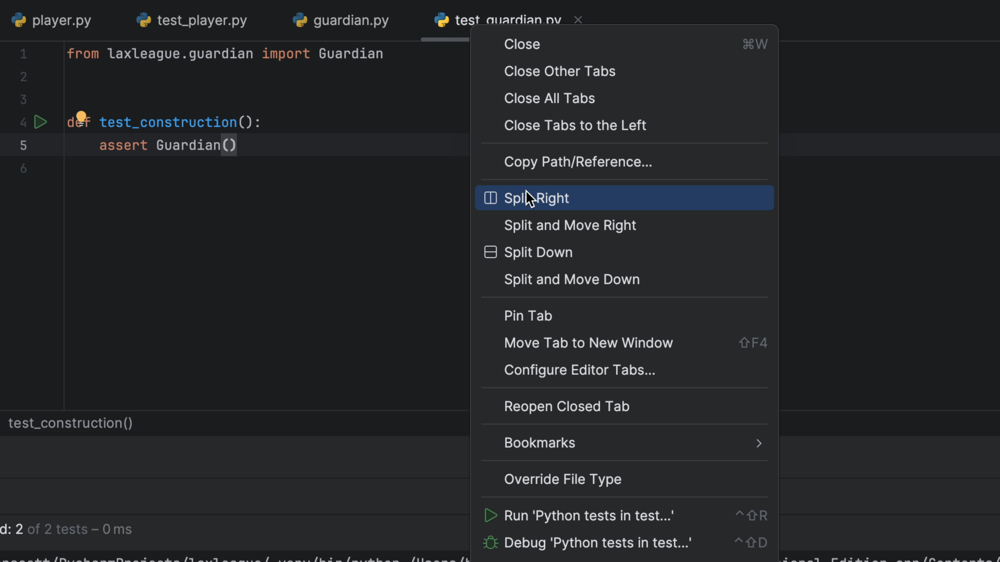
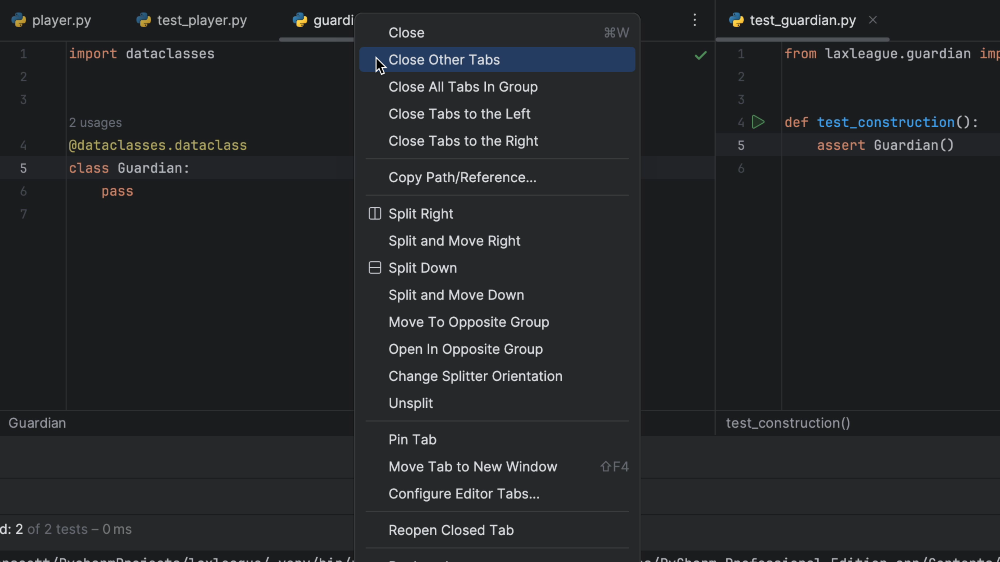
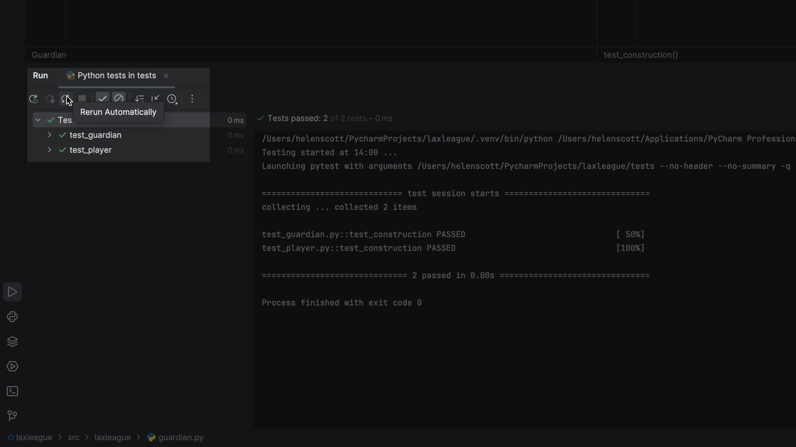
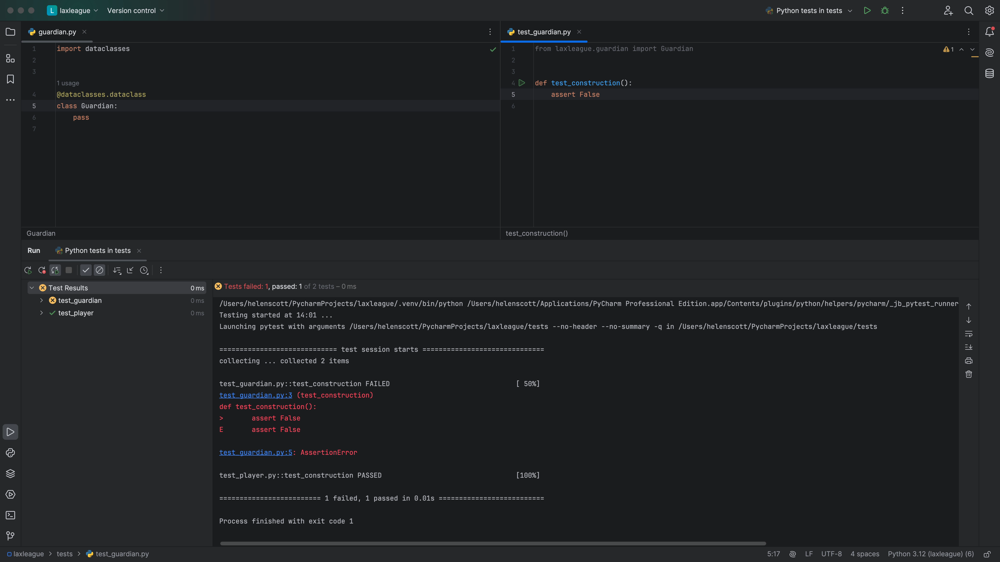
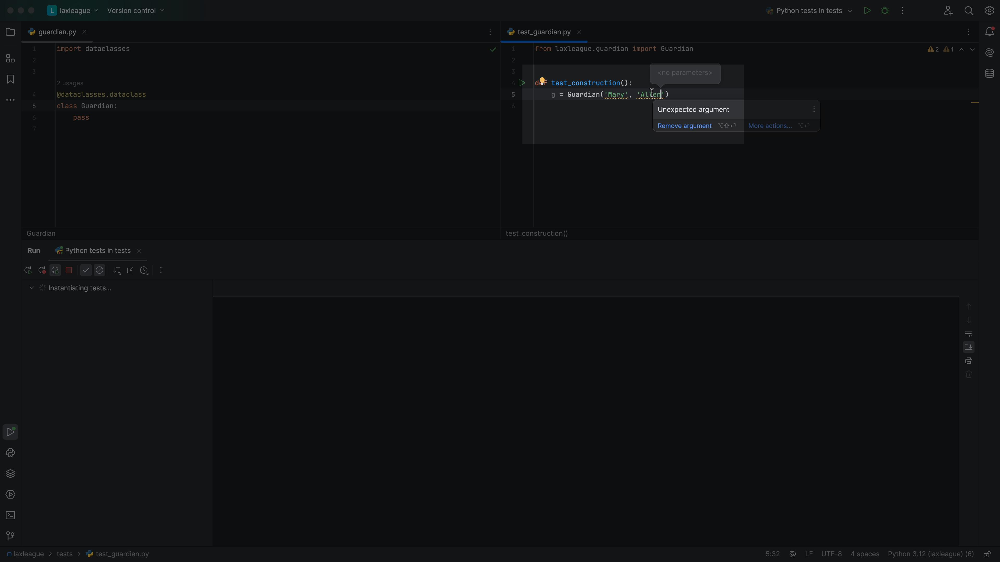
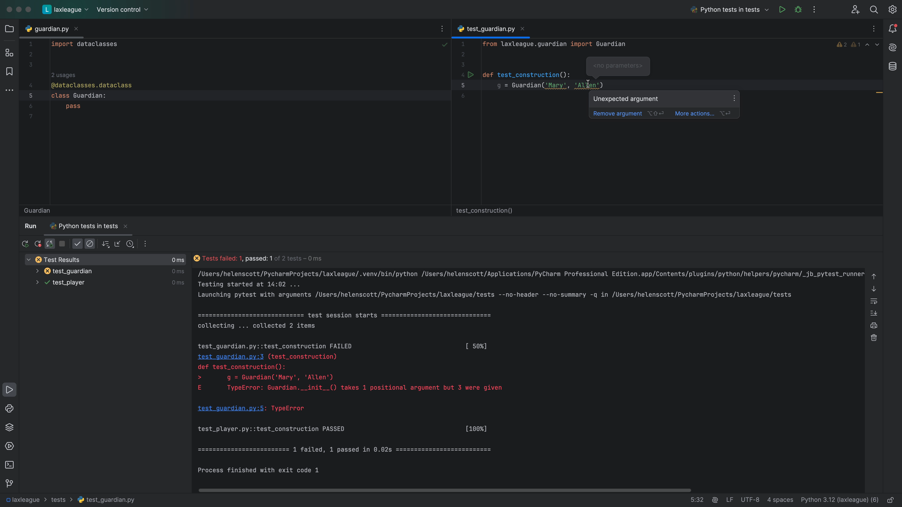

Players have parents, also known as guardians. Let's make a module for a `Guardian` class. This time let's do it with a bit of test-driven development (TDD) and show how to get PyCharm into a good "flow" for TDD.

## New python class

First, we need to create our new guardian class. From your Project tool window <kbd>⌘1</kbd> (macOS) / <kbd>Alt+1</kbd> (Windows/Linux), navigate to your `src` directory, right-click and select **New** > **File**. You can start typing in "python" and to quickly filter then press return.



Call your new class `guardian` and press <kbd>⏎</kbd> (macOS) / <kbd>Enter</kbd> (Windows/Linux). PyCharm will create your new python file `src/laxleague/guardian.py` with an empty class:

```python
import dataclasses


@dataclasses.dataclass
class Guardian:
    pass
```

Why do we make an empty placeholder class? To let PyCharm generate the test for us. Use Navigate To Test (<kbd>⌘⇧T</kbd> (macOS) / <kbd>Ctrl+Shift+T</kbd> (Windows/Linux)) as explained in the last step to help generate `tests/test_guardian.py`:



In the new test file, change the first test to `test_construction` to "get me into the flow", letting PyCharm generate the import:

```python
from laxleague.guardian import Guardian


def test_construction():
    assert Guardian()
```

This time we will run the test by opening the Project tool window <kbd>⌘1</kbd> (macOS) / <kbd>Alt+1</kbd> (Windows/Linux), right-clicking on your `tests` folder and selecting **Run 'Python tests in test'**:



Not only does our new `Guardian` test pass, but our `Player` test passes too and we can see both in the _Run_ tool window.

## TDD Flow

Now let's get ourselves into a TDD flow. We'd like to easily look at the code we are writing and the tests we providing against that code. I like both visible, with my code on the left and the tests on the right.

There are a few ways you can achieve the TDD \_look_in PyCharm. You can invoke Find Action with <kbd>⌘⇧A</kbd> (macOS) / <kbd>Ctrl+Shift+A</kbd> (Windows/Linux) and search for `Split Vertically`. Alternatively you right-click on the tab you want to split to the right and select **Split Right**. In our case, that's `test_guardian`:



On the left, we want just `guardian.py` so we can right-click on that file and select **Close Other Tabs**. This will close the other tabs on the left, but leave `test_guardian.py` open on the right:



While we're at it, collapse the _Project_ tool window with <kbd>⌘1</kbd> (macOS) / <kbd>Alt+1</kbd> (Windows/Linux).

The _Run_ tool window stays on the bottom so we don't need to move that anywhere. Now you have your code on the left, the test on the right and the test results on the bottom so we can more easily stay in the flow:


Let's have our tests run, automatically, as we type. PyCharm makes this easy and visually convenient -- it even integrates with your desktop notification system when tests are finished running and PyCharm isn't visible.

In the _Run_ tool window for the test output, click the **Run automatically** icon:



With autorun enabled, your tests run _automatically_ every few seconds after you have changed something. You can configure this delay by going to the three vertical dots, and selecting **Test Runner Settings** > **Set AutoTest Delay** and choosing what works for you.

One final point: you don't have to save changes to your code or tests. PyCharm has an auto-save virtual filesystem.

To see this autorun in action, change something in one of your `assert` statements to make your test fail. After your delay period, you'll see the tests re-run, automatically and fail:



Don't forget to change it back so it passes though:


That's a nice start to a good TDD flow. Let's write a failing test, then fix the implementation.

## Coding the Guardian

We'll work in TDD and change the first test in `tests/test_guardian.py`:

```python
def test_construction():
    g = Guardian('Mary', 'Allen')
```

Notice that PyCharm warns you (on hovering) with 'Unexpected argument' when we supply arguments:



After two seconds, even without saving, our tests show as broken:



Of course it breaks: `Guardian` has no constructor. Since it is the _code_ we are writing tests for, the mistake is conveniently right there in our left tab. Change `laxleague/guardian.py` to implement storing names on instances:

```python
class Guardian:
    first_name: str
    last_name: str
```

As you are writing this, let PyCharm help you with code completion. You can press <kbd>⇥</kbd> (macOS) / <kbd>Tab</kbd> (Windows/Linux) to accept the code completion as you go.

Our test now passes but doesn't do an assertion. Back in `test_construction`, let's show a bit about how PyCharm can help you be more productive and accurate.

First, hold down <kbd>Ctrl</kbd> and hover on the `g`. PyCharm tells you that `g` is of inferred type `Guardian.` Next, add an assertion:

```python
assert g.first_name == 'Mary'
assert g.last_name == 'Allen'
```

As you type `first_name` you can see PyCharm offering you the autocomplete. This is because PyCharm inferred the type of `Guardian`, thus speeding up your TDD.

One last point: PyCharm's tool window for testing shows passing tests by default. If you don't want to see them, and focus on failing tests instead, click on the `Show Passed` icon to the right of the green play button.
