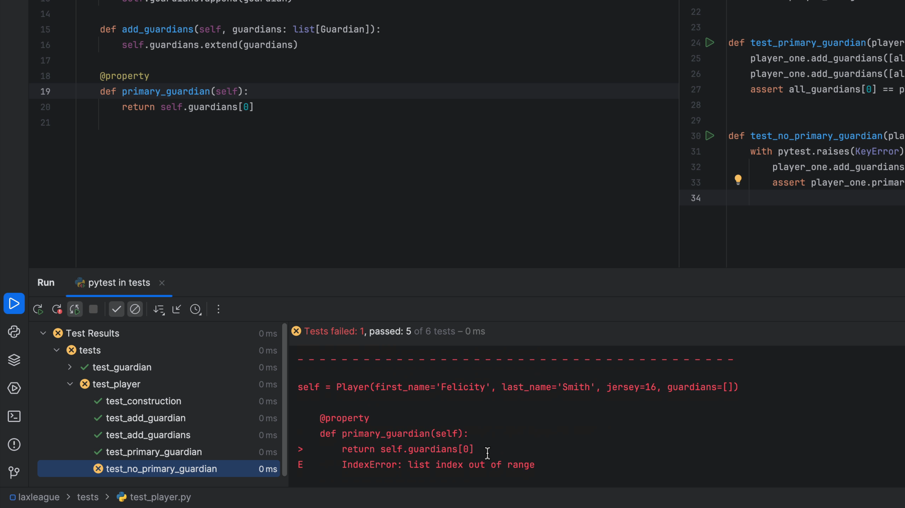
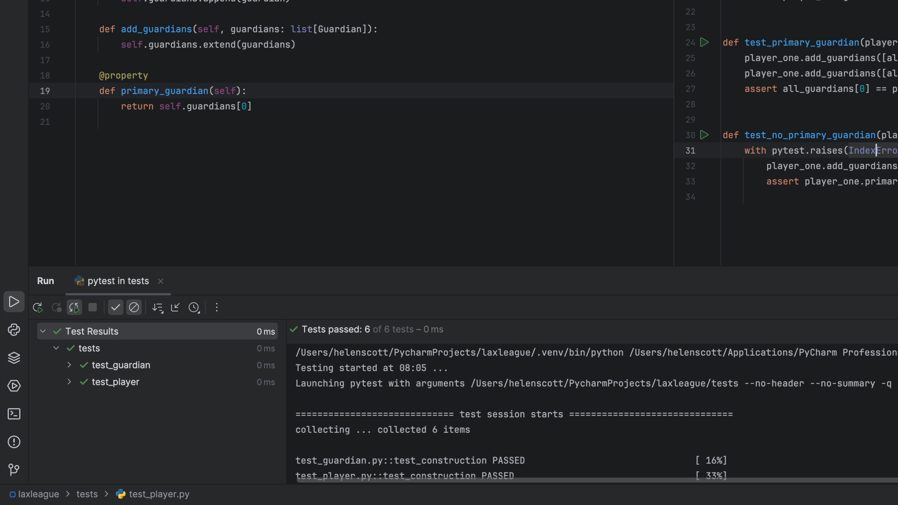

In the previous step we showed how to debug a problem. Let's show how to write a test that _recreates_ the problem -- _and_ ensures our Python code handles it correctly -- by using `pytest` exception assertions. We'll then refactor the code to detect that situation and return `None`, writing tests before doing the refactoring.

## Testing Exceptions

We start, as always, with a test.

We're adding a new test `test_no_primary_guardian` in `test_player.py`, to detect the case when no guardians have been assigned:

```python {
import pytest
def test_no_primary_guardian(player_one):
    with pytest.raises(KeyError) as excinfo:
    player_one.add_guardians([])
    assert player_one.primary_guardian is None
```

As we type the code above, don't forget to use autocomplete to let PyCharm generate `import pytest` for you. This test uses a special context manager facility in `pytest`, in which you run a block of code that you expect to raise an exception, and let `pytest` handle it. You test will _fail_ if the exception is not raised. The context manager optionally lets you add `as exc` to then do some asserts after the block, about the nature of the exception value.

We can see that an exception is raised, but not the one we were expecting:



We expected an `IndexError`, but we got a `KeyError` but we got an `IndexError`.

If we change the exception type in our test code to `IndexError`:

```python {
def test_no_primary_guardian(player_one):
    with pytest.raises(IndexError) as excinfo:
    player_one.add_guardians([])
    assert player_one.primary_guardian is None
```

Our tests will pass again:



## Return `None` Instead

Perhaps we decide that raising an exception isn't a good pattern. Instead, we want to detect if `self.guardians` is empty, and if so, return `None`. To start, let's...write a test. Or in this case, change that last test:

```python
def test_no_primary_guardian(player_one):
    assert player_one.primary_guardian is None
```

Good news, the test fails. Remember to remove the now-unused `import pytest` via PyCharm's Optimize Imports <kbd>⌃⌥O</kbd> (macOS) / <kbd>Ctrl+Alt+O</kbd> (Windows/Linux).

We now change our implementation in `player.py` to correctly return `None`:

```python
@property
def primary_guardians(self)  -> Optional[Guardian]:
    return self.guardians[0] if self.guardians else None
```

Python type hinting uses `Optional` when the value might be `None`. Our tests now pass which means we did the refactoring safely.

## PyCharm TDD mode reminder

Before I leave you, here's a quick reminder of how to configure PyCharm in TDD mode. Use **Split Right** to move your tests to the right so you have code on the left, tests on the right and your _Run_ tool window at the bottom. You can configure your tests to run automatically when something in your code or tests change. Most people like this delay to be around 3 seconds so you can spot and fix errors quickly, but as always, the choice is yours!
