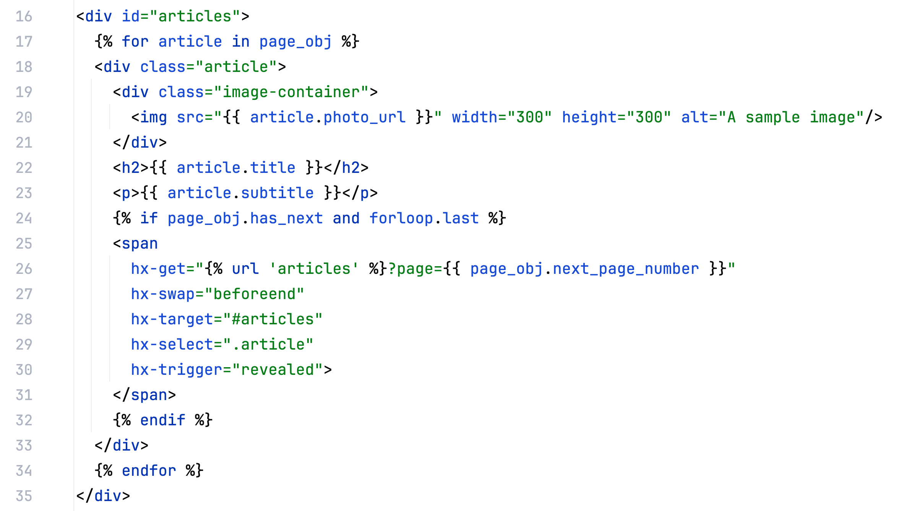

[django-debug-toolbar](https://django-debug-toolbar.readthedocs.io/en/latest/installation.html) is telling you your "DOM loading" is slow...

What does that even mean?

_Note: This article covers one use case for htmx. We won't go into 'how to' but provide links on where to get started (googling "django htmx" will give you a lot more)._

## What is the DOM?

The Document Object Model (DOM) is a representation of the web page as a tree of nodes and objects.

Programs, such as Javascript, use this to update the page structure, style, and content.

Lots of elements? BIG tree.

## Don't load everything at once

In my list view, I was trying to load all articles onto the page at once... 22,000 of them.

You can limit this by using [pagination](https://docs.djangoproject.com/en/5.0/topics/pagination/). From 22,000 articles, down to 10.

But... now you have to think about navigating between pages.

## Sprinkle in htmx

We can use htmx to load the next page once the last item of the previous page is scrolled into view.

This creates an infinite scroll effect that's also super speedy!

The attributes here are:

- [`hx-get`](https://htmx.org/attributes/hx-get/): the URL the element will use to issue an AJAX `GET` request to.
- [`hx-target`](https://htmx.org/attributes/hx-target/): the element for swapping in the AJAX response, default is the `innerHTML` of the one issuing the AJAX request.
- [`hx-swap`](https://htmx.org/attributes/hx-swap/): how the response will be swapped in relative to the target of an AJAX request, the default is `innerHTML`.
- [`hx-trigger`](https://htmx.org/attributes/hx-trigger/): what triggers an AJAX request.

In other words, `hx-get` is WHAT, `hx-target` is WHO, `hx-swap` is HOW and `hx-trigger` is WHEN.

_Note: [htmx](https://htmx.org) needs to be added as a script to the page._

## Summary

When your DOM takes too long to load...

- Don't load everything at once!
- Use htmx to load more elements _once they're needed_.
