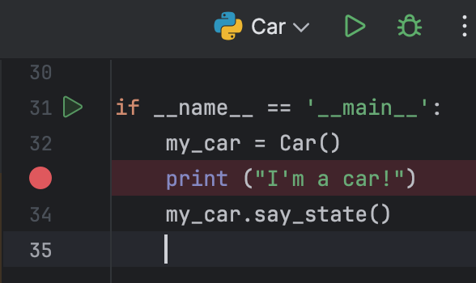
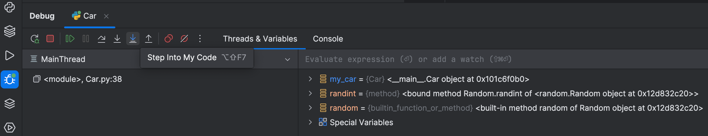
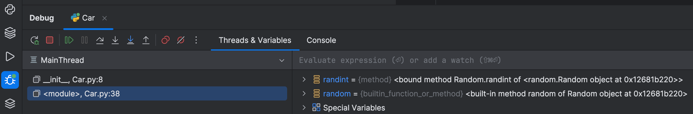
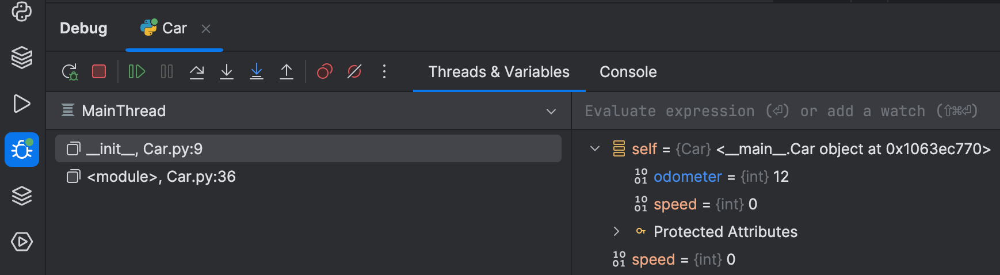

In the previous step, we saw how PyCharm refactoring can save you time by doing work for you.

In this step, we’ll look at PyCharm’s debugger, specifically how to use it to walk through your running code and to help you find and fix bugs.

## Breakpoints and Debug Session

Everything starts with a breakpoint. Breakpoints are markers that tell the debugger to suspend the execution of a program. To add and remove breakpoints click the gutter in the line where you want to add them. You can also add a breakpoint from the keyboard by leaving the caret at the end of the line and pressing <kbd>⌘F8</kbd> (macOS) / <kbd>Ctrl+F8</kbd> (Windows/Linux).

In this example we are adding a breakpoint to this `if` statement inside our loop, so the program will suspend the execution on each iteration. We can run the program with the debugger by clicking the little _bug_ button at the top of PyCharm. This runs the currently-selected configuration, but under the debugger.

Another way to run the program with the debugger is to right-click inside the editor and select **Debug name** and PyCharm will create a temporary Run Configuration and run it for you.

When you run a project in PyCharm using the debugger, it will open the _Debug_ tool window. When you click the URL in the Debug tool window, the execution is suspended, as the breakpoint was hit. You can now examine the program in its current state, control its execution, and test several scenarios at runtime.

## Debug Tool Window

The _Debug_ tool window has a few sections that are worth mentioning.

The first few buttons on the top menu bar allow you to:

- Re-run your application with the debugger
- Stop your program button when you are done with debugging and want the program to terminate
- Resume your program to move forward with its execution
- Pause the program's execution

The remaining buttons relate to stepping in, and out, of the code you're debugging as well as managing your breakpoints.

Sometimes, you need to walk through the execution of your code. You can _step into_ functions with the **Step Into** icon, but if that function belongs to Python, that isn't always particularly helpful! Instead you can use the **Step Into My Code** icon to step _into_ just your code rather than library code.

On the top there are two main areas:

- Threads & Variables
- Console

The debugger has a lot of power available to you. On the **Threads & Variables** tab you can see the stack frames that represent the current state of the program on the left side, and the variables panel with local values at that execution point on the right.

The stack frame on the left acts like a history of your program’s current state. New frames are added to the top of the stack each time a method is called, and removed when its execution is complete.

By examining it you can go back in time and understand when and why specific parameters were passed to a method, as well as the current state of the caller at the time of the call.

Stack frames from code outside your project like libraries, for instance, are in gray.

Let’s select the most recent frame. We can use the variable panel to see the current value assigned to any variables in our program. In this case, we can see that the value 12 is assigned to our ‘odometer’ variable.

If you don't want the distraction of looking away from your code, you can also see the values in the editor, as code comments.

While in the current context, you can also play around with your variables to obtain additional details about the program state or test different scenarios at runtime. For example, you can change the value of the variable.

Finally, we can click the Console tab to get the full Python console in the context of this point of the execution. Here you can start using the interactive prompt in the context of the current breakpoint and line.

## Conclusion

In this step, we saw PyCharm’s star attraction, the debugger. We covered what you need to be productive: breakpoints, the tool window layout, evaluating variables and expressions, and stepping through code. Check the [documentation](https://www.jetbrains.com/help/pycharm/debugging-python-code.html) for an in-depth understanding of debugging capabilities in PyCharm.

That's it, the end of the tutorial! We hope you found this useful and, that you enjoy using PyCharm!

## Video

You can also check out the video for this step from our Getting Started series on YouTube:
