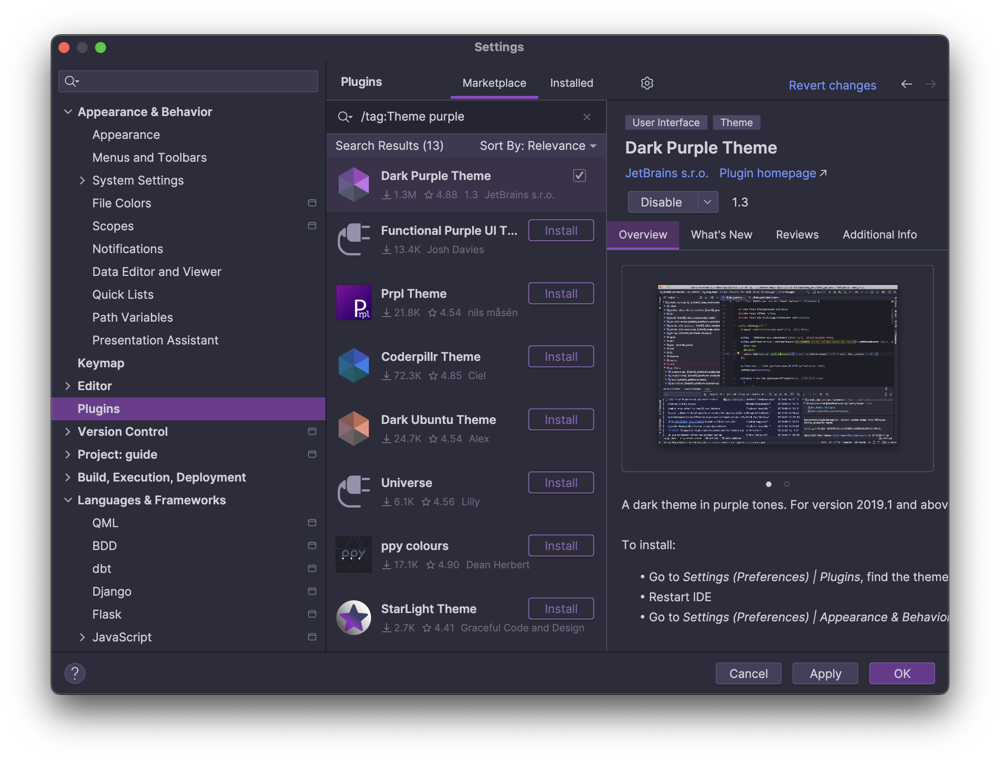
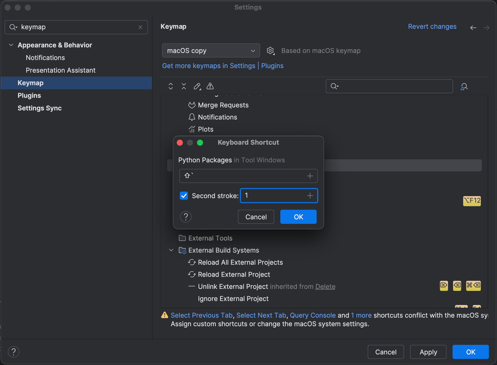

In the previous step, we took a tour of the PyCharm UI, in all its IDE glory.

Did you know you can strip down PyCharm’s IDE UI? Add a new theme and customize the keymap? Even install plugins?

## Themes

The very first thing you may want to do is change the UI theme. To do that, go to Preferences/Settings <kbd>⌘,</kbd> (macOS) / <kbd>Ctrl+Alt+S</kbd> (Windows/Linux) and navigate to the **Appearance** section on the left. You can see that PyCharm comes with some preinstalled themes, but there’s also a variety of custom ones to choose from. Let’s look in the **Plugins** section and search the marketplace for “theme”.

Let’s install one of the most popular themes, ”Dark Purple Theme”. PyCharm has now installed and switched to the community plugin for the Dark Purple theme.

What if you want to quickly check what the other themes you’ve installed look like? You can go back to Preferences/Settings and change the current theme in **Appearance & Behavior | Appearance** or the switcher <kbd>⌃\`</kbd> (macOS) / <kbd>Ctrl+\`</kbd> (Windows/Linux) to cycle through the themes.

## Layout

What if you don’t want it to look like an IDE at all? Let’s see how to get a lean UI while keeping the IDE. For example, if you want to make your workspace less cluttered, you can use the same switcher <kbd>⌃\`</kbd> (macOS) / <kbd>Ctrl+\`</kbd> (Windows/Linux) then select **5 View Mode** and select **Zen mode**. This can can be very helpful whenever you need to remove distractions and focus on your code.

You can also reposition tool windows and put them where you want them including having them floating on top of the editor or detached completely so that you can view it independently on a different monitor. If you don't like it you can always re-dock it. You can also hide and show some tool windows with keyboard shortcuts. The most common ones are:

Project tool window <kbd>⌘1</kbd> (macOS) / <kbd>Alt+1</kbd> (Windows/Linux)
Run tool window <kbd>⌘4</kbd> (macOS) / <kbd>Alt+4</kbd> (Windows/Linux)
Services tool window <kbd>⌘8</kbd> (macOS) / <kbd>Alt+8</kbd> (Windows/Linux)
VCS (usually Git) tool window <kbd>⌘9</kbd> (macOS) / <kbd>Alt+9</kbd> (Windows/Linux)

The fastest way to toggle the visibility of UI elements is the Find Action <kbd>⌘⇧A</kbd> (macOS) / <kbd>Ctrl+Shift+A</kbd> (Windows/Linux). For example, if you're not going to use breadcrumbs, and you don’t want to see them, you can use Find Action, search for “breadcrumbs,” and then turn them off from there.

## Keymap

You can modify your keymap in your Settings <kbd>⌘,</kbd> (macOS) / <kbd>Ctrl+Alt+S</kbd> (Windows/Linux) then search for "keyboard". Here you can choose the keymap you want to use, reassign existing shortcuts, and create custom shortcuts for the actions that don’t have anything associated with them.

Let’s say you want to know what shortcut is assigned to the _Python Packages_ action, which is under Tool Windows. This action doesn't have a key binding by default, but you can add one. Right-click on the action and choose **Add Keyboard Shortcut**.

Enter the keys you want to associate with the action and then when you use those keys it will invoke the action, in this case our Python Packages tool window.

If you don't know a shortcut, you can also find out what it is in the keymap settings by typing in part of the name into the action name. You'll see a listing of actions and the keybindings currently in use.

Of course, you can also change your entire keymap and install plugins for custom keymaps as well. Keeping your hands on the keyboard means customizing it to work the way you want and that's what PyCharm allows you to do.

## Other Customizations

Apart from themes and keymaps, there are lots of other things you may want to customize. If you don’t know where to find a specific setting, you can use Find Actions <kbd>⌘⇧A</kbd> (macOS) / <kbd>Ctrl+Shift+A</kbd> (Windows/Linux) to find it. For example, perhaps we want to change the default font.

You can also change things like your code style by searching for "python", then go to the Python section and make your changes there. For example, you can change the _Hard wrapping_ setting to wrap lines at 79 characters to follow the PEP-8 convention.

The Settings window has many options that let you make the IDE look however you want.

## Conclusion

In this step we went through some UI customization that will help you get more comfortable with PyCharm. Of course, PyCharm is an IDE and has multiple configurable settings. We’ve covered just the basics.

In the next step, we are going to see how to configure local and remote interpreters in PyCharm.

## Video

You can also check out the video for this step from our Getting Started series on YouTube:
