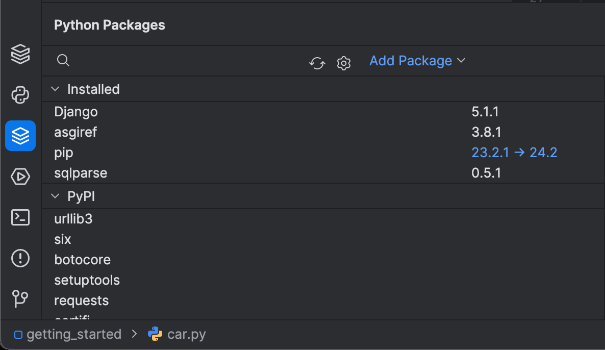
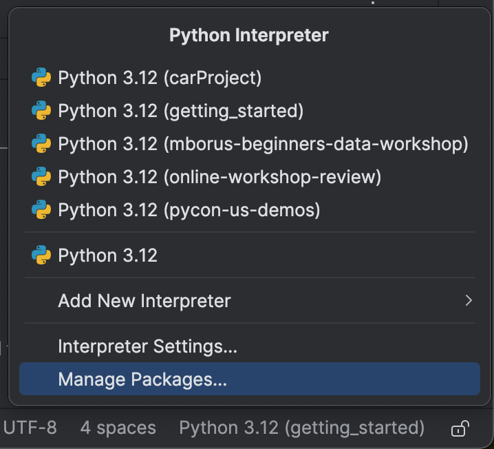
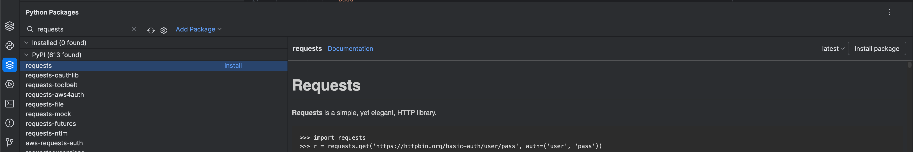
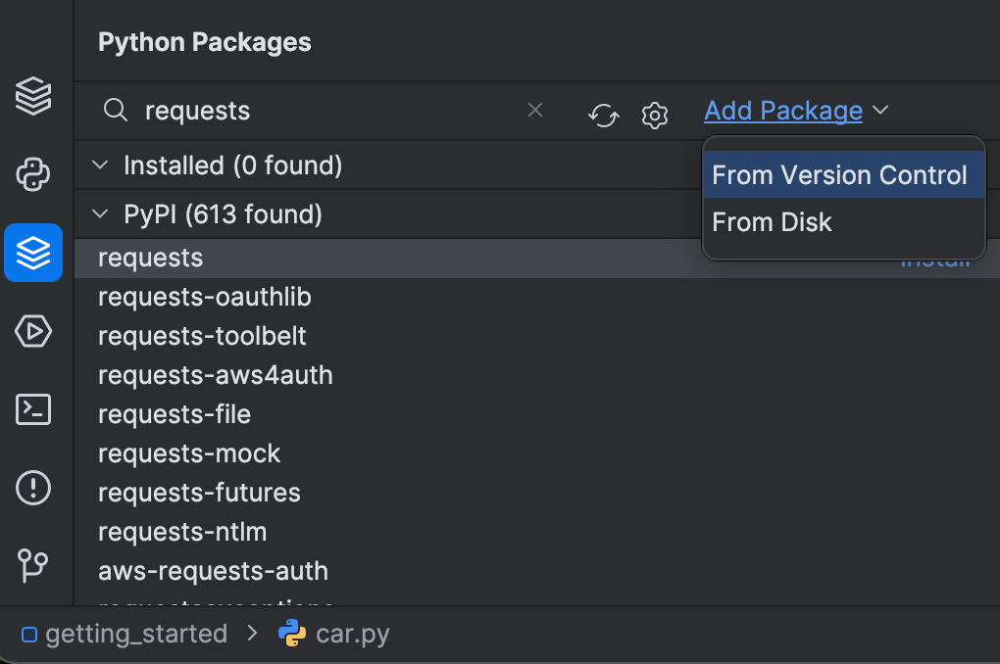

In the previous step, we set up a Python interpreter for our project. But sometimes our project depends on Python packages and getting those setup can be tricky.

## Package Tool Window

In 2021, PyCharm added a new _Packages_ tool window to help you see which Python packages are in your interpreter, as well as manage them. You can use this to see what packages PyCharm has installed, for example some will be installed if you select Flask as your project type such as the _Jinja2_ and _Flask_ packages.

It’s important to mention that these packages belong to the current virtual environment that PyCharm also created for this project.

In this case, a virtual environment in this project directory, based on Python 3.10. You can see this information by clicking on the Status Bar.

## Add PyPI Package

You can also browse and install PyPi packages such as _requests_; a very popular Python package. In the Packages tool window you can type in _requests_ and PyCharm will search the PyPi repository and return the most relevant packages that match your search.

If you click the package name, the PyPi documentation for this package is shown on the right-hand side. Not all minor packages have PyPi documentation so in some cases it will not be available.

To install the package, you can click **Install** which will use the latest stable version of the package. You don't need to install it using the command line. You can also select a specific version to install if you need to.

If you now check your list of installed packages, _requests_ is there, ready to be imported and used in our scripts. You might also want to delete a package. In this case, you need to click the three dots and then select **Delete package**.

PyCharm can manage local or remote environments, pip vs. conda vs. pipenv vs. poetry, and more!

## Add Repository Package

We've covered how to install packages from PyPi, but you might also want to install packages from a version control system like GitHub or from your local machine. In this case, you can click **Add packages** in the Package tool window, and then you have two options:

- Add packages from version control
  - Select the version control system that you're using and specify a path to the target repository.
- Add packages from your local disk
  - You can provide the local path to your package directory or an archive.

In both cases, you can select the **-e** checkbox to install the package in _editable_ mode.

## Conclusion

You just saw how easy it is to install and manage Python packages in PyCharm. Another quick tip is that sometimes people install Python packages from the local terminal without having the virtual environment activated. In this case, when you import the package using PyCharm, you will see a red squiggly line and an error saying ‘No module named requests’, for example. You can prevent this kind of error by using PyCharm to install and upgrade your packages.

In the next step, we’ll see some basic code assistance tips that will boost your productivity in PyCharm.

## Video

You can also check out the video for this step from our Getting Started series on YouTube:
