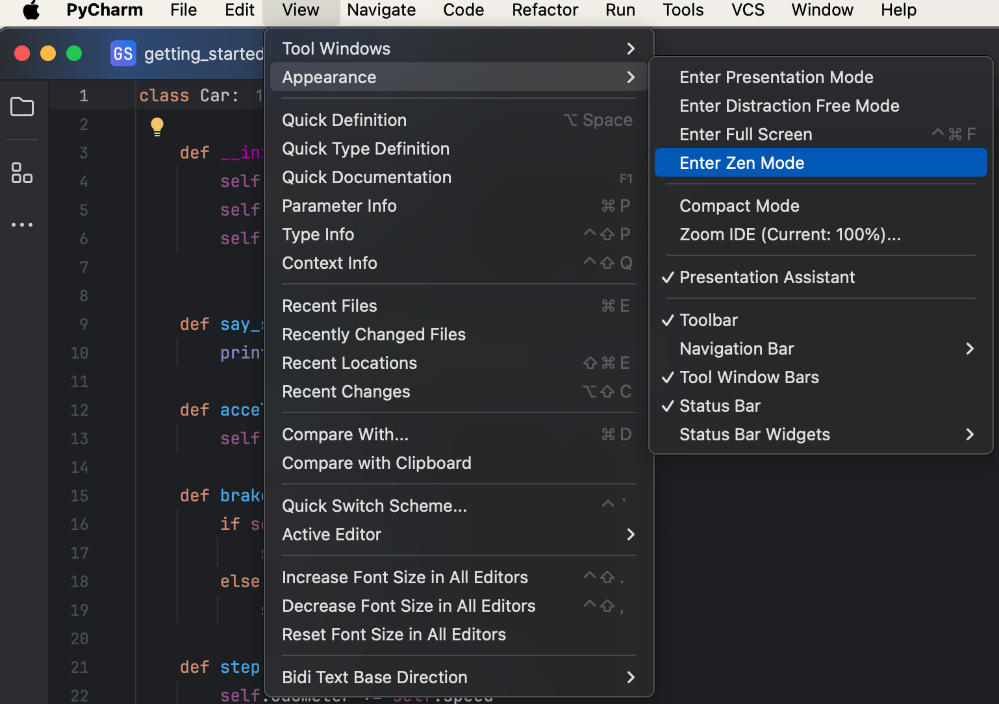
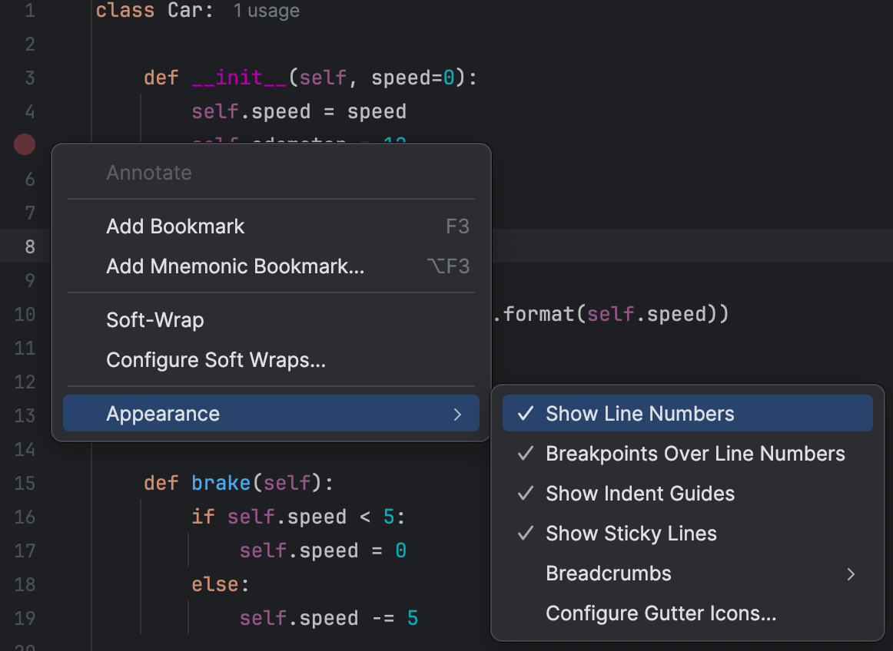
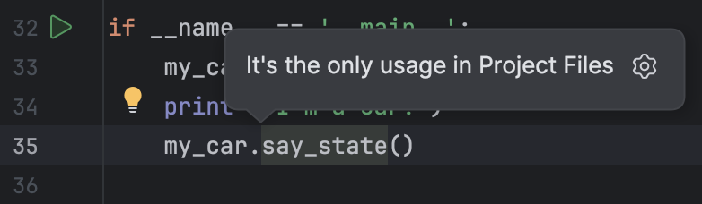
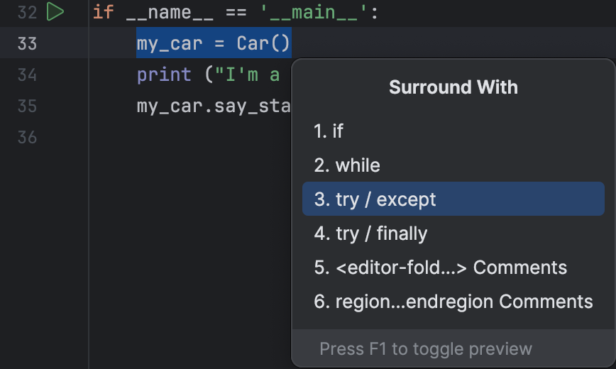
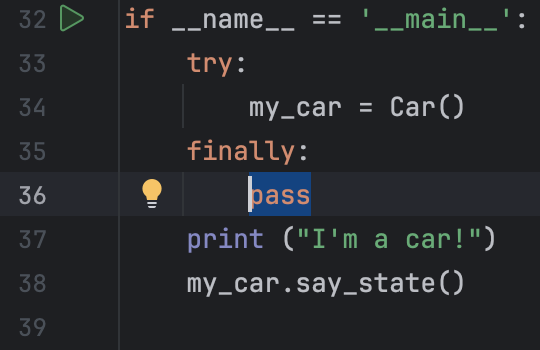
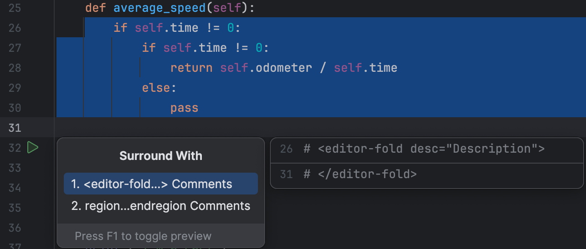
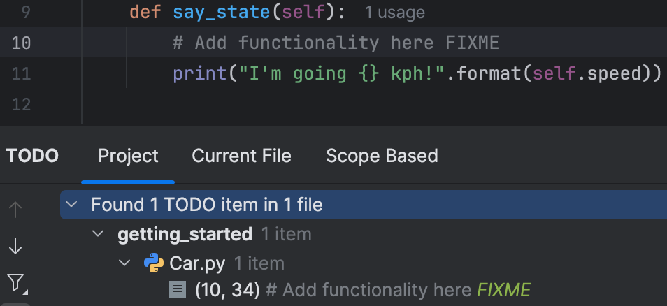
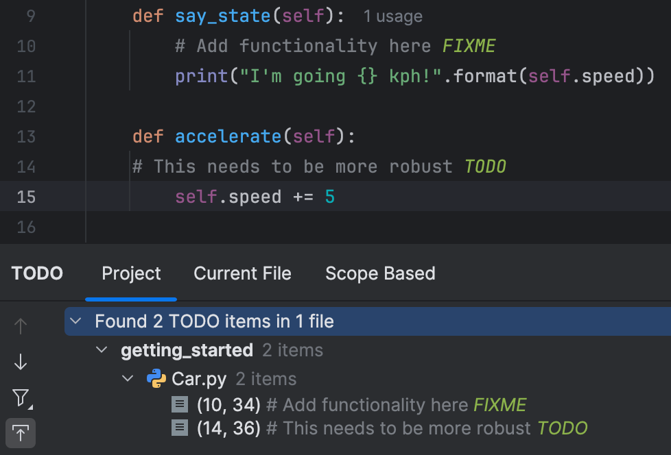
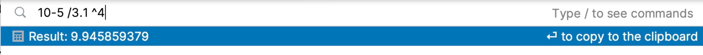
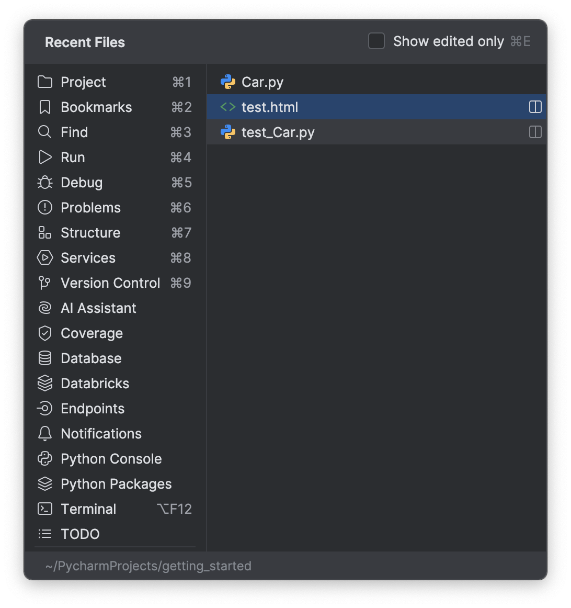

In the previous step, we saw how you can use PyCharm to get help with writing your tests. In this step, we're going to look at some tips for your productivity.

## Zen Mode

Sometimes you just want to get rid of everything and focus on your code! You could of course close toolbars one by one with your mouse, or you could use the keyboard shortcuts to close each one.

But the best way is to get a code only view is with View | Appearance | Enter Zen mode.

If you're fond of your line numbers, you can get them back by right-clicking in the gutter and selecting Appearance | Show line numbers.

You can leave Zen Mode with the same menu by selecting View | Appearance | Exit Zen Mode.

So next time you need some headspace, consider using Zen mode to full screen your IDE with nothing but the code.

## Code Navigation

It can be challenging to find your way around larger production codebases, but PyCharm can help you here.

You can use (**⌘B** | **Ctrl+B**) to Go to Declaration or Usages. Here we can see that `question_text` has several usages and we can select one to view it.

Another way to navigate your code is with Go to Implementation <kbd>⌥⌘B</kbd> (macOS) / <kbd>Ctrl+Alt+B</kbd> (Windows/Linux).

Another top tip is to use <kbd>⌘\[</kbd> (macOS) / <kbd>Ctrl+Alt+Left Arrow</kbd> (Windows/Linux) to navigate backwards in your code and <kbd>⌘\]</kbd> (macOS) / <kbd>Ctrl+Alt+Right Arrow</kbd> (Windows/Linux) in the order you navigated through it.

Navigating your code in this manner is a great way to build up your mental model of the functional aspects of the code base rather than digging through sequentially.

## Source Code Generation

You can use <kbd>⌘N</kbd> (macOS) / <kbd>Alt+Insert</kbd> (Windows/Linux) to get PyCharm to offer code relevant for the context. PyCharm will always try and do the right thing based on what you’re typing. This might be through different types of completion, or live templates.

Next time you think you need to type out some constructs, go ahead and see what PyCharm can help you with so you can concentrate on the fun stuff.

## Surround With

Our next stop on this tour is _Surround With_. Consider this Python code for the question variable.

We can use _Surround With_ and then select `try/finally` and PyCharm will fill in the code construct for us.

How about this HTML code here.

We can use _Surround With_ the same functionality again to wrap `question.question_text` in a Django template.

Let’s say you want to hide this code so you can focus on a smaller subset of the file.

Once again use “surround with” and this time select &lt;Editor Fold&gt;There are more contexts that you can use surround with in including XML, HTML and Javascript.

## TODO List

Sometimes you might need to come back to some code in the future, but you don’t want to hold that information in your head. For example, you want to come back to a line in the future you can add `FIXME`.

When you subsequently open your TODO tool window, the comment that includes the phrase FIXME appears.

The TODO tool window shows both `TODO` and `FIXME` comments, so you can keep track of all those tasks we need to come back to.

## Search Everywhere, Find Action and Find Recent Files

To use Search Everywhere, use <kbd>⇧⇧</kbd> (macOS) / <kbd>Shift+Shift</kbd> (Windows/Linux) and start typing the thing you’re looking for, for example _Editor Tabs_. You can toggle anything that's an action on or off here.

As you tab along the top of the dialog you can filter what you’re looking for, including Git commits.

You can also do basic calculations in PyCharm within the Search Everywhere dialog.

You can search just for actions with <kbd>⌘⇧A</kbd> (macOS) / <kbd>Ctrl+Shift+A</kbd> (Windows/Linux). For example, if you type in ‘zen’ and then press Enter, PyCharm will enter Zen mode. You can exit it the same way.

Note that you can access Find Actions from the Search Everywhere dialog, either route is valid, it’s whatever works for you.

## Find Files/Locations

You probably don’t need to work with all the files at the same time so your IDE can help you to load just a small portion of them as your Recent Files.

Recent Files <kbd>⌘E</kbd> (macOS) / <kbd>Ctrl+E</kbd> (Windows/Linux) shows you all the files you’ve accessed recently.

You can use this checkbox on the top right to further filter that list to edited files too.

Similar to Recent Files is Recent Locations <kbd>⌘⇧E</kbd> (macOS) / <kbd>Ctrl+Shift+E</kbd> (Windows/Linux). This shortcut is helpful if you have some really long files in your project and saves you scrolling through them.

## Conclusion

Congratulations! You've just learned about lots of ways to increase your productivity in PyCharm!

## Video

You can also check out the video for this step from our Getting Started series on YouTube:
