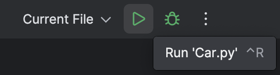
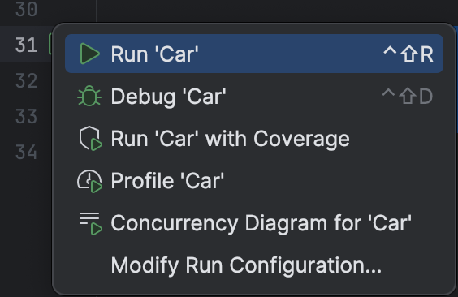
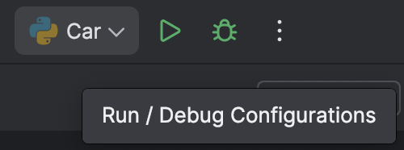
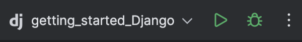
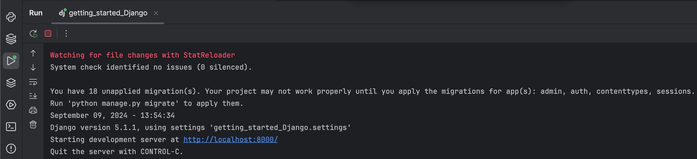
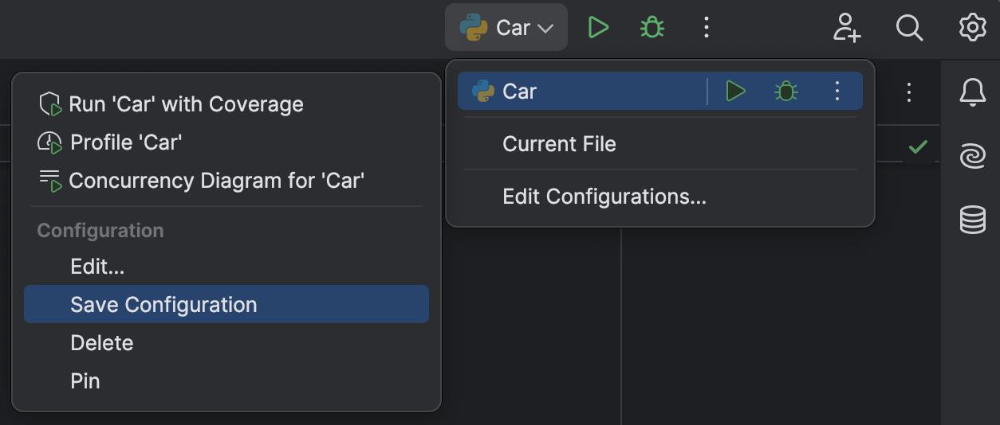
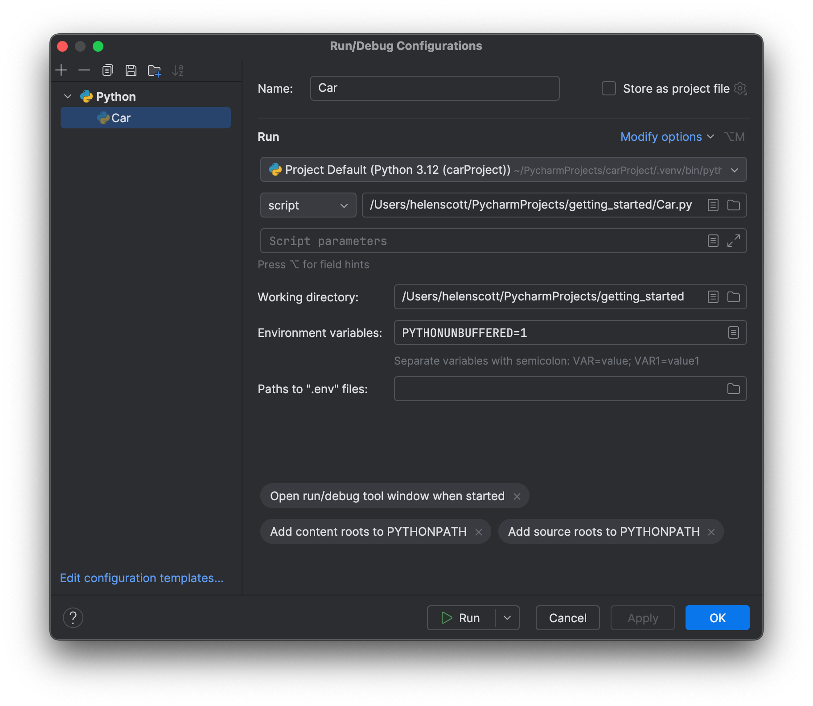

In the previous step, we saw how PyCharm makes coding productive.

In this step, we are going to talk about Run Configurations and how PyCharm helps you to run your Python code.

## Temporary Run Configurations

First off, let’s talk about temporary Run Configurations. If you haven't run your pure Python script yet, you can just click the green run arrow in the top menu bar:



If PyCharm can figure out what you want to run, it will execute the Python but you won't get a temporary run configuration created. The same is true if you right-click anywhere inside the editor and click **Run script name**. PyCharm will run the script, and display the output inside the _Run_ tool window. The _Run_ tool window is useful to see your output, as well as more comprehensive error messages if the Python interpreter finds an error in your program.

Alternatively If you scroll down to the end of the file, you can see that we have an `if __name__ == '__main__'` block, specifically:

```
if __name__ == '__main__':
    my_car = Car()
    print ("I'm a car!")
    my_car.say_state()
```

and it has a _play_ icon in the gutter. This is a shortcut to create a temporary Run Configuration. When you click it, a context menu shows up, and the first option says **Run &lt; name of your script &gt;**.



Using the **Play** button will also create a temporary Run Configuration as well as displaying the output inside the Run tool window.



## Configurations From Project Templates

Let’s look at explicitly creating a Run Configuration. The previous scenario applies for both PyCharm and PyCharm with Pro subscription, but this option is only available for with a PyCharm Pro subscription.

In an empty Django project, you can see that the Run Configurations button already shows the project name and a _Django_ logo. This is because PyCharm with Pro subscription has already created a basic Run Configuration, special for Django.



When you click the **play** button, PyCharm launches the Django project, including a web server, so you can click the link in the Run tool window and see your Django project.



PyCharm with Pro subscription also creates configurations for your Flask projects, FastAPI projects, and projects based on other frameworks.

## Permanent Run Configurations

Many times in your development workflow you will need to configure different startup points for your application, including, for example, executing your script with different Python interpreters. This is when your permanent Run Configurations come in handy.

The easiest way to do it is by transforming a temporary Run Configuration into a permanent one by clicking the drop-down menu and selecting **Save project name Configuration**.



You can also use pre-configured templates to create your Run Configurations by opening the **Edit configurations** dialog and clicking on the **plus** button. You can then choose the target you are creating Run Configurations for. You can then choose the Run Configuration targets.



## Conclusion

We saw how to quickly run our Python scripts with temporary Run Configurations, and why sometimes it is handy to create permanent ones.

In the next step, we’ll talk about basic code refactoring in PyCharm.

## Video

You can also check out the video for this step from our Getting Started series on YouTube:
