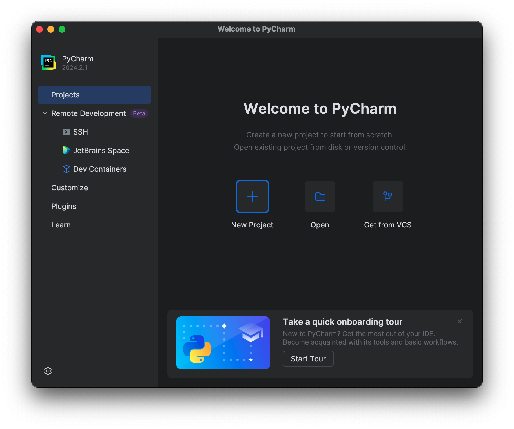
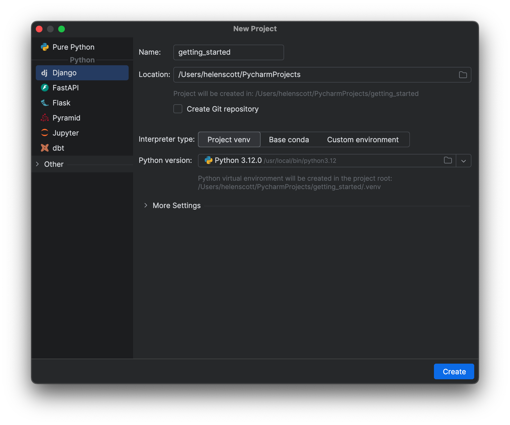

In the previous step, we stopped on the Welcome Screen’s Projects tab.

But...what’s a project and how does it help you? What kinds of projects does PyCharm support? How do you start working with projects that might need a virtual environment?

## Why "Projects"?

Let's say you need to make a _project_. This is a major difference between an IDE like PyCharm and text editors.

PyCharm is great at analyzing all of your code in a project and then making you really productive at moving around, editing, bulk refactoring, warnings about problems and more.

But your coding isn’t just editing files. You have development workflows too; running code, debugging code, Python console, system terminal, tests, coverage, profiling, version control, databases, frontends... etc. The project is your central view of all of this for your code, in a consistent, quality, familiar UI.

## Starting a Project

Now, back to where we left off on the Welcome Screen and the “Projects” tab. If you’ve already worked on a project, the welcome screen will look a bit different. It will have a list of your recent projects in the center but the options will stay the same.

There are three available options on this screen.

First, you can get an existing project from version control like GitHub, for example. You could then paste a repository URL in and click **Clone**.

Secondly, you can open a project stored on your machine by navigating to your local drive and finding a project you want to work on. Then, select it and click **Open**.

Finally, you can create a new project which is what we will do in this tutorial.

Now that we decided to create a new project, you can see the first difference between PyCharm and PyCharm with Pro subscription. If you are using PyCharm with Pro subscription you can take advantage of project types. Project types are pre-configured environments that automate the project-creation by setting technology-specific preferences, downloading dependencies, creating required files, etc.

PyCharm without Pro subscription is for pure Python only, you won’t see these options on the left side. In PyCharm with Pro subscription, on the other hand, there are several technologies that you can choose from. You can also select ‘Pure Python’ if all you want to do is work on a pure Python project.

If your work requires a Python web framework, or scientific tools, or maybe front-end technologies, you have some options. For example, if you are working with a Python Web project, PyCharm supports popular frameworks such as Django and Flask out of the box. If you're working in the field of data science you can use the scientific tooling setup. It will create both a Conda environment and the folder structure for you. Finally, if you want to work on the front-end, PyCharm with Pro subscription also has professional support for working with JavaScript, TypeScript, and its related technologies, including Angular and React.

In this tutorial, we are going to start working on a Django project which we will call _getting_started_. We now need to take a detour and cover virtual environments.

## Interpreters

In Python projects, it’s a best practice to do your work by creating a _virtual environment_. Each project then acts like it has its own Python. If you install some packages in one project, it won’t break another project.

PyCharm takes care of this part by creating and activating a virtual environment for your new project. Back to our New Project screen, we have a section called **Python Interpreter: New Virtualenv environment**. In our case, we are going to create a new one using _virtualenv_, but as you can see here PyCharm also supports _PipEnv_ and _Conda_ out of the box.

We already have Python 3.10 installed as my default Python. PyCharm detected it, so we can click **Create**.

PyCharm will now create a new Django project for you as well as creating and activating a virtual environment, downloading all the required dependencies, generating an empty Django project with configuration files, creating run and debug configurations, and more.

If you close this project, you go back to the PyCharm Welcome Screen where you can see that the _Projects tab_ has changed slightly. Now you see your recent projects, and this list will grow as you have more projects.

## Conclusion

In this step we learned about projects, and how to start a new project in PyCharm.

In the next step, we are going to dive into PyCharm’s UI so you’ll feel more comfortable starting your code journey right away.

## Video

You can also check out the video for this step from our Getting Started series on YouTube:
