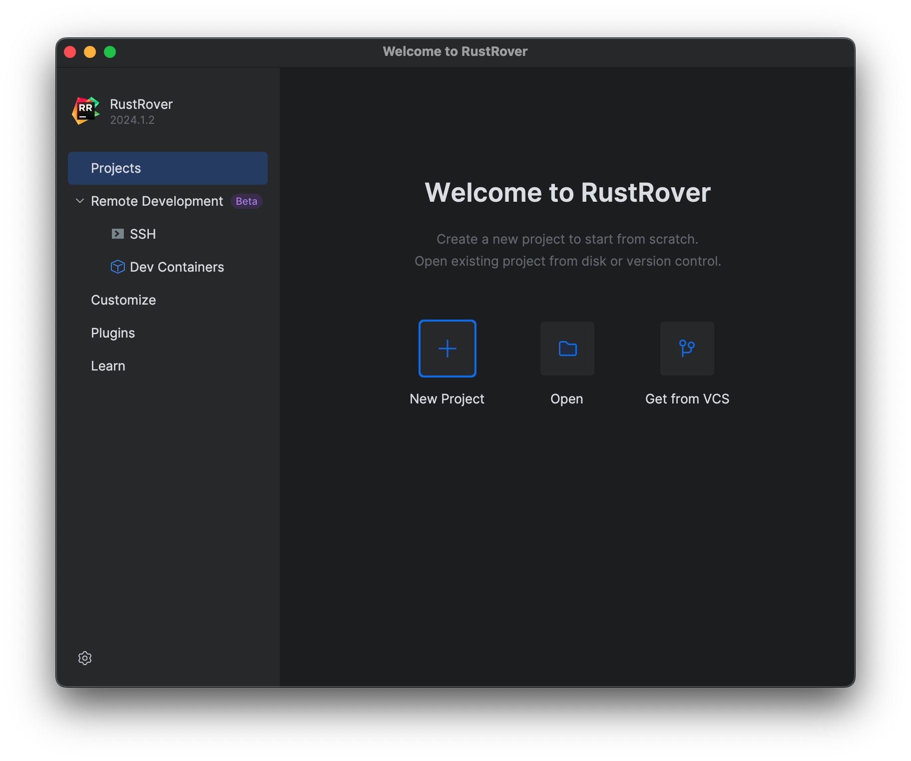
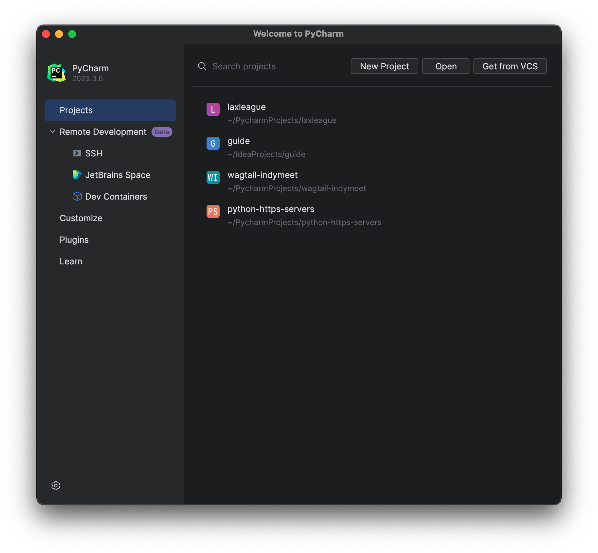
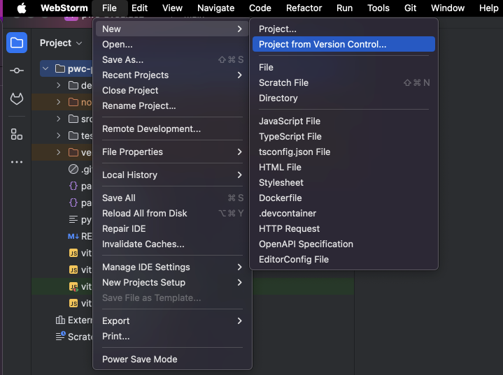
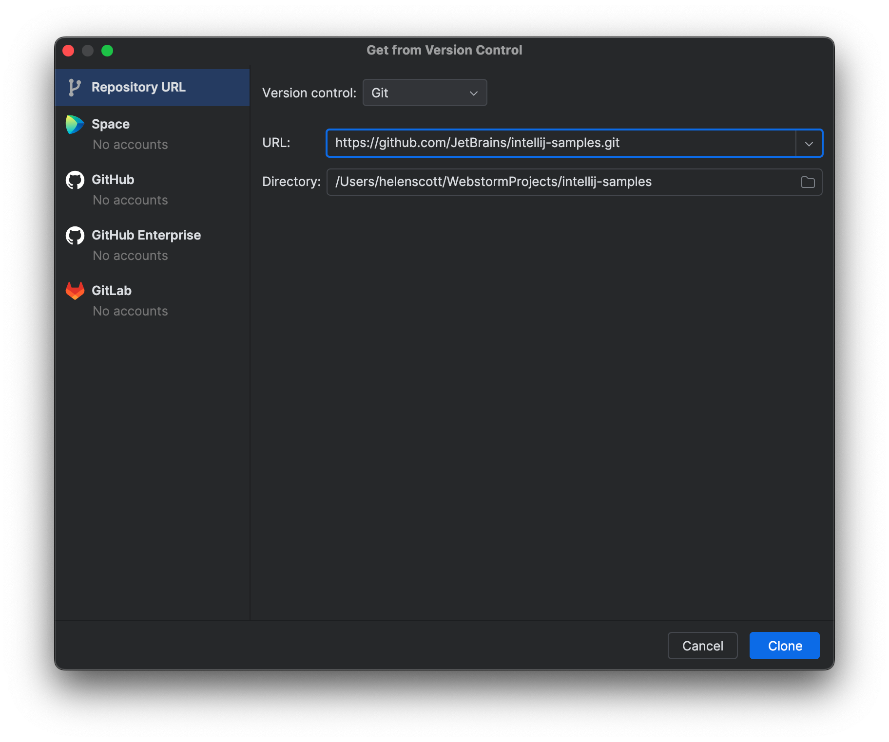

## The Problem

You want to work on a project that's hosted in GitHub, but how do you get it from there on to your machine?

## The Solution

The first step is to get the link from GitHub. Navigate to [https://github.com/](https://github.com/) and navigate to the project that you want to use to create your project locally. You normally want to clone the _main_ branch which will be selected by default. Click the green **Code** button and leave it on the default of _Local_. Click the icon to the right of the HTTPS link to copy the code to your clipboard:

Now you have three choices for pasting it into your IDE.

1. If this is your first time opening your JetBrains IDE, you'll see this welcome screen. The **Get from VCS** option is the button on the right:

2. If you have already opened some projects, perhaps locally, you'll see this screen instead. The **Get from VCS** option is a button on the top right.

3. Alternatively, if you are already in a project, you can access the **Project from Version Control** option either from the **File** menu or from the **File** > **New** menu depending on the IDE.

Paste the link that you copied from GitHub into the dialog box that opens when you choose one of these options:

And then click **Clone**. The clone action copies the entire repository to your local machine including all the files, branches and commits.

And that's it, you can now work on the project locally, perhaps your first step is to make a branch!
