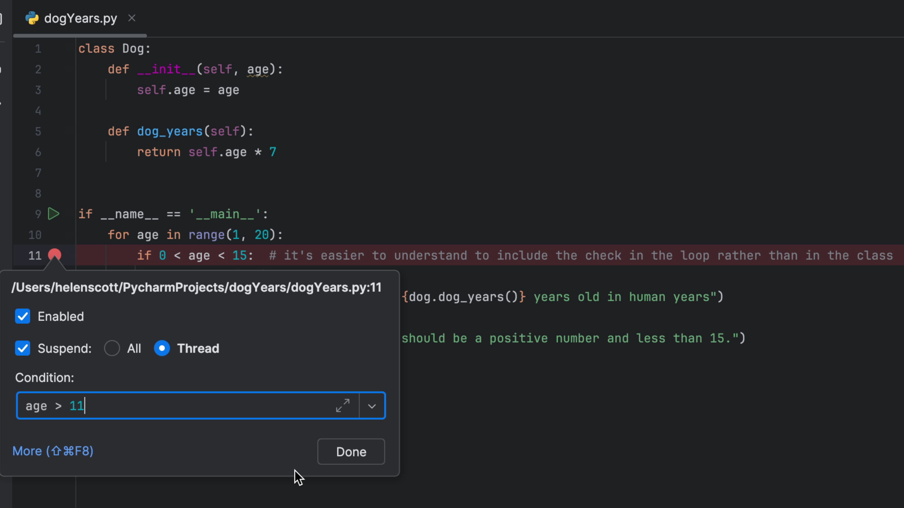
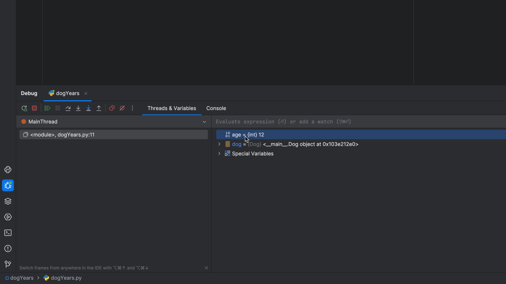
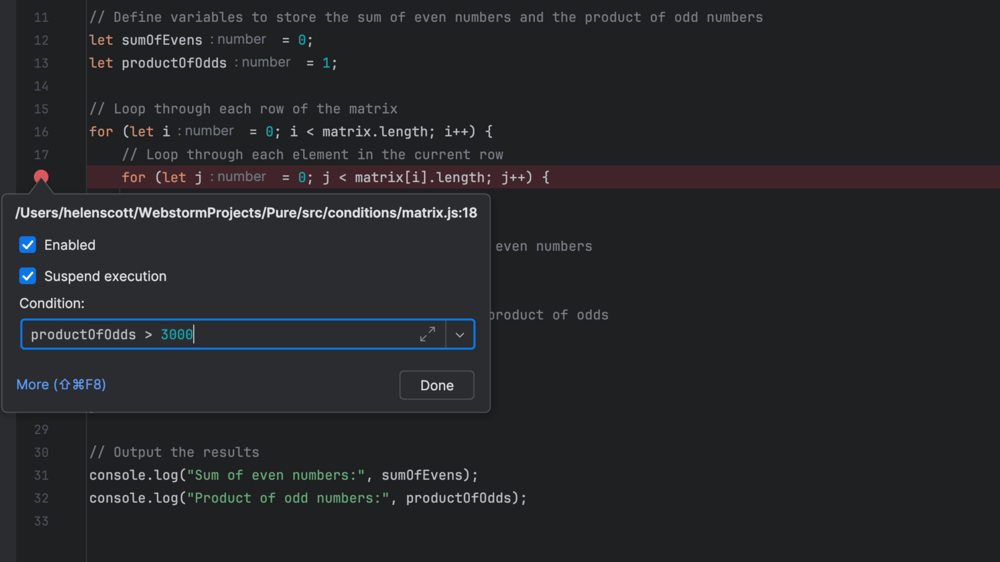
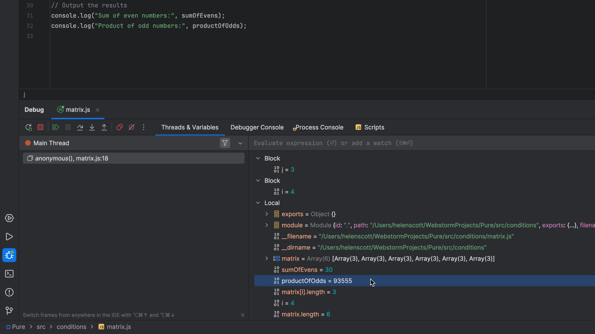

## The Problem

You have a bug in your code, but it's only happening when you've run through a certain number of iterations, or a certain condition is true. You don't want to sit there and click
**Step Over** twenty thousand times, so what can you do?

## The Solution

You can use the _Condition_ property on the breakpoint to enter a boolean value and tell the debugger to stop when that condition becomes true.

Place your caret on the line you want to investigate and then invoke "Toggle Breakpoint" <kbd>⌘F8</kbd> (macOS) / <kbd>Ctrl+F8</kbd> (Windows/Linux). Right-click on the breakpoint and enter a value that evaluates to a boolean and click **Done**:

Invoke "Debug" with <kbd>⌃D</kbd> (macOS) / <kbd>Shift+F9</kbd> (Windows/Linux) and note that the debugger now stops when the condition is true:

This works in any JetBrains IDE. You can also hover your mouse over the line numbers in the gutter, right-click and select **Add Conditional Breakpoint**, once again entering a boolean expression in the _Condition_ property and clicking **Done**:

Once again, the debugger will stop when your condition evaluates to true:

Side note here, if you prefer the debug icon to be adjacent to your line number rather than on top of it, you can right-click in the gutter and select
**Appearance** and then clear **Breakpoints Over Line Numbers** to configure it.
