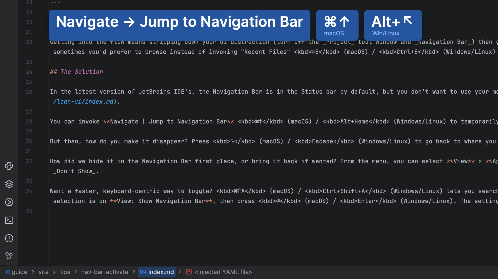
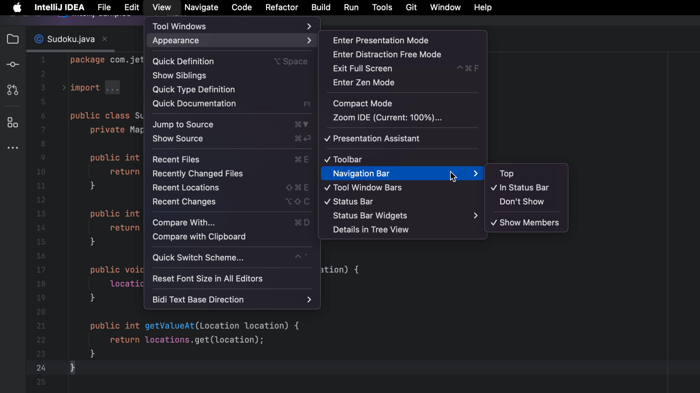

## The Problem

Getting into the flow means stripping down your UI distraction (turn off the _Project_ tool window and _Navigation Bar_) then going _keyboard-centric_ to avoid the mouse. But you still need to get to your files, and sometimes you'd prefer to browse instead of invoking "Recent Files" <kbd>⌘E</kbd> (macOS) / <kbd>Ctrl+E</kbd> (Windows/Linux) or "Find File" <kbd>⌘⇧O</kbd> (macOS) / <kbd>Ctrl+Shift+N</kbd> (Windows/Linux) action.

## The Solution

In the latest version of JetBrains IDE's, the Navigation Bar is in the Status bar by default, but you don't want to use your mouse to get there, or perhaps you've already hidden it altogether as part of a [lean UI](../lean-ui/).

You can invoke **Navigate | Jump to Navigation Bar** <kbd>⌘↑</kbd> (macOS) / <kbd>Alt+Home</kbd> (Windows/Linux) to temporarily re-activate the Navigation Bar. Once you use it, the window disappears.

But then, how do you make it disappear? Press <kbd>␛</kbd> (macOS) / <kbd>Escape</kbd> (Windows/Linux) to go back to where you were working.

How did we hide it in the Navigation Bar first place, or bring it back if wanted? From the menu, you can select **View** > **Appearance** > **Navigation Bar** which allows you to toggle between _Top_, _In Status Bar_ and _Don't Show_.

Want a faster, keyboard-centric way to toggle? <kbd>⌘⇧A</kbd> (macOS) / <kbd>Ctrl+Shift+A</kbd> (Windows/Linux) lets you search for such settings and even toggle inline. Type `vi nav` to speed search, make sure the selection is on **View: Show Navigation Bar**, then press <kbd>⏎</kbd> (macOS) / <kbd>Enter</kbd> (Windows/Linux). The setting is toggled...no mouse usage needed.

If you want to know what else the Navigation Bar can do, check out [Navigating Like a Pro](https://youtu.be/zK7Q8dVE-g8).
