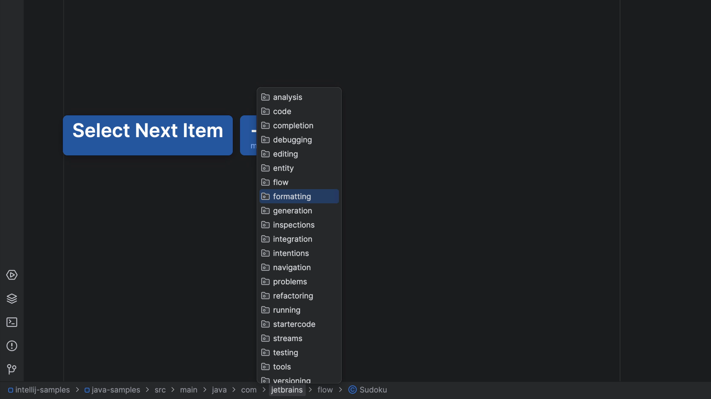
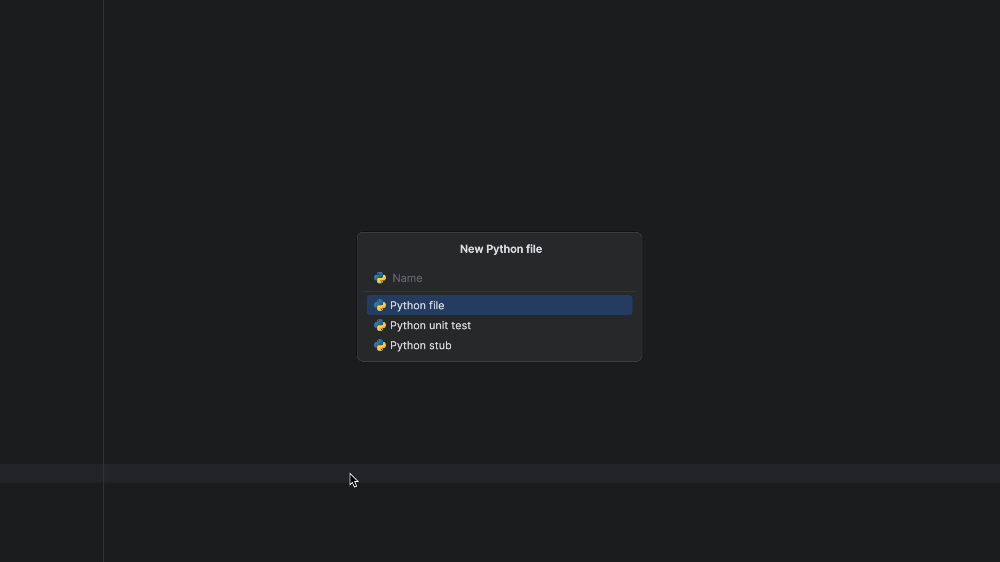

## The Problem

How can I create a file if I've turned off the Project tool window? Let the Navigation Bar be your one-stop replacement for the Project Tool window!

## The Solution

In your JetBrains IDE, [invoke the "Navigation Bar"](../nav-bar-activate/index.md) with <kbd>⌘↑</kbd> (macOS) / <kbd>Alt+Home</kbd> (Windows/Linux)

You can now:

- Use the cursor keys to get to the target directory
- Speed search to select any subdirectories

Once you have selected your target, use <kbd>⌘N</kbd> (macOS) / <kbd>Alt+Insert</kbd> (Windows/Linux) to bring up the new file dialog. Just like in the Project tool window, the new file is opened after creation.

Also like the Project tool window, your selection doesn't have to be on a directory. If you're on a file, the new file will be created as a sibling. This is particularly useful in the common case of creating a new file in the current directory:

- Activating the navigation bar highlights the current file.
- Immediately press **New** <kbd>⌘N</kbd> (macOS) / <kbd>Alt+Insert</kbd> (Windows/Linux)

In summary, after two key combos, you have a new sibling file, with no permanent file tree visible and no popups to close afterward. That's what getting in the flow is about.

