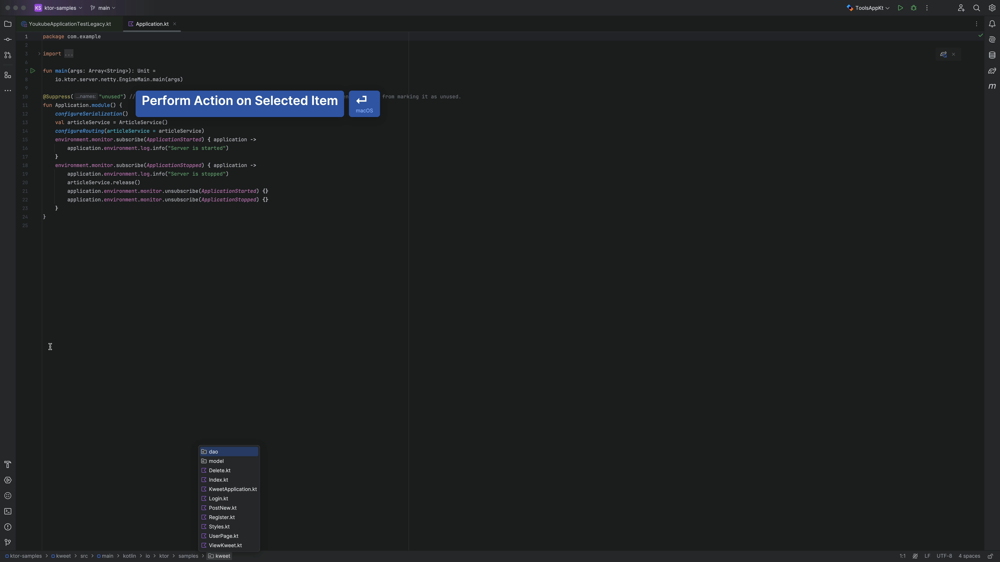
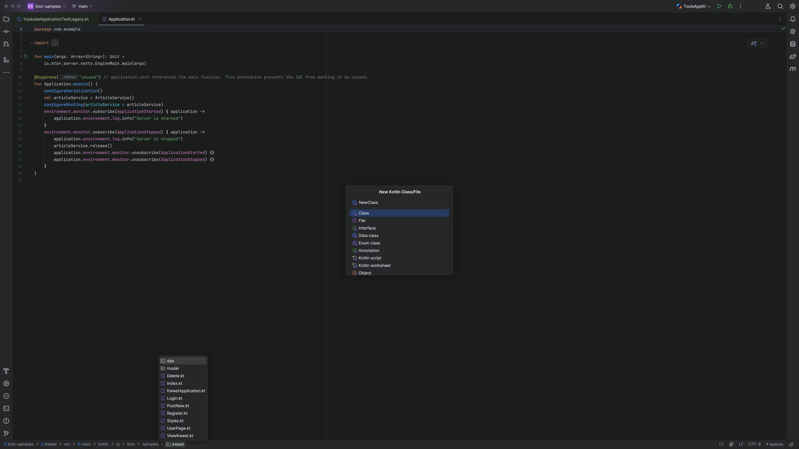
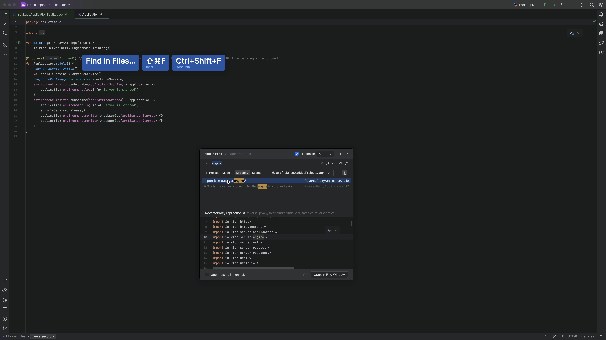
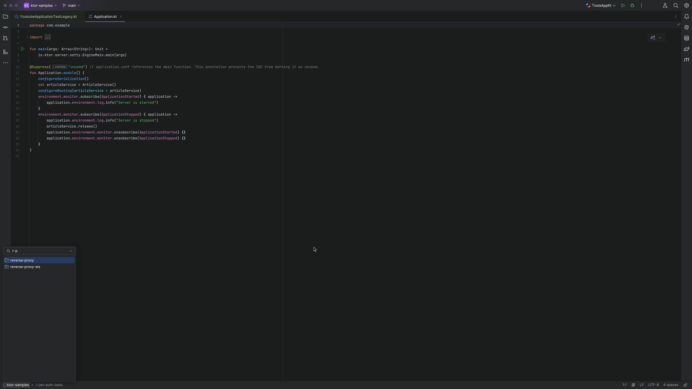
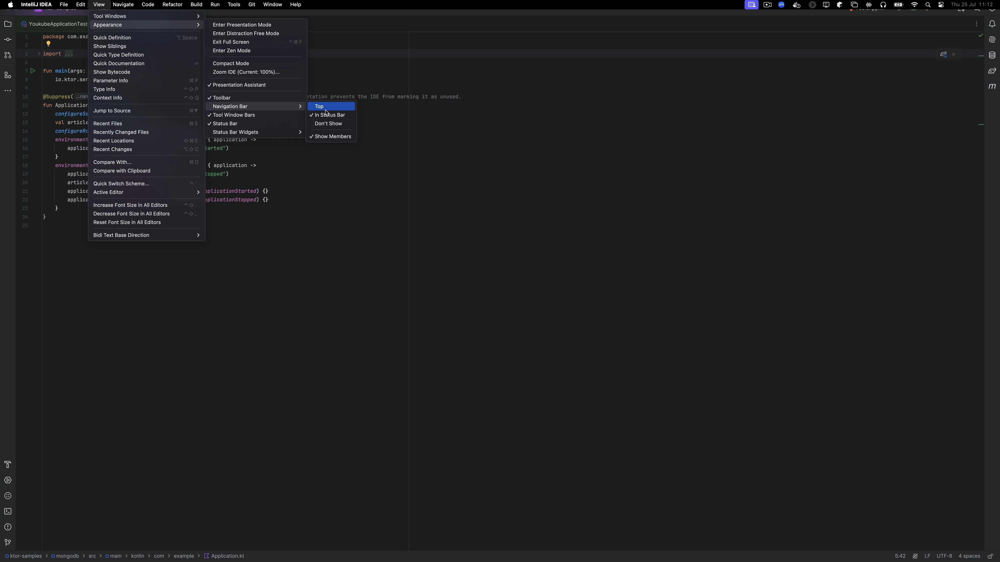

## The Problem

Have you ever used your Navigation Bar in anger? 🫨 Did you know you can use it to:

- Open files
- Create new files
- Limit the scope of find in files
- Speed search across any location

No? Let's start with the basics then! 🗄️

### Open existing files

Invoke the Navigation Bar with <kbd>⌘↑</kbd> (macOS) / <kbd>Alt+Home</kbd> (Windows/Linux) and then use the arrow keys to find the directory your file is in, select it and press <kbd>⏎</kbd> (macOS) / <kbd>Enter</kbd> (Windows/Linux) to open it.

New files when you want them where you want them? Yup! 🆕

### Create new files

Invoke the Navigation Bar with <kbd>⌘↑</kbd> (macOS) / <kbd>Alt+Home</kbd> (Windows/Linux) and then use the arrow keys to find where you want to place your new file.

If you have another file selected, your new file will be a sibling to that file in the same location. If you have a directory selected, your new file will be placed in that directory.

Invoke New File with <kbd>⌘N</kbd> (macOS) / <kbd>Alt+Insert</kbd> (Windows/Linux) and away you go.

Limiting the search scope for efficiency? Yup! 🔎

### Limit the scope for searching

Invoke the Navigation Bar with <kbd>⌘↑</kbd> (macOS) / <kbd>Alt+Home</kbd> (Windows/Linux) and then use the arrow keys to find the directory that you want to search.

Invoke Find in Files with <kbd>⌘⇧F</kbd> (macOS) / <kbd>Ctrl+Shift+F</kbd> (Windows/Linux) and your search is limited to that directory.

Typing less and getting the right result? Yup! ⌨ ️

### Use speed search

Invoke the Navigation Bar with <kbd>⌘↑</kbd> (macOS) / <kbd>Alt+Home</kbd> (Windows/Linux) and then use [speed search](https://www.jetbrains.com/help/idea/speed-search-in-the-tool-windows.html) to find what you're looking for. For example you could type `PCA` to find `PetClinicApplication`. Less is more!

Hide it when you want to? Yup! 😅

### Show/Hide it

The Navigation Bar is really helpful for moving around your project efficiently, but if you really want to, you can turn it off by going to **View > Appearance > Navigation Bar > Don't show**. Of course, you can turn it back on in exactly the same way!

