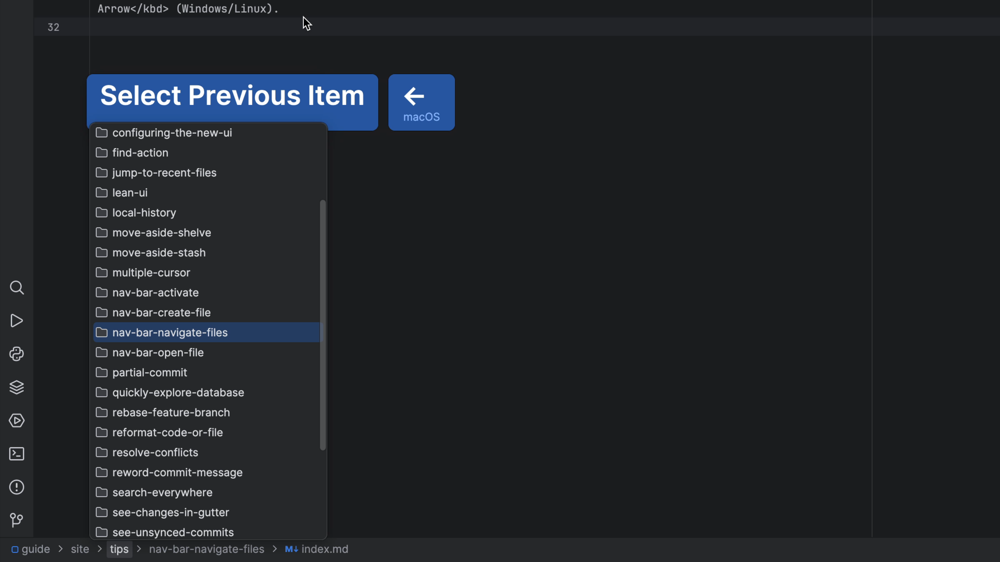

## The Problem

We've discussed "getting into the flow"... strip down the IDE to focus and don't take your hands off the keyboard. But if you've turned off your Project tool window, how can you navigate files and directories?

You could use the _Project_ action <kbd>⌘1</kbd> (macOS) / <kbd>Alt+1</kbd> (Windows/Linux) to bring back the Project tool, do your work, and then hide it again.

## The Solution

Instead, temporarily bring back the Navigation Bar then navigate it with the keyboard.In your JetBrains IDE, [invoke the "Navigation Bar"](../nav-bar-activate/index.md) with <kbd>⌘↑</kbd> (macOS) / <kbd>Alt+Home</kbd> (Windows/Linux).

You can use the left arrow to go up a directory and right arrow to go down a directory. To see the contents of a directory, either press the down arrow or press <kbd>⏎</kbd> (macOS) / <kbd>Enter</kbd> (Windows/Linux). With this you can get to any place in the tree, without using the mouse.

For looking at the directory the currently-edited file is in, this is even easier. Activating the Navigation Bar makes the current file selected. You don't have to press <kbd>←</kbd> (macOS) / <kbd>Up Arrow</kbd> (Windows/Linux) to select the parent directory. Just press <kbd>↓</kbd> (macOS) / <kbd>Down Arrow</kbd> (Windows/Linux).
