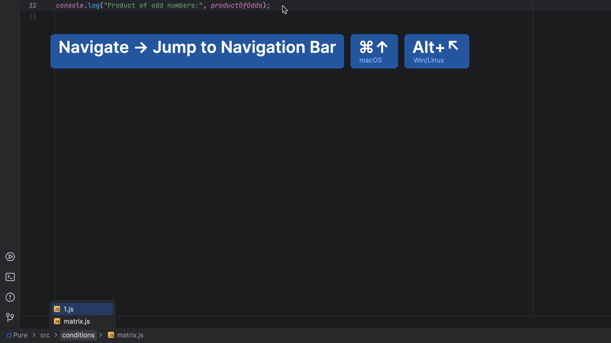
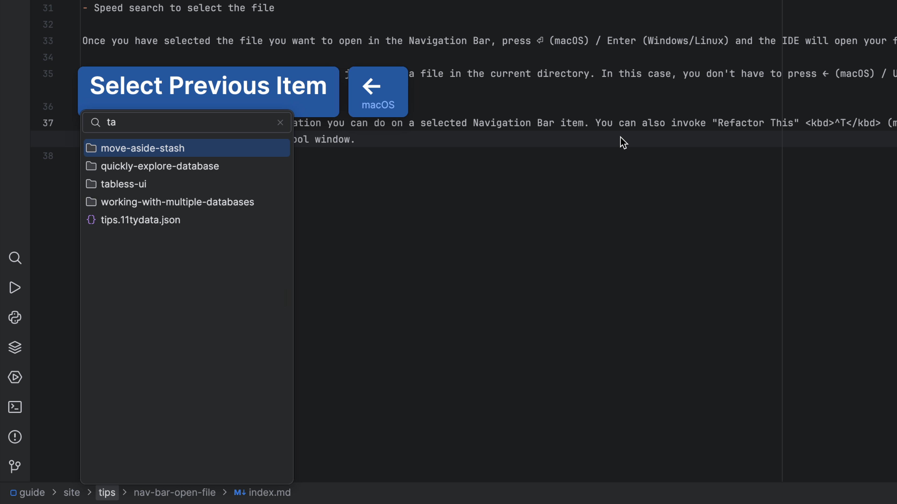

## The Problem

If you've closed the Project tool window and hidden the Navigation Bar, you need a way to open file that's keyboard centric and doesn't disrupt your flow. Usually, the fastest way to open a file is the various search options (Recent Files, Navigate to File, etc.) But other times, you want to browse instead of search.

## The Solution

In your JetBrains IDE, [invoke the "Navigation Bar"](../nav-bar-activate/) with <kbd>⌘↑</kbd> (macOS) / <kbd>Alt+Home</kbd> (Windows/Linux).

You can now:

- Use the cursor keys to get to the target directory
- Speed search to select the file

Once you have selected the file you want to open in the Navigation Bar, press ⏎ (macOS) / Enter (Windows/Linux) and the IDE will open your file. Clicking with the mouse also works.

As a note, this is a very common pattern for jumping to a file in the current directory. In this case, you don't have to press ← (macOS) / Up Arrow (Windows/Linux) to go up to the directory. Even though the current file selected, you can still press ↓ (macOS) / Down Arrow (Windows/Linux) or better still, just start speed searching.

Opening the file isn't the only operation you can do on a selected Navigation Bar item. You can also invoke "Refactor This" <kbd>^T</kbd> (macOS) / <kbd>Ctrl+Alt+Shift+T</kbd> (Windows/Linux), or "Delete" <kbd>␡</kbd> (macOS) / <kbd>Delete</kbd> (Windows/Linux) , basically, anything you could do when you click on the file in the Project tool window.

If you want to know what else the Navigation Bar can do, check out [Navigating Like a Pro](https://youtu.be/zK7Q8dVE-g8).

If you want to know what else the Navigation Bar can do, check out [Navigating Like a Pro](https://youtu.be/zK7Q8dVE-g8).
