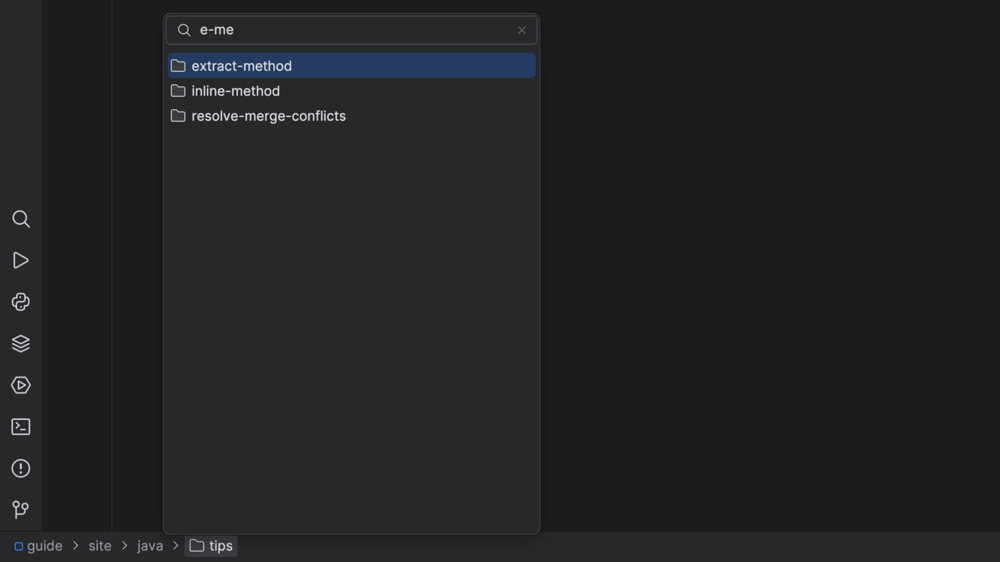

## The Problem

We've discussed getting into the flow by reducing UI clutter and being keyboard-focused. We're using the Navigation Bar on-demand to get to targets in our project tree.

When we get a drop-down for contents of a directory, but sometimes the listing is long. We don't want to press down arrow a bunch of times. Instead, we can use the IDEs "speed search" facility to quickly dive through a long listing.

## The Solution

You can invoke **Navigate | Jump to Navigation Bar** <kbd>⌘↑</kbd> (macOS) / <kbd>Alt+Home</kbd> (Windows/Linux) to temporarily re-activate the Navigation Bar. Once you use it, the window disappears.

Use speed search to select one item in the list by:

- Simplest case: Type one letter
- Type a second letter...if your choice is selected, then you're done and you can press <kbd>⏎</kbd> (macOS) / <kbd>Enter</kbd> (Windows/Linux) to open it. Alternatively, you can perform over actions too. Perhaps you want to invoke "Refactoring" <kbd>⌃T</kbd> (macOS) / <kbd>Shift+Ctrl+Alt+T</kbd> (Windows/Linux).

Go ahead and experiment with speed searching and see what you can discover. For example, you can also type a period and a letter to search in the file extension.

This becomes a very fast workflow for speeding through the navigation bar, all without using the mouse. Moreover, speed search is a pervasive pattern in all JetBrains IDEs.
