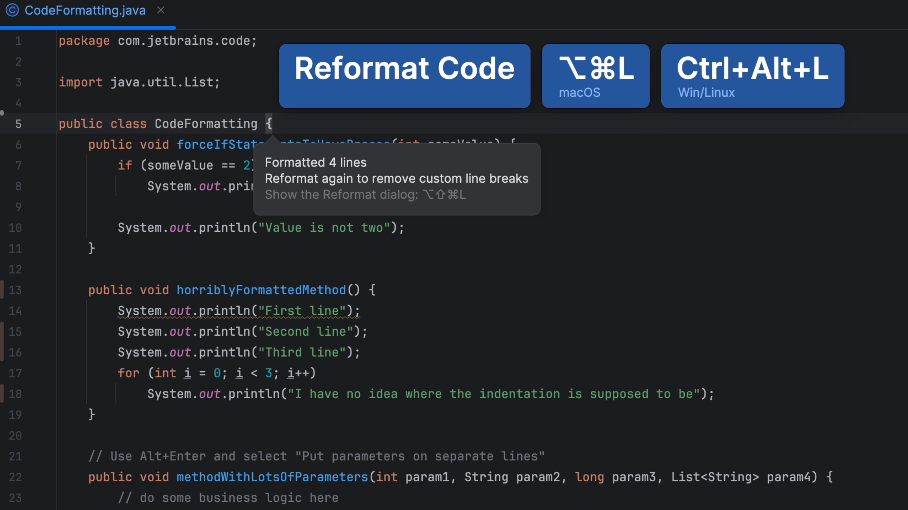
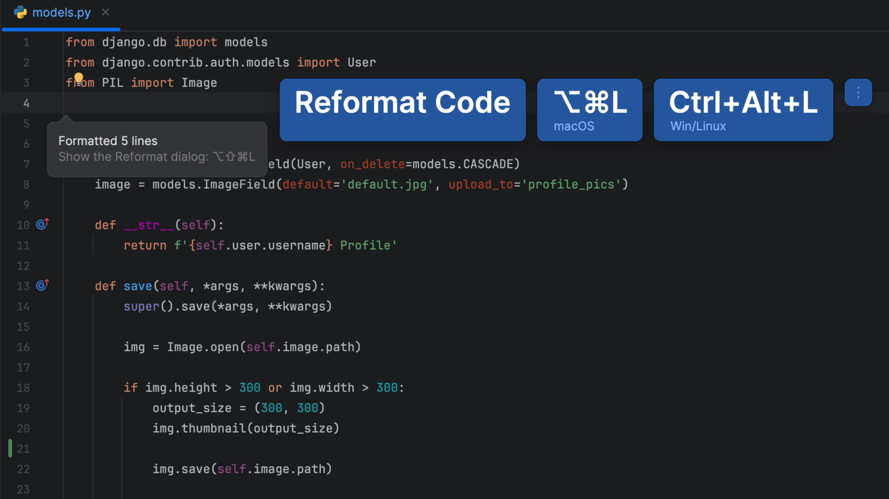
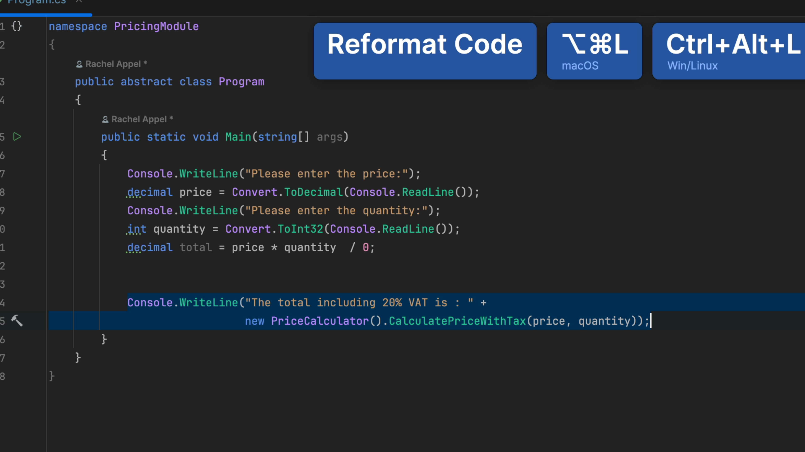
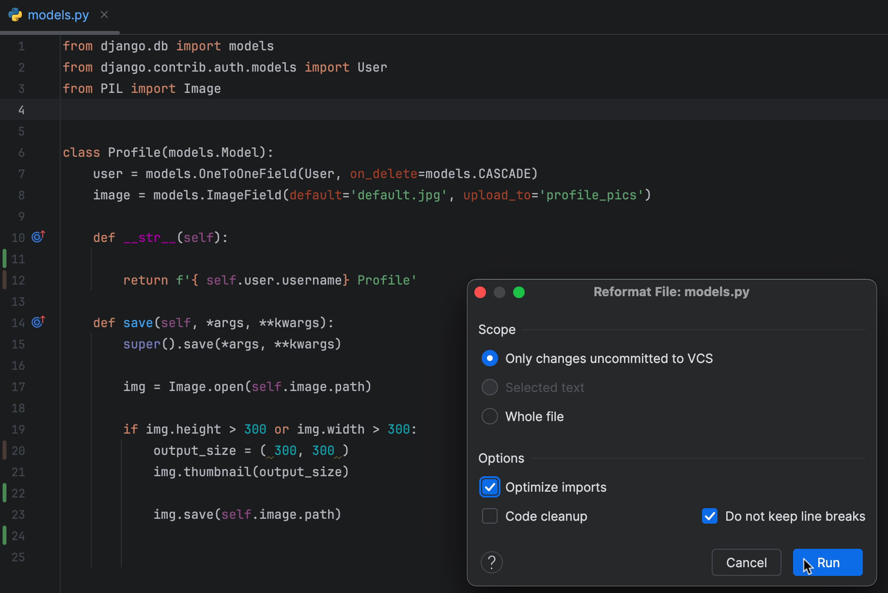

## The Problem

You're busy hammering out line after line of amazing code but when you're done and you look up to marvel at your masterpiece, you see that the indentation is all wrong.

## The Solution

You can quickly reformat the whole file by invoking "Reformat Code" <kbd>⌘⌥L</kbd> (macOS) / <kbd>Ctrl+Alt+L</kbd> (Windows/Linux).

As you'd expect, this works in any JetBrains IDE.

However, what if you just want to reformat just one block of code? For example, maybe the whole team changed their code style, and you don't want a large full file reformat to be part of this specific commit. In that case, select the code you want to reformat and again invoke "Reformat Code" <kbd>⌘⌥L</kbd> (macOS) / <kbd> Ctrl+Alt+L</kbd> (Windows/Linux).

You can reformat code at the directory level too! Invoke your Project tool window <kbd>⌘1</kbd> (macOS) / <kbd>Alt+1</kbd> (Windows/Linux), select the directory you want to reformat and invoke "Reformat Code" <kbd>⌘⌥L</kbd> (macOS) / <kbd>Ctrl+Alt+L</kbd> (Windows/Linux) again. A word of warning here, you probably don't want to mix large commits that include reformatting and code changes - it can make deciphering the commit harder for the next person.

Lastly, there are additional settings you can use for reformatting your code which you can access by invoking the "Reformat Code Dialog" <kbd>⌘⌥⇧L</kbd> (macOS) / <kbd>Ctrl+Alt+Shift+L</kbd> (Windows/Linux). The options here will vary depending on which type of code you're working with so try it out and see what you can learn!

