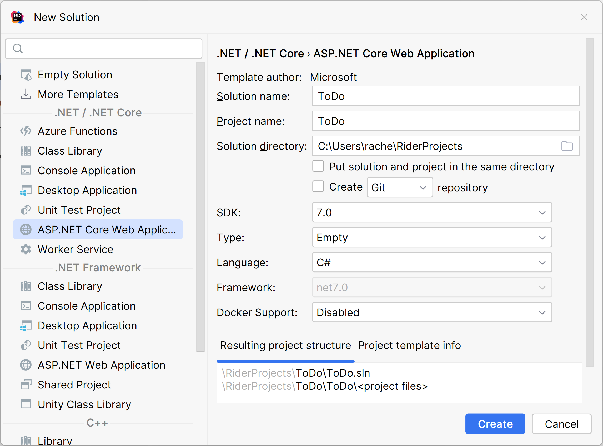

## Blazor Projects

Because Blazor is an ASP.NET technology, you can leverage your existing experience and skills to build Blazor apps. Start by using the pre-built [Blazor Server and Blazor WebAssembly templates](https://learn.microsoft.com/en-us/dotnet/core/tools/dotnet-new#arguments) that are available through the [.NET CLI](https://learn.microsoft.com/en-us/dotnet/core/tools/) or an IDE such as [Rider](https://jetbrains.com/rider). 
IDEs with this functionality are a graphical way to call the CLI and pass arguments to it.  

*.NET CLI*

`dotnet new blazorserver -o TodoList`

*Rider IDE*

Blazor projects contain references ASP.NET libraries needed to develop a web app. 
A complete Blazor solution can be contained within a single project. However, enterprise web apps may include other projects. 
Complex solutions may contain multiple project including a client Blazor app, a class library containing a shared object model, an API project for data access, and one or more projects for testing, such as a Unit Test project and a UI Automation Project. It depends on what your needs are.
If you're working on a small-medium sized app that interacts with an API, then putting all resources into one Blazor project can work well. 

The project structure for Blazor looks quite similar to that of ASP.NET Razor Pages, containing folders named `Pages`, `Shared`, and `wwwroot`.   
In the project's root is a `Program.cs` file containing configuration code. Similarly, depending on the template, you may see `App.razor`, `appSettings.json` and other files or folders that form the basic structure of a Blazor app. Modify any of them to your liking.

In this tutorial, we’ll build a small app to demonstrate the basics of Blazor. The app is contained within a single project and uses an API to communicate with the data store. 

## Conclusion
Blazor is Microsoft’s newest offering for web development. Blazor is built on the ASP.NET stack so it takes advantage of mature technology features such as the hosting model, routing, program structure, and middleware. For those moving to Blazor from ASP.NET, the learning curve is less steep since you can reuse a lot of your existing ASP.NET and web development skills.
