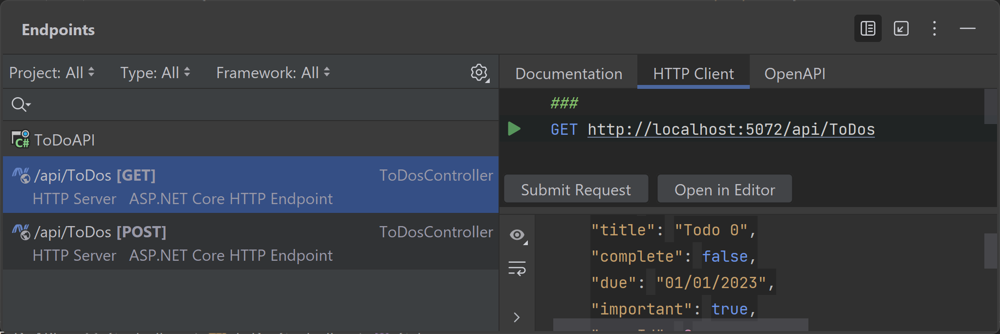

Communication between a Blazor client app and an API is typically done via HTTP using [JSON](https://www.json.org/json-en.html). Using GraphQL, Protobuf or other technologies is possible as well, but let's focus on working with a JSON-based API in this tutorial.

## API/server-side communication
For the purposes of HTTP Communication in Blazor apps, APIs accept and return JSON (mostly, though it's possible to use XML or a custom format). A nice feature of .NET and Blazor is that they contain classes that help us send and receive data between clients and APIs. 
Use the resources from `System.Text.Json` or go with a 3rd party libraries such as [Json.Net](https://www.newtonsoft.com/json) to work with JSON, so you don't have to parse it yourself. 

Blazor apps use `System.Net.Http.HttpClient` to send and receive requests and responses from APIs. However, it’s necessary to first register `HttpClient` with the runtime. We do that by appending the service to the `WebHostBuilder` using a call to `AddHttpClient`. This lets the runtime know which classes call to which endpoints. 
You may register HTTP clients and services in `Program.cs` to access any HTTP API. 

`builder.Services.AddHttpClient();`

If you're accessing an API through a service layer that uses `HttpClient` in your Blazor app, you can specifically register the service:

`builder.Services.AddSingleton<ToDoService>();`

> **Tip**
> 
> Rider is an excellent tool for working with APIs and JSON data. Open the Endpoints Tool Window through the **View | Tool Windows | Endpoints** menu option. From there you can navigate to the code behind the endpoint and make, manage, and save calls to endpoints. The **Endpoints Tool Window** gives a great look at the various endpoints in your solution.
> 
> 
> 

## Conclusion
Accessing an API from a client app is a popular and mature approach to app building. ASP.NET has supported this method of development by providing a framework and runtime with a middleware layer so that each project can be built to spec. Blazor enables ASP.NET developers to create the client side without as much JavaScript as there otherwise might be.

## See Also
* [Format response data in ASP.NET Core Web API | Microsoft Docs](https://docs.microsoft.com/en-us/aspnet/core/web-api/advanced/formatting?view=aspnetcore-5.0)
* [Make HTTP requests using IHttpClientFactory in ASP.NET Core](https://docs.microsoft.com/en-us/aspnet/core/fundamentals/http-requests?view=aspnetcore-5.0)
