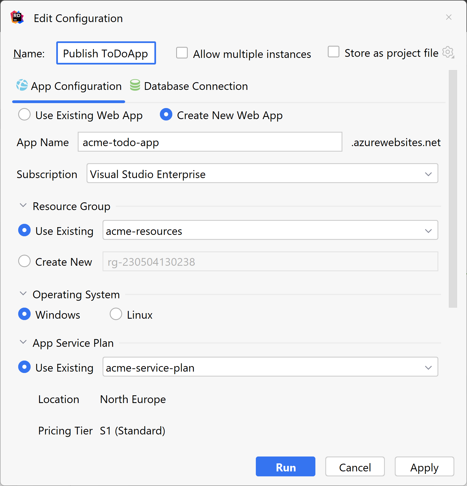

## Publish a Blazor App
There are many ways to publish Blazor apps, and software in general. 
Publishing using IDE tools is a straightforward way to get the app up and running quickly, especially for solo developers. 
However, if you’re working on a team, the team may have a deployment process in place, or even a DevOps person or team that creates the procedures and steps around deployment. 
For teams who are using CI/CD (Continuous Integration/Continuous Delivery), [TeamCity](https://www.jetbrains.com/teamcity/) is a general-purpose CI/CD solution that allows the most flexibility any kind of workflow. 
For the purposes of this tutorial, we’ll look at publishing using the [Azure toolkit for Rider](https://plugins.jetbrains.com/plugin/11220-azure-toolkit-for-rider).

## Deployment Considerations
Blazor Server and Blazor WebAssembly have slightly different ways of working so there are a few considerations based on which project type you have. 
However, when [Blazor United](https://github.com/dotnet/aspnetcore/issues/46636) ships these two Blazor paradigms will have merged. For Blazor WASM, keep in mind that the Blazor app, its dependencies, and the .NET runtime are downloaded to the browser in parallel. Then the browser executes the app on its UI thread. Blazor server apps run in a manner that is more similar to the way ASP.NET MVC or Razor Pages apps run with SignalR. That is, Blazor apps execute on the server from within an ASP.NET Core app. Any UI updates, JavaScript calls and other communications are performed with SignalR in the background.
Additionally, you must consider that structure of the overall solution. You may have multiple projects in a solution which need deployment. You may also have a database to deploy.
Databases and Web API projects can be deployed right along with your Blazor projects. For this tutorial, however, we'll assume the database and API have already been deployed. We'll publish just the Blazor app to Azure. 

## Deploy the Client App
To deploy a Blazor client app to Azure, you must supply the following information:

* Azure sign-in credentials 
* The [Azure subscription](https://azure.microsoft.com/en-us/free/) you want to use
* Unique app name
* [Resource groups](https://learn.microsoft.com/en-us/azure/azure-resource-manager/management/manage-resource-groups-portal).
* Target OS
* [Azure App Service plan](https://learn.microsoft.com/en-us/azure/app-service/overview-hosting-plans).

You may use existing resources or create new ones when you deploy. Tools like Rider provide a nice UX to use the deployment information to publish. Right-click on the project and choose **Publish**. While we're deploying to Azure, you may deploy to a web host or internally as well through Rider's UI. 

This information is needed so the [Azure Toolkit](https://plugins.jetbrains.com/plugin/11220-azure-toolkit-for-rider/) can create and configure your app in Azure. You may use existing resources from Azure or create new ones just for your app.
Click **Run** to publish the app to Azure. Once published, you can use the Azure Toolkit or the [Azure Portal](https://portal.azure.com/) to manage the settings in Azure.

## Conclusion
Rider’s quick-publish strategy works well when a single developer or small team wants to deploy a solution, especially to Azure. Keep in mind there are CI/CD options available for larger teams and those working in an enterprise environment. 

### See Also

* [Azure Portal](https://portal.azure.com)
* [Azure Toolkit](https://plugins.jetbrains.com/plugin/11220-azure-toolkit-for-rider/)
* [Host and deploy Blazor WebAssembly](https://docs.microsoft.com/en-us/aspnet/core/blazor/host-and-deploy/webassembly?view=aspnetcore-5.0)
* [TeamCity](https://azure.microsoft.com/en-us/pricing/details/app-service/windows/)