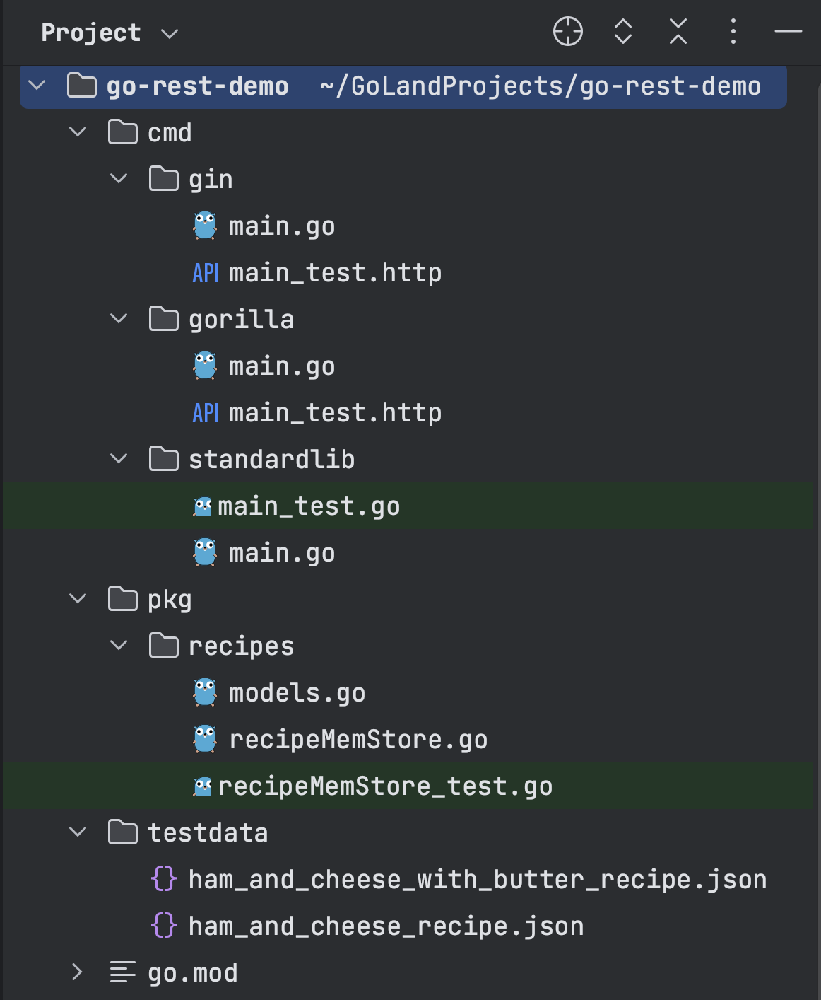
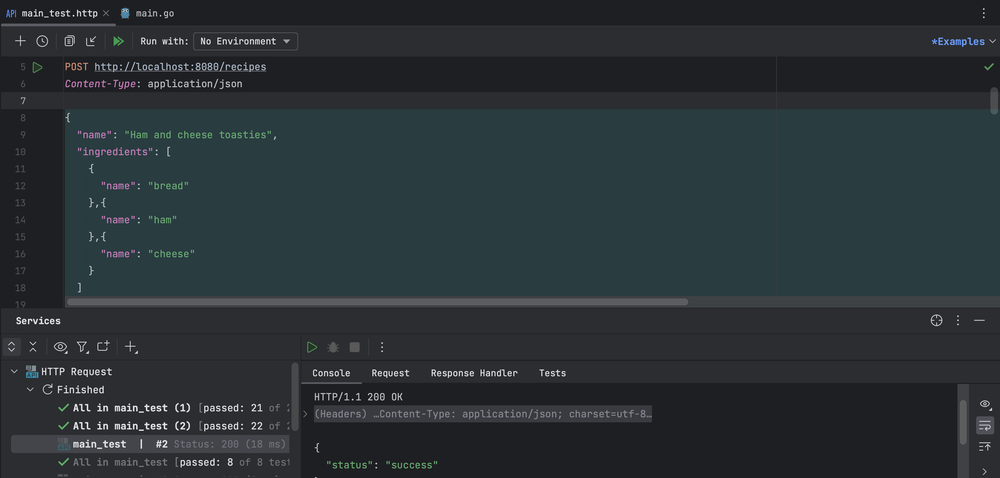
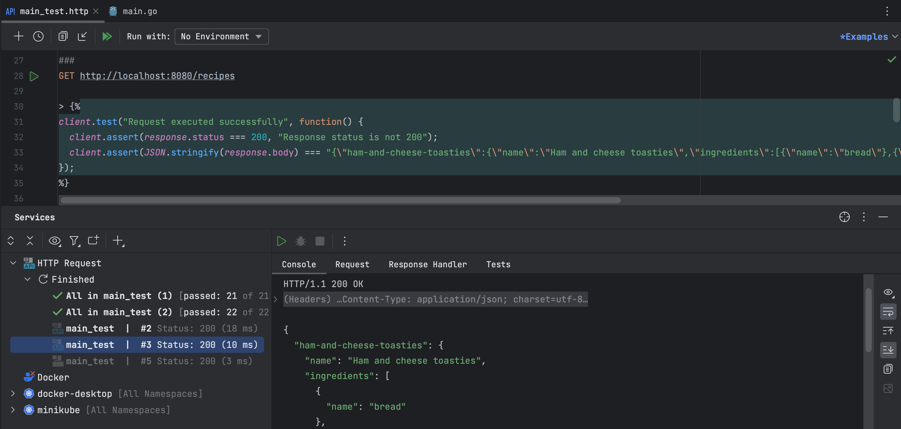
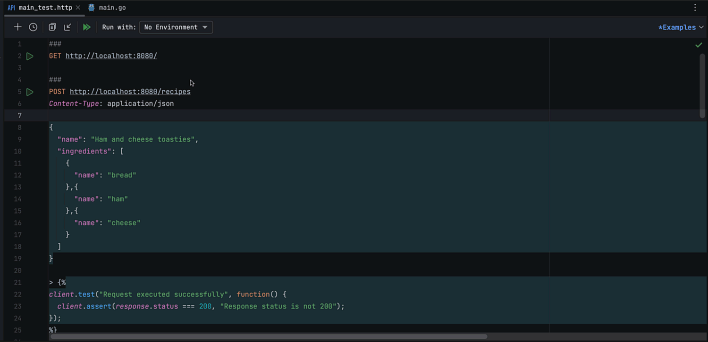

_This tutorial was created by an external contributor, <a href="https://github.com/xNok" target="_blank">Alexandre Couëdelo</a>_.

# Go REST Guide: Gin Framework

This is the third article in a three-part series dedicated to different methods of building a Golang REST API. Part one started with the "default" solution using the standard library, and then part two added a router component called [`gorilla/mux`](https://github.com/gorilla/mux) to simplify some repetitive tasks. This final installment looks at how to build a REST API using a web framework called Gin.

[Gin](https://github.com/gin-gonic/gin) is popular for web development with Go because it provides an intuitive API and plenty of built-in functionality. This article walks through setting up the same REST API as in the previous tutorials so you can objectively compare each solution and see why a web framework could be considered an all-in-one solution for web application development.

## What Is a Web Framework?

A web framework is a collection of software components and libraries that provide the necessary tools for developing web applications.

The main advantage of using a web framework over the standard library for web development is its ability to accelerate the development process. A web framework typically provides an easier-to-use API as well as built-in functionality for routing, templating, authentication, and session management. Additionally, web frameworks often include logging and error-handling support, which are essential in production environments. These features improve development speed and reliability since you don't have to build everything from scratch.

On the flip side, you'll have to adapt the way you code to the specific framework you're using. All frameworks have an opinionated view on coding and building web applications. This means that you have to learn and follow the conventions imposed by the framework; this can lead to a steep learning curve for anyone joining the project.

Another disadvantage is that it can be challenging to move away from your adopted framework. If you decide to move to another solution or framework that better suits your needs, you might have to rewrite a lot of your code to make it compatible. This can be particularly problematic if you're switching because you've reached the inherent limitations of your chosen framework or it's become obsolete. Thus, popularity and an active community are key criteria when selecting a framework.

There are a few popular web frameworks available for Go:

- [Gin](https://github.com/gin-gonic/gin) 64k ⭐
- [Echo](https://github.com/labstack/echo) 24k ⭐
- [beego](https://github.com/beego/beego) 29k ⭐
- [Revel](https://github.com/revel/revel) 24k ⭐

This tutorial focuses on Gin, the most popular web framework based on the number of stars on GitHub. As you're only focusing on implementing a REST API, you don't need to use or be aware of all of Gin's features, but it's worth noting that Gin provides server-side rendering for web pages.

## Hello World Server with Gin

For a quick overview of Gin, start by implementing a simple "hello world" home page.

Create a new folder called `/cmd/gin` and a new `main.go` file. If you've been following the tutorial series, your project should look like this:



You can find the complete repository for this demo on [GitHub](https://github.com/JetBrains/go-code-samples/tree/main/go-rest-demo).

First, you need to install the framework by importing it as a dependency on your project:

```go
go get -u github.com/gin-gonic/gin
```

You want to display the message `"This is my home page"` for the path `/` .

First, instantiate the Gin router:

```
router := gin.Default()
```

Next, define a handler function of type [`HandlerFunc`](https://pkg.go.dev/github.com/gin-gonic/gin@v1.8.1#HandlerFunc); this means the function signature must only accept one argument of type `*gin.Context`. The pointer `*gin.Context` gives you access to the HTTP request as well as Gin's framework functions, such as `String`, which lets you write a string-type HTTP response.

The following is an example handler function:

```go
func homePage(c *gin.Context) {
    c.String(http.StatusOK, "This is my home page")
}
```

Use the router's method `GET(path, handler)` to associate the route `/` with the handler function `homePage` you defined above.

```
router.GET("/", homePage)
```

Finally, start the server by calling `router.Run()`:

```go
func main() {
    // Create Gin router
    router := gin.Default()

    // Register Routes
    router.GET("/", homePage)

    // Start the server
    router.Run()
}

func homePage(c *gin.Context) {
    c.String(http.StatusOK, "This is my home page")
}
```

With this small example, you can already identify differences between this method and the two previous approaches. `gorilla/mux` provided a more convenient router but still used the types defined by the standard library. Using Gin, all types are defined by the Gin framework, including the `HandlerFunc` you've just seen. The `router` provides the functions, such as `GET` and `POST`, that replace the generic `HandleFunc` or `Handle` seen in `gorilla/mux` and in the standard library. You can also see the `*gin.Context` parameter that will be used to access the Gin features from inside handlers.

## Building a REST API with Gin

Now that you've had a brief introduction to how Gin works, the rest of the tutorial covers how you can use it to build the same demo REST API as in the two previous articles.

As in the first two tutorials, you're going to build a small REST API to store your favorite recipes. This API provides five endpoints to manage your recipes, including creating, deleting, and updating recipes, as well as listing all recipes or a specific recipe. All the endpoints are summarized in the following table:

| Action | Verb | Path | Description |
| --- | --- | --- | --- |
| Create | POST | `/recipes` | Create an entity represented by the JSON payload |
| List | GET | `/recipes` | Get all entities from the resource |
| Read | GET | `/recipes/<id>` | Get a single entity |
| Update | PUT | `/recipes/<id>` | Update an entity with the JSON payload |
| Delete | DELETE | `/recipes/<id>` | Delete an entity |

## Defining a Recipes Handler

    Similar to the "hello world" example, you need to define the handler functions and then associate each path from the table with the right handler.

    All the handler functions will interact with data storage to perform the basic CRUD operations (create, read, update, and delete). To access the store from each handler function, you need to use a struct with the "store" as an attribute and define each handler as a method of that struct.

First, define the `RecipesHandler` struct with an attribute `store` of type `recipeStore`:

```go
type RecipesHandler struct {
    store recipeStore
}
```

Next, define the interface `recipeStore`. This interface will define the five operations you'd expect a store implementation to provide (`Add`, `Get`, `List`, `Update`, `Remove`):

```go
// recipeStore is an interface for the data store
type recipeStore interface {
    Add(name string, recipe recipes.Recipe) error
    Get(name string) (recipes.Recipe, error)
    List() (map[string]recipes.Recipe, error)
    Update(name string, recipe recipes.Recipe) error
    Remove(name string) error
}
```

Remember, it's best practice to use interfaces to inject dependencies, as this ensures loose coupling of your application. No matter how you implement the recipe storage later, as long as it respects the interface, it'll be compatible with your REST API. This interface makes references to the `Recipe` struct in the package `recipes`, which you can find in the repo under [`models.go`](https://github.com/JetBrains/go-code-samples/blob/main/go-rest-demo/pkg/recipes/models.go) if you don't have it already.

Now define each of the five handler functions listed in the table. For now, you're focusing on the router component, so you only need to define the function, and you'll implement each of them separately later in the tutorial:

```go
// Define handler function signatures
func (h RecipesHandler) CreateRecipe(c *gin.Context) {}
func (h RecipesHandler) ListRecipes(c *gin.Context)  {}
func (h RecipesHandler) GetRecipe(c *gin.Context)    {}
func (h RecipesHandler) UpdateRecipe(c *gin.Context) {}
func (h RecipesHandler) DeleteRecipe(c *gin.Context) {}
```

Finally, define a constructor for `RecipesHandler` so you can more conveniently initialize variables for this struct:

```go
// NewRecipesHandler is a constructor for RecipesHandler 
func NewRecipesHandler(s recipeStore) *RecipesHandler {
    return &RecipesHandler{
        store: s,
    }
}
```

## Configuring the Router

With the handler functions defined, you can now map each of them to their corresponding paths. You need to handle two types of paths:

```go
/recipes
/recipes/<id>
```

The first one is simply the resource name (`recipes`), and the second contains the resource name and the ID of the resource.

The following example demonstrates how to capture the `id` parameter after `recipes/`:

```go
/recipes/:id
```

Gin uses the `:` symbol followed by the name of the parameter you want to capture in URLs.

The Gin router also improves readability by providing one function for each HTTP verb (`GET`, `POST`, etc.), allowing you to read from left to right: verb, path handler.

```go
router.VERB(path, handler)
```

Putting together what you've learned so far, you can now define the main function. For your demo application to work and actually store recipes, you need an implementation of the `recipeStore` interface. If you've been following the series from the beginning, you should already have an implementation of `recipeStore` in the folder `pkg/recipes`. If not, you can either write your own by implementing the `recipeStore` interface or grab [`recipeMemStore.go`](https://github.com/JetBrains/go-code-samples/blob/main/go-rest-demo/pkg/recipes/recipeMemStore.go) from the GitHub repository.

The result should look as follows:

```go
func main() {
    // Create Gin router
    router := gin.Default()

    // Instantiate recipe Handler and provide a data store implementation
    store := recipes.NewMemStore()
    recipesHandler := NewRecipesHandler(store)

    // Register Routes
    router.GET("/", homePage)
    router.GET("/recipes", recipesHandler.ListRecipes)
    router.POST("/recipes", recipesHandler.CreateRecipe)
    router.GET("/recipes/:id", recipesHandler.GetRecipe)
    router.PUT("/recipes/:id", recipesHandler.UpdateRecipe)
    router.DELETE("/recipes/:id", recipesHandler.DeleteRecipe)

    // Start the server
    router.Run()
}
```

## Implementing Handlers

At this point, you have all the structure in place to receive and handle HTTP calls. All that remains is to implement each of the handler functions. In the following sections, you'll see how to leverage the Gin framework inside the handler function via `c *gin.Context`.

### Implementing the CreateRecipe Handler

To implement the `CreateRecipe` handler, you expect a JSON body containing a recipe and save it to the store:

```go
// Get request body and convert it to recipes.Recipe
var recipe recipes.Recipe
if err := c.ShouldBindJSON(&recipe); err != nil {
    c.JSON(http.StatusBadRequest, gin.H{"error": err.Error()})
    return
}
```

In the above code, `*gin.Context` provides a `ShouldBindJSON` function that converts the HTTP body into a struct. `ShouldBindJSON` is essentially a wrapper around the [`json.Marshal`](https://pkg.go.dev/encoding/json#marshal) function you used in the previous tutorials. Note that Gin offers a range of `ShouldBind` functions in case you need to parse other content types, such as XML.

Next, you need to save items using a URL-friendly name, also called a slug. You can convert the name of the recipe into a slug using a library called [`gosimple/slug`](https://github.com/gosimple/slug):

```go
// Create a URL-friendly name
id := slug.Make(recipe.Name)
```

Once you have the slug and the recipe, you can save the recipe to the store using the `Add()` function:

```go
// Add to the store
h.store.Add(id, recipe)
```

Lastly, you need to return a success status. Gin offers a range of "response" functions to return an HTTP response in various forms, such as JSON, XML, or even YAML. The `JSON()` function is the one you are looking for in this specific case:

```go
// Return success payload
c.JSON(http.StatusOK, gin.H{"status": "success"})
```

Putting everything together, the code for the `CreateRecipe` function should look as follows:

```go
func (h RecipesHandler) CreateRecipe(c *gin.Context) {
    // Get request body and convert it to recipes.Recipe
    var recipe recipes.Recipe
    if err := c.ShouldBindJSON(&recipe); err != nil {
        c.JSON(http.StatusBadRequest, gin.H{"error": err.Error()})
        return
    }

    // Create a URL-friendly name
    id := slug.Make(recipe.Name)

    // Add to the store
    h.store.Add(id, recipe)

    // Return success payload
    c.JSON(http.StatusOK, gin.H{"status": "success"})
}
```

You can quickly test your `CreateRecipe` handler using the [GoLand HTTP client](https://www.jetbrains.com/go/whatsnew/#http-client). To use this HTTP client, you need to create an `.http` file. For instance, you can create a file called `main_test.http` and define the following request to test the `CreateRecipe` handler:

```text
POST http://localhost:8080/recipes

{
    "name": "Ham and cheese toasties",
    "ingredients": [
    {
        "name": "bread"
    },{
        "name": "ham"
    },{
        "name": "cheese"
    }
    ]
}
```

You can find a `main_test.http` example [here](https://github.com/JetBrains/go-code-samples/blob/main/go-rest-demo/cmd/gin/main_test.http) that contains all the HTTP calls that you'll need to test your application throughout the tutorial. This file also contains test scripts that automatically validate the response:



### Implementing the ListRecipes Handler

Implementing the `ListRecipes` handler is very straightforward using Gin:

```go
func (h RecipesHandler) ListRecipes(c *gin.Context) {
    // Call the store to get the list of recipes
    r, err := h.store.List()
    if err != nil {
        c.JSON(http.StatusInternalServerError, gin.H{"error": err.Error()})
    }

    // Return the list, JSON encoding is implicit
    c.JSON(200, r)
}
```

The `JSON` function automatically converts a Go struct into JSON format, provided you've used JSON struct tags. You define these in the [`models.go`](https://github.com/JetBrains/go-code-samples/blob/main/go-rest-demo/pkg/recipes/models.go) file when defining the `Recipe` struct. For more about struct tags, you can read [this article](https://blog.boot.dev/golang/json-golang/).

You can also test this endpoint using the GoLand HTTP client with a `GET http://localhost:8080/recipes` call:



### Implementing the GetRecipe Handler

To implement the `GetRecipe` handler, you first need to learn how to retrieve URL parameters. Remember that the URL to retrieve a recipe is `/recipes/:id`, where `:id` refers to your recipe. The `c *gin.Context` input provides a function called `Param` that returns a URL parameter by name:

```
id := c.Param("id")
```

The implementation of the `GetRecipe` function should look like the following:

```go
func (h RecipesHandler) GetRecipe(c *gin.Context) {
    // Retrieve the URL parameter
    id := c.Param("id")

    // Get the recipe by ID from the store
    recipe, err := h.store.Get(id)
    if err != nil {
        c.JSON(http.StatusNotFound, gin.H{"error": err.Error()})
    }

    // Return the recipe, JSON encoding is implicit
    c.JSON(200, recipe)
}
```

You can now test this endpoint with a `GET http://localhost:8080/recipes/ham-and-cheese-toasties` call. Note that you might have restarted your application, so you also need to create the recipe!

### Implementing the UpdateRecipe and DeleteRecipe Handlers

At this point, you should be able to apply what you've learned so far to implement the next two handlers, `UpdateRecipe` and `DeleteRecipe`.

However, they have slightly more complicated error handling because you're dealing with two cases. In some cases, if you try to delete or update something that does not exist, you want to return a `404` error code, meaning "Not Found." In any other case, you want to return a `500` error code instead, meaning "Internal Server Error."

Your implementation of `UpdateRecipe` should look as follows:

```go
func (h RecipesHandler) UpdateRecipe(c *gin.Context) {
    // Get request body and convert it to recipes.Recipe
    var recipe recipes.Recipe
    if err := c.ShouldBindJSON(&recipe); err != nil {
        c.JSON(http.StatusBadRequest, gin.H{"error": err.Error()})
        return
    }

    // Retrieve URL parameter
    id := c.Param("id")

    // Call the store to update the recipe
    err := h.store.Update(id, recipe)
    if err != nil {
        if err == recipes.NotFoundErr {
            c.JSON(http.StatusNotFound, gin.H{"error": err.Error()})
            return
        }
        c.JSON(http.StatusInternalServerError, gin.H{"error": err.Error()})
        return
    }

    // Return success payload
    c.JSON(http.StatusOK, gin.H{"status": "success"})
}
```

Finally, the implementation of `DeleteRecipe` should look like this:

```go
func (h RecipesHandler) DeleteRecipe(c *gin.Context) {
    // Retrieve URL parameter
    id := c.Param("id")

    // Call the store to delete the recipe
    err := h.store.Remove(id)
    if err != nil {
        if err == recipes.NotFoundErr {
            c.JSON(http.StatusNotFound, gin.H{"error": err.Error()})
            return
        }
        c.JSON(http.StatusInternalServerError, gin.H{"error": err.Error()})
        return
    }

    // Return success payload
    c.JSON(http.StatusOK, gin.H{"status": "success"})

}
```

Now is the moment of truth;, you can test all the endpoints of the REST API. Once again, use the GoLand HTTP client. The GitHub repository contains a [`main_test.http`](https://github.com/JetBrains/go-code-samples/blob/main/go-rest-demo/cmd/gin/main_test.http) file that defines calls for each of the endpoints and test scripts to validate the responses of your API.

Copy the [`main_test.http`](https://github.com/JetBrains/go-code-samples/blob/main/go-rest-demo/cmd/gin/main_test.http) file to your project (if you haven't already) and click the **Run all tests** button at the top of the interface:



If you've followed the steps correctly, all of your tests should pass. With that, you've completed the last tutorial of the Go REST Guide series.

If you've just joined for this last part of the series, check out part one and part two to see how the Gin web framework compares to the standard library and `gorilla/mux`.

## Conclusion

Go is awesome for writing web applications, including REST APIs, because it's a fast, lightweight language with a small [footprint](https://en.wikipedia.org/wiki/Application_footprint), ideal for microservices and containerized applications in general.

The big question lies in what tools you should use to code your application. You could opt for the standard library with little to no external dependencies. However, going that route forces you to rewrite the same routing logic again and again. As a result, you might want to add a "better" routing component such as [`gorilla/mux`](https://github.com/gorilla/mux). However, routing is probably not the only issue you need to repeatedly solve when coding a REST API. Overall, using a web framework such as [Gin](https://github.com/gin-gonic/gin) provides a more complete solution.

Despite the numerous advantages of web frameworks, they can have some inherent limitations, as their opinionated nature can mean a steeper learning curve. It also introduces the risk of having to rewrite your code if you want to drop the framework if it no longer meets your needs. So, before opting for a web framework solution, you should consider whether either of these challenges will affect you.

Regardless, after completing all three tutorials in the series, you should have a good understanding of how to implement a REST API with all three options (standard library, router, and web framework), and you can now make an informed decision about which option is best for you.
