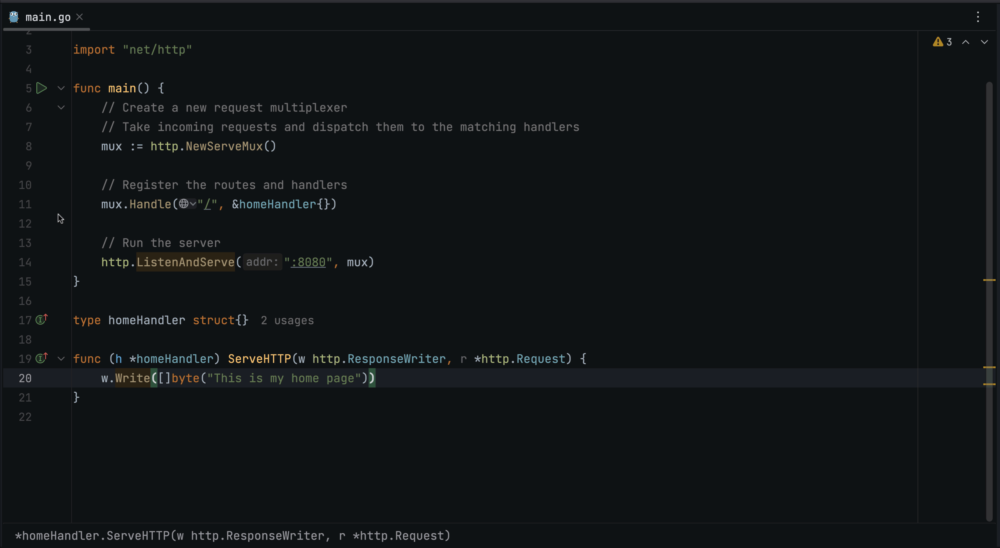
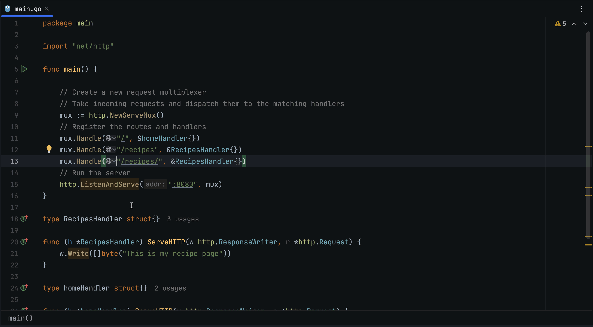
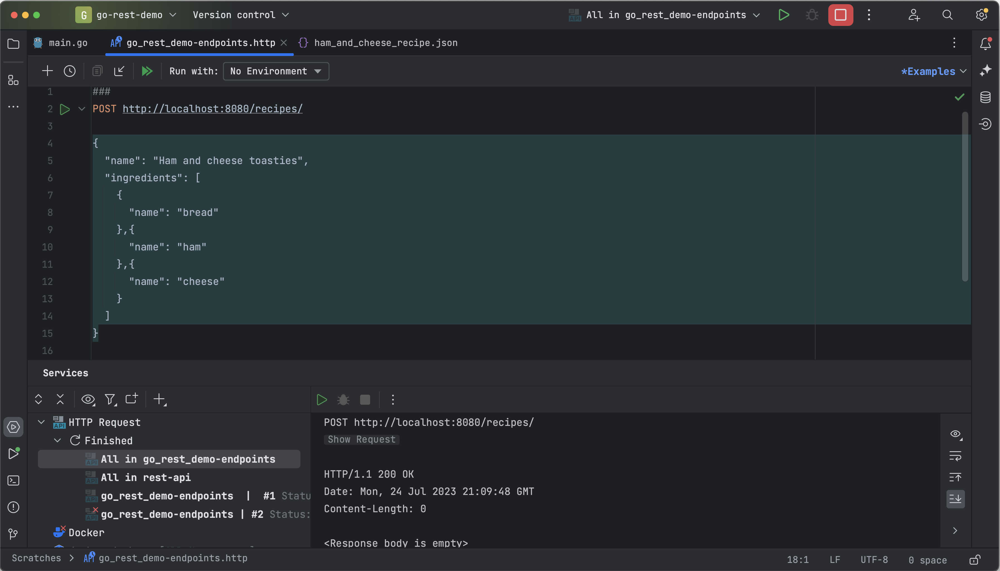
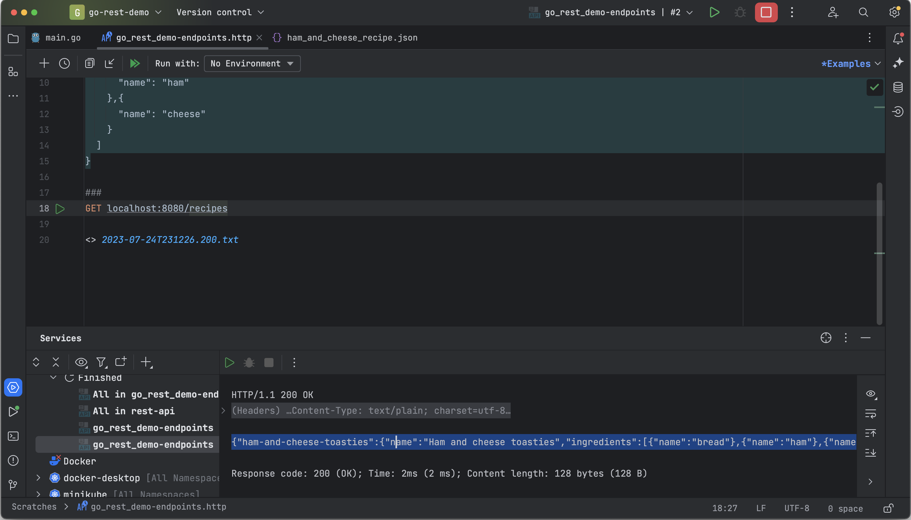
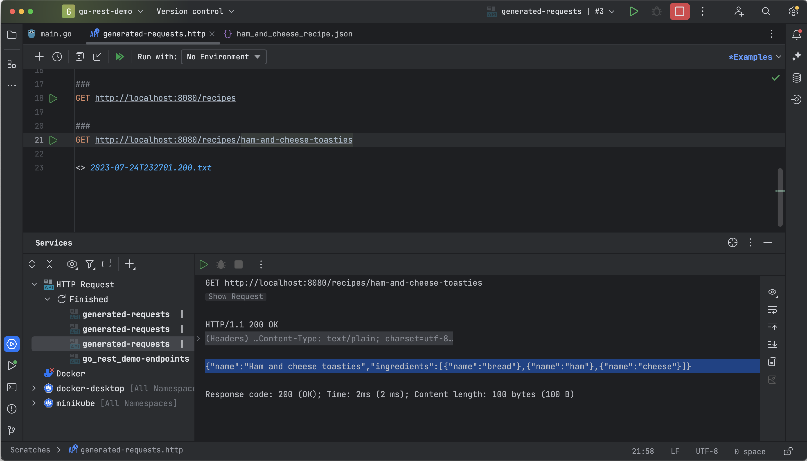
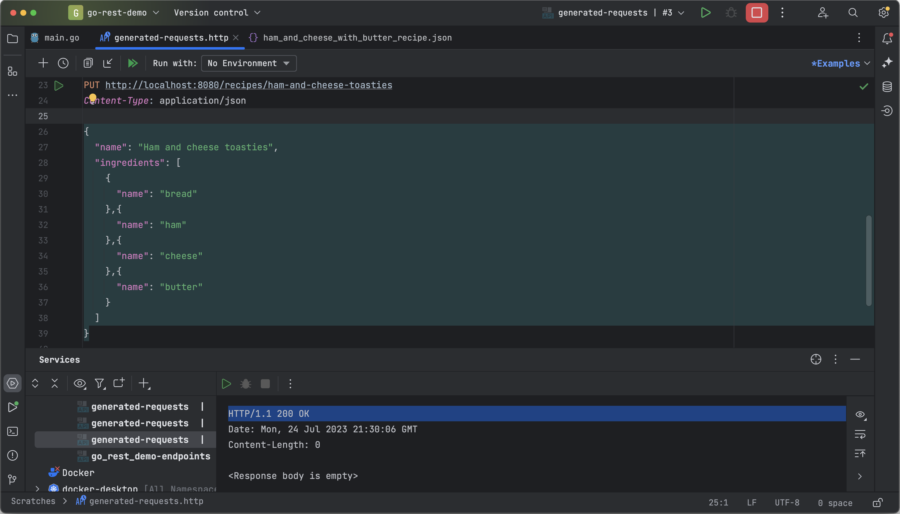
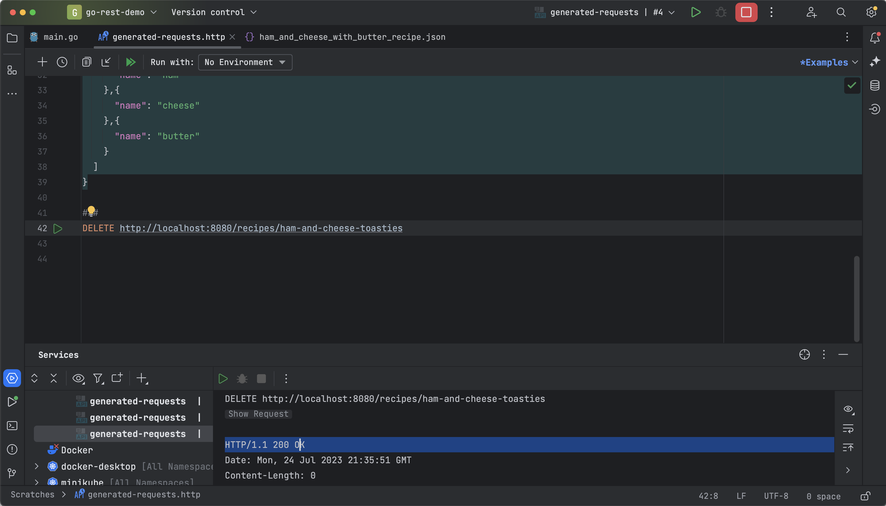

_This tutorial was created by an external contributor, <a href="https://github.com/xNok" target="_blank">Alexandre Couëdelo</a>_.

## Go REST Guide. The Standard Library

REST APIs provide a convenient and efficient way for clients to access data and functionality. This approach has thus been widely adopted, and building a REST API is a core skill for software developers working in any language, including Go.

This article is the first in a three-part series dedicated to three different methods of building a Go REST API. It focuses on using the standard library, a simple and native way to create HTTP servers. The second article uses the gorilla/mux framework, which provides a more sophisticated way of creating HTTP servers with features like middleware and routing. The third article uses the Gin framework, which provides a comprehensive solution for creating REST applications.

Each article walks you through the basics of building a web application by using and creating a small REST API. This application will help you compare the different frameworks throughout the series. You can find the code for all three parts of the series in [this repository]( https://github.com/xNok/go-rest-demo).

In this article, you'll create a small REST API with the standard library. You'll start by creating a simple "Hello World" server to understand the concept behind HTTP servers and routing requests, then complete the demo REST API.

## What is the standard library?

The standard library is a collection of Go packages that provide commonplace functionality, such as string manipulation, I/O, math, and an HTTP client/server. Its benefits are twofold. First, it provides a consistent API that can be used across Go programs. Second, it's been battle-tested by the Go community and is considered to be rock-solid.

As a result, Go programs that use the standard library should be more reliable and easier to maintain as they do not rely on external libraries.

## “Hello, World!” server with the standard library

Start by creating a simple "Hello World" example to illustrate the key concept behind the standard library's `http` package. In this example, you want to display a message whenever a user hits the home page of your site (for instance, `example.com/`).

The first step is to instantiate a request multiplexer, [`http.ServeMux`](https://pkg.go.dev/net/http#ServeMux), which receives incoming HTTP requests and matches them with URI patterns:

```go
mux := http.NewServeMux()
```

Next, register the `/` pattern and define which HTTP handler ([`http.Handler`](https://pkg.go.dev/net/http#Handler)) will be executed when this pattern is matched:

```go
mux.Handle("/", &home{})
```

In the standard library, a [handler](https://pkg.go.dev/net/http#Handler) is an interface that defines the method signature `ServeHTTP(w http.ResponseWriter, r *http.Request)`. So, to create a handler, you need to create a struct and implement `ServeHTTP`:

```go
type homeHandler struct{}

func (h *homeHandler) ServeHTTP(w http.ResponseWriter, r *http.Request) {
	w.Write([]byte("This is my home page"))
}
```

Call the `ListenAndServe` function to start an HTTP server listening on the defined port (`8080`) and using `mux`, the request multiplexer you defined above:

```go
http.ListenAndServe(":8080", mux)
```

When you put everything together, your starting example should look like this:

```go
package main

import "net/http"

func main() {

	// Create a new request multiplexer
	// Take incoming requests and dispatch them to the matching handlers
	mux := http.NewServeMux()

	// Register the routes and handlers
	mux.Handle("/", &homeHandler{})

	// Run the server
	http.ListenAndServe(":8080", mux)
}

type homeHandler struct{}

func (h *homeHandler) ServeHTTP(w http.ResponseWriter, r *http.Request) {
	w.Write([]byte("This is my home page"))
}
```

Click on the green triangle in the gutter next to `func main()`. Your server is now ready and accessible via [http://localhost:8080/](http://localhost:8080/). You can also use GoLand's [Generate Request tool](https://blog.jetbrains.com/go/2022/02/17/goland-2022-1-eap-3-is-out-with-new-features-for-working-with-microservices/#generate-a-request) to query that endpoint by clicking the drop-down menu next to the handler registration:



## Building a REST API with the Standard Library

Next, you're going to build a sample API that helps users find available recipes they can make with the ingredients in their fridges. This is a simple example, but it will go through the basic [CRUD operations](https://en.wikipedia.org/wiki/Create,_read,_update_and_delete) required in most REST APIs.

Specifically, you'll implement the following endpoints for the resource `/recipes/`:

| Action | Verb | Path | Description |
| --- | --- | --- | --- |
| Create | POST | `/recipes` | Create an entity represented by the JSON payload |
| List | GET | `/recipes` | Get all entities from the resource |
| Read | GET | `/recipes/<id>` | Get a single entity |
| Update | PUT | `/recipes/<id>` | Update an entity with the JSON payload |
| Delete | DELETE | `/recipes/<id>` | Delete an entity |

Start by registering a new `RecipesHandler` struct. For now, just duplicate the `home` handler and associate it with the pattern `/recipes`:

```go
func main() {

    // Create a new request multiplexer
    // Take incoming requests and dispatch them to the matching handlers
    mux := http.NewServeMux()
    // Register the routes and handlers
    mux.Handle("/", &homeHandler{})
    mux.Handle("/recipes", &RecipesHandler{})
    mux.Handle("/recipes/", &RecipesHandler{})
    // Run the server
    http.ListenAndServe(":8080", mux)
}

type RecipesHandler struct{}

func (h *RecipesHandler) ServeHTTP(w http.ResponseWriter, r *http.Request) {
    w.Write([]byte("This is my recipe page"))
}
```

Here, you defined three paths: `/`, `/recipes`, and `/recipes/`. When calling the `/` endpoint, the home handler takes care of the request, and when calling `/recipes` or `/recipes/`, the recipes handler is used. You can conveniently navigate between the defined endpoints using the [Endpoints tool window](https://blog.jetbrains.com/go/2022/02/17/goland-2022-1-eap-3-is-out-with-new-features-for-working-with-microservices/#endpoints-tool-window):



## Routing REST requests

You'll create one function per action in your table and use a `switch` in `ServeHTTP` to route the request to the matching function. Each function signature will match a [HandlerFunc](https://cs.opensource.google/go/go/+/go1.19.3:src/net/http/server.go;l=2105) type. That way, `ServeHTTP` can easily delegate the task of handling the request but propagate `w http.ResponseWriter` and `r *http.Request` to the next function.

First, create the required function:

```go
func (h *RecipesHandler) CreateRecipe(w http.ResponseWriter, r *http.Request) {}
func (h *RecipesHandler) ListRecipes(w http.ResponseWriter, r *http.Request) {}
func (h *RecipesHandler) GetRecipe(w http.ResponseWriter, r *http.Request) {}
func (h *RecipesHandler) UpdateRecipe(w http.ResponseWriter, r *http.Request) {}
func (h *RecipesHandler) DeleteRecipe(w http.ResponseWriter, r *http.Request) {}
```

Next, you need to route the request to the proper handler using two pieces of information: the HTTP verb (GET, POST, etc.) and the URI (`/recipes` vs. `/recipes/<id>`). The following two regexes differentiate the two possible URIs:

```go
var (
    RecipeRe       = regexp.MustCompile(`^/recipes/*$`)
    RecipeReWithID = regexp.MustCompile(`^/recipes/([a-z0-9]+(?:-[a-z0-9]+)+)$`)
)
```

Now that you have one function per action, you can implement `ServeHTTP` to dispatch the request to the correct handler. A `switch` statement is probably the most elegant way to route the request:

```go
func (h *RecipesHandler) ServeHTTP(w http.ResponseWriter, r *http.Request) {
    switch {
    case r.Method == http.MethodPost && RecipeRe.MatchString(r.URL.Path):
        h.CreateRecipe(w, r)
        return
    case r.Method == http.MethodGet && RecipeRe.MatchString(r.URL.Path):
        h.ListRecipes(w, r)
        return
    case r.Method == http.MethodGet && RecipeReWithID.MatchString(r.URL.Path):
        h.GetRecipe(w, r)
        return
    case r.Method == http.MethodPut && RecipeReWithID.MatchString(r.URL.Path):
        h.UpdateRecipe(w, r)
        return
    case r.Method == http.MethodDelete && RecipeReWithID.MatchString(r.URL.Path):
        h.DeleteRecipe(w, r)
        return
    default:
        return
    }
}
```

With the routing logic in place, it's time to work on the business logic of the API.

## Implementing the Recipes REST handlers

This section explains how you can implement a few different REST handlers.

### Defining the data model

Start by putting all the business logic and data model into a dedicated package called `recipes`. Putting all the code into a single `main.go` file is bad practice; instead, you want to properly structure your application. If you want to learn more about organizing a Go application, Kat Zien's [GopherCon 2018 talk about hexagonal architecture](https://www.youtube.com/watch?v=oL6JBUk6tj0) is a great place to start.

In the `recipes` package, define the models for recipes by creating a file called `pkg/recipes/models.go` containing the following code:

```go
package recipes

// Represents a recipe
type Recipe struct {
    Name        string       `json:"name"`
    Ingredients []Ingredient `json:"ingredients"`
}

// Represents individual ingredients
type Ingredient struct {
    Name string `json:"name"`
}
```

Take note of the `json` [struct tag](https://www.digitalocean.com/community/tutorials/how-to-use-struct-tags-in-go) in the code above. As you're using a JSON payload in this REST API, you add the `json` struct tag to define the name of the field in JSON representation. This will be useful later to encode and decode JSON into the recipe struct.

### Defining a storage interface

An interface allows your server code to be totally detached from the storage solution (in memory, Redis, MySQL, and etc.). You can store your data anywhere as long as you implement this interface.

Go back to the `main.go` file and define an interface for data storage containing the list of recipes:

```go
type recipeStore interface {
    Add(name string, recipe recipes.Recipe) error
    Get(name string) (recipes.Recipe, error)
    Update(name string, recipe recipes.Recipe) error
    List() (map[string]recipes.Recipe, error)
    Remove(name string) error
}
```

Now, alter `RecipesHandler` to accept `recipeStore` as an attribute, and define a constructor to simplify the process of creating an instance of `RecipesHandler`:

```go
// RecipesHandler implements http.Handler and dispatches requests to the store
type RecipesHandler struct {
    store recipeStore
}

func NewRecipesHandler(s recipeStore) *RecipesHandler {
    return &RecipesHandler{
        store: s,
    }
}
```

Implementing storage is not one of this tutorial's objectives, so for test purposes, you can use [`recipeMemStore.go`](https://github.com/xNok/go-rest-demo/blob/main/pkg/recipes/recipeMemStore.go) to save the data in a map. If you choose to use this proposed implementation, simply copy the `recipeMemStore.go` file to your project in the `recipes` package.

Update your main function to instantiate the store and `RecipesHandler`:

```go
func main() {

    // Create the Store and Recipe Handler
    store := recipes.NewMemStore()
    recipesHandler := NewRecipesHandler(store)

    // Create a new request multiplexer
    // Takes incoming requests and dispatches them to the matching handlers
    mux := http.NewServeMux()

    // Register the routes and handlers
    mux.Handle("/", &homeHandler{})
    mux.Handle("/recipes", recipesHandler)
    mux.Handle("/recipes/", recipesHandler)

    // Run the server
    http.ListenAndServe(":8080", mux)
}
```


### Implementing generic error handlers

Before jumping into implementing the five handlers for recipes, create two more handler functions, `InternalServerErrorHandler` and `NotFoundHandler`, which will be useful when dealing with errors:

```go
func InternalServerErrorHandler(w http.ResponseWriter, r *http.Request) {
    w.WriteHeader(http.StatusInternalServerError)
    w.Write([]byte("500 Internal Server Error"))
}

func NotFoundHandler(w http.ResponseWriter, r *http.Request) {
    w.WriteHeader(http.StatusNotFound)
    w.Write([]byte("404 Not Found"))
}
```

### Implementing the CreateRecipe handler

The first step in implementing the `CreateRecipe` handler is to read the JSON payload from the HTTP request body and convert it into an instance of `recipes.Recipe`. You can do this easily in Go using `json.NewDecoder`:

```go
var recipe recipes.Recipe
err := json.NewDecoder(r.Body).Decode(&recipe)
```

Adding a new `Recipe` to the store is as simple as calling the dedicated function. However, you need to make sure you can identify this resource later. You could receive the ID of the recipe via URL (for instance, `/recipes/name-of-my-recipe`). However, there's no guarantee that the name of the recipe (`recipe.Name`) is URL friendly; for example, it might contain spaces or special characters. You can solve this common problem by ["slugifying"](https://en.wikipedia.org/wiki/Clean_URL#Slug) the name of the recipe with the `gosimple/slug` package:

```go
go get -u github.com/gosimple/slug
```

As a result, you can call the `Add` function of the store and pass the attribute of the slug generated from the `recipe.Name` and the recipe itself:

```go
resourceID := slug.Make(recipe.Name)
err := h.store.Add(resourceID, recipe)
```

If everything is successful, set the HTTP status code to 200 by calling the `WriteHeader` function from `w http.ResponseWriter`:

```go
w.WriteHeader(http.StatusOK)
```

Once you put everything together, including the error handling logic, the `CreateRecipe` handler should look as follows:

```go
func (h *RecipesHandler) CreateRecipe(w http.ResponseWriter, r *http.Request) {
    // Recipe object that will be populated from JSON payload
    var recipe recipes.Recipe
    if err := json.NewDecoder(r.Body).Decode(&recipe); err != nil {
        InternalServerErrorHandler(w, r)
        return
    }

    // Convert the name of the recipe into URL friendly string
    resourceID := slug.Make(recipe.Name)
    // Call the store to add the recipe
    if err := h.store.Add(resourceID, recipe); err != nil {
        InternalServerErrorHandler(w, r)
        return
    }

    // Set the status code to 200
    w.WriteHeader(http.StatusOK)
}
```

You can run the server and quickly test the endpoint with GoLand's [Generate Request tool](https://blog.jetbrains.com/go/2022/02/17/goland-2022-1-eap-3-is-out-with-new-features-for-working-with-microservices/#generate-a-request). This time, you need to add a JSON payload that represents the recipe you need to create. Try using the recipe payload for ["Ham and Cheese Toasties"](https://github.com/xNok/go-rest-demo/blob/main/testdata/ham_and_cheese_recipe.json):



### Implementing the ListRecipes handler

The `ListRecipes` handler is very simple to implement.

First, retrieve the recipes from the store:

```go
recipes, err := h.store.List()
```

Then, convert the return list into JSON using the `json.Marshal` function:

```go
jsonBytes, err := json.Marshal(recipes)
```

Now, add the JSON payload to the HTTP response using the `Write` function of `http.ResponseWriter` (don't forget to set the header to 200 as before):

```go
w.WriteHeader(http.StatusOK)
w.Write(jsonBytes)
```

Putting everything together, including the error handling, your `ListRecipes` handler should look as follows:

```go
func (h *RecipesHandler) ListRecipes(w http.ResponseWriter, r *http.Request) {
    resources, err := h.store.List()

    jsonBytes, err := json.Marshal(resources)
    if err != nil {
        InternalServerErrorHandler(w, r)
        return
    }

    w.WriteHeader(http.StatusOK)
    w.Write(jsonBytes)
}
```

Restart the application, run the create request again, and test the list request you just implemented. All your recipes (probably only one) should appear in the terminal:



### Implementing the GetRecipe Handler

For the `GetRecipe` handler, receive the name of the resource via the URL with `/recipes/slug-of-recipe-name`. Then, reuse the regex `RecipeReWithID` to capture the slug:

```go
matches := RecipeReWithID.FindStringSubmatch(r.URL.Path)
```

With Go regex, the first match when calling `FindStringSubmatch` is always the full matching string, then all the subgroups. Looking at the regex `^/recipes/([a-z0-9]+(?:-[a-z0-9]+)+)$` , the first matching group `([a-z0-9]+(?:-[a-z0-9]+)+)` is the resource ID. You just need to call the store `Get` function with that ID:

```go
recipe, err := h.store.Get(matches[1])
```

Then, convert the returned recipe into a JSON payload, as you previously did for the `ListRecipes` handler.

The complete `GetRecipe` handler should look as follows:

```go
func (h *RecipesHandler) GetRecipe(w http.ResponseWriter, r *http.Request) {
    // Extract the resource ID/slug using a regex
    matches := RecipeReWithID.FindStringSubmatch(r.URL.Path)
    // Expect matches to be length >= 2 (full string + 1 matching group)
    if len(matches) < 2 {
        InternalServerErrorHandler(w, r)
        return
    }

    // Retrieve recipe from the store
    recipe, err := h.store.Get(matches[1])
    if err != nil {
        // Special case of NotFound Error
        if err == recipes.NotFoundErr {
            NotFoundHandler(w, r)
            return
        }

        // Every other error
        InternalServerErrorHandler(w, r)
        return
    }

    // Convert the struct into JSON payload
    jsonBytes, err := json.Marshal(recipe)
    if err != nil {
        InternalServerErrorHandler(w, r)
        return
    }

    // Write the results
    w.WriteHeader(http.StatusOK)
    w.Write(jsonBytes)
}
```

To test this endpoint, restart the application, run the two previous requests, and grab the slug of the "Ham and Cheese Toasties" recipe (`ham-and-cheese-toasties`) in the terminal:



### Implementing the UpdateRecipe handler

The `UpdateRecipe` handler combines what you learned in the previous examples. This means you need to obtain the recipe from the URL using the `RecipeReWithID` regex, read the JSON payload containing the updated recipe, and call `h.store.Update` to update the recipe in the data storage.

`NotFound` is a specific error that can occur when updating a recipe, meaning that you tried to update something that did not exist. In that case, call the `NotFoundHandler` instead of the `InternalServerErrorHandler`.

So, creating this method should be straightforward:

```go
func (h *RecipesHandler) UpdateRecipe(w http.ResponseWriter, r *http.Request) {
    matches := RecipeReWithID.FindStringSubmatch(r.URL.Path)
    if len(matches) < 2 {
        InternalServerErrorHandler(w, r)
        return
    }

    // Recipe object that will be populated from JSON payload
    var recipe recipes.Recipe
    if err := json.NewDecoder(r.Body).Decode(&recipe); err != nil {
        InternalServerErrorHandler(w, r)
        return
    }

    if err := h.store.Update(matches[1], recipe); err != nil {
        if err == recipes.NotFoundErr {
            NotFoundHandler(w, r)
            return
        }
        InternalServerErrorHandler(w, r)
        return
    }

    w.WriteHeader(http.StatusOK)
}
```

Testing the update is slightly more complicated, as you need to perform four HTTP calls to ensure everything is correct:

* Create a recipe using `POST /recipes`, with the recipe as the body
* Check if it is in the store using `GET /recipes/<id>`
* Call the update endpoint using `PUT /recipes/<id>`, with the updated recipe as the body
* Check that the update is effective using `GET /recipes/<id>`



### Implementing the DeleteRecipe handler

This is the final method in the set. Once again, you already know all you need to be able to write this in one shot. Retrieve the recipe ID from the URL using the `RecipeReWithID` regex, then call the `h.store.Remove` method and return `http.StatusOK`:

```go
func (h *RecipesHandler) DeleteRecipe(w http.ResponseWriter, r *http.Request) {
    matches := RecipeReWithID.FindStringSubmatch(r.URL.Path)
    if len(matches) < 2 {
        InternalServerErrorHandler(w, r)
        return
    }

    if err := h.store.Remove(matches[1]); err != nil {
        InternalServerErrorHandler(w, r)
        return
    }

    w.WriteHeader(http.StatusOK)
}
```

Testing the delete operation is very similar to testing the update operation:



## Testing your REST API

So far, you've used GoLand to quickly test your API as you implement each endpoint. However, if you are writing a unit test or integration test, you'd use the standard library's `httptest` package instead. So, to wrap up this tutorial, you're going to write an integration test for your application using the `httptest` package.

First, create a helper function to read recipes from JSON files. Since you're using a JSON API, it's easy to define payloads in dedicated files that can be used for examples as well:

```go
func readTestData(t *testing.T, name string) []byte {
    t.Helper()
    content, err := os.ReadFile("../../testdata/" + name)
    if err != nil {
        t.Errorf("Could not read %v", name)
    }

    return content
}
```

The following code sets up the test:

```go
func TestRecipesHandlerCRUD_Integration(t *testing.T) {

    // Create a MemStore and Recipe Handler
    store := recipes.NewMemStore()
    recipesHandler := NewRecipesHandler(store)

    // Test data
    hamAndCheese := readTestData(t, "ham_and_cheese_recipe.json")
    hamAndCheeseReader := bytes.NewReader(hamAndCheese)

    hamAndCheeseWithButter := readTestData(t, "ham_and_cheese_with_butter_recipe.json")
    hamAndCheeseWithButterReader := bytes.NewReader(hamAndCheeseWithButter)

}
```

In the above code, you execute the following steps:

1. Create a new `MemStore`
2. Instantiate `RecipesHandler`
3. Load the test data using the helper function `readTestData`

Note that you also create an `io.Reader` version of the test data using `bytes.NewReader`, because you need it to create an HTTP request. You can find an example in the [`testdata` folder](https://github.com/xNok/go-rest-demo/tree/main/testdata).

With the test set up, you can use the `httptest` package to create a test request with `httptest.NewRequest` and a test response receiver with `httptest.NewRecorder()`. Then, call `recipesHandler.ServeHTTP` with those parameters:

```go
// CREATE - add a new recipe
req := httptest.NewRequest(http.MethodPost, "/recipes", hamAndCheeseReader)
w := httptest.NewRecorder()
recipesHandler.ServeHTTP(w, req)
```

After calling the handler, you need to validate the call. You can write a test assertion to validate the response body and the status code. Note that the following example uses [stretchr/testify](https://github.com/stretchr/testify) to write an assertion:

```go
// Read the result
res := w.Result()
defer res.Body.Close()
assert.Equal(t, 200, res.StatusCode)

// Validate by looking at the store
saved, _ := store.List()
assert.Len(t, saved, 1)
```

Testing your REST API is very easy with the `httptest` package when using the standard library. The next tests follow the same pattern:

1. Define the new request with `httptest.NewRequest` and the new response receiver with `httptest.NewRecorder`.
2. Call `recipesHandler.ServeHTTP`.
3. Write an assertion about the response body and header.

So, the code for the tests is as follows:

```go
func TestRecipesHandlerCRUD_Integration(t *testing.T) {

    // Create a MemStore and Recipe Handler
    store := recipes.NewMemStore()
    recipesHandler := NewRecipesHandler(store)

    // Test data
    hamAndCheese := readTestData(t, "ham_and_cheese_recipe.json")
    hamAndCheeseReader := bytes.NewReader(hamAndCheese)

    hamAndCheeseWithButter := readTestData(t, "ham_and_cheese_with_butter_recipe.json")
    hamAndCheeseWithButterReader := bytes.NewReader(hamAndCheeseWithButter)

    // CREATE - add a new recipe
    req := httptest.NewRequest(http.MethodPost, "/recipes", hamAndCheeseReader)
    w := httptest.NewRecorder()
    recipesHandler.ServeHTTP(w, req)

    res := w.Result()
    defer res.Body.Close()
    assert.Equal(t, 200, res.StatusCode)

    saved, _ := store.List()
    assert.Len(t, saved, 1)

    // GET - find the record you just added
    req = httptest.NewRequest(http.MethodGet, "/recipes/ham-and-cheese-toasties", nil)
    w = httptest.NewRecorder()
    recipesHandler.ServeHTTP(w, req)

    res = w.Result()
    defer res.Body.Close()
    assert.Equal(t, 200, res.StatusCode)

    data, err := io.ReadAll(res.Body)
    if err != nil {
        t.Errorf("unexpected error: %v", err)
    }

    assert.JSONEq(t, string(hamAndCheese), string(data))

    // UPDATE - add butter to ham and cheese recipe
    req = httptest.NewRequest(http.MethodPut, "/recipes/ham-and-cheese-toasties", hamAndCheeseWithButterReader)
    w = httptest.NewRecorder()
    recipesHandler.ServeHTTP(w, req)

    res = w.Result()
    defer res.Body.Close()
    assert.Equal(t, 200, res.StatusCode)

    updatedHamAndCheese, err := store.Get("ham-and-cheese-toasties")
    assert.NoError(t, err)

    assert.Contains(t, updatedHamAndCheese.Ingredients, recipes.Ingredient{Name: "butter"})

    // DELETE - remove the ham and cheese recipe
    req = httptest.NewRequest(http.MethodDelete, "/recipes/ham-and-cheese-toasties", nil)
    w = httptest.NewRecorder()
    recipesHandler.ServeHTTP(w, req)

    res = w.Result()
    defer res.Body.Close()
    assert.Equal(t, 200, res.StatusCode)

    saved, _ = store.List()
    assert.Len(t, saved, 0)

}
```

If you need to review the code or play with the sample application, you'll find everything you require for that in [this GitHub repository](https://github.com/xNok/go-rest-demo).

## Disadvantages of the standard library approach

With what you have learned so far, it's clear that the Go standard library is sufficient for building a REST application, but it can get tedious, especially when it comes to dispatching requests to the correct handler function.

When building a REST API, you're following conventions about how a path looks and what verb is associated with it. As a result, when building a REST API with many resources, you might be tempted to write some helper methods to simplify the registration of REST endpoints.

The Go standard library requires a third party to implement a custom router. However, there's a way to avoid this, which is the focus of the next article in this series.

## Conclusion

In this tutorial, you built a simple REST API that manages a `recipes` resource and provides five endpoints (create, list, get, update, and delete) to interact with this resource. You also learned how to test that API using the `httptest` package.

While simple, building REST APIs with the standard library can feel overly tedious if you have multiple resources. This problem should motivate you to find a better solution that makes your application easier to maintain. You can learn all about one potential solution in the next article in this series.
