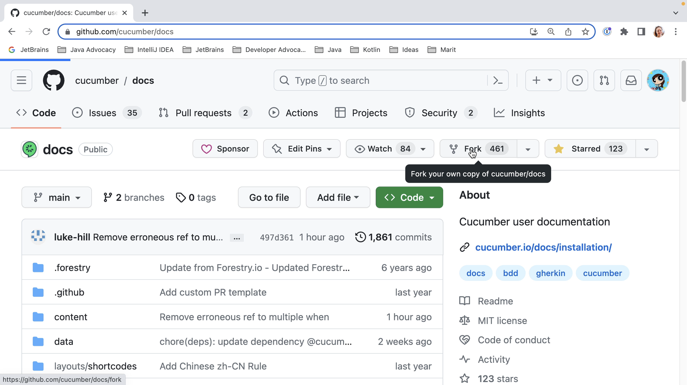
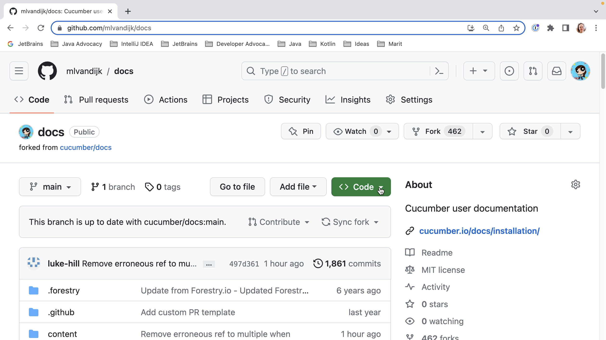
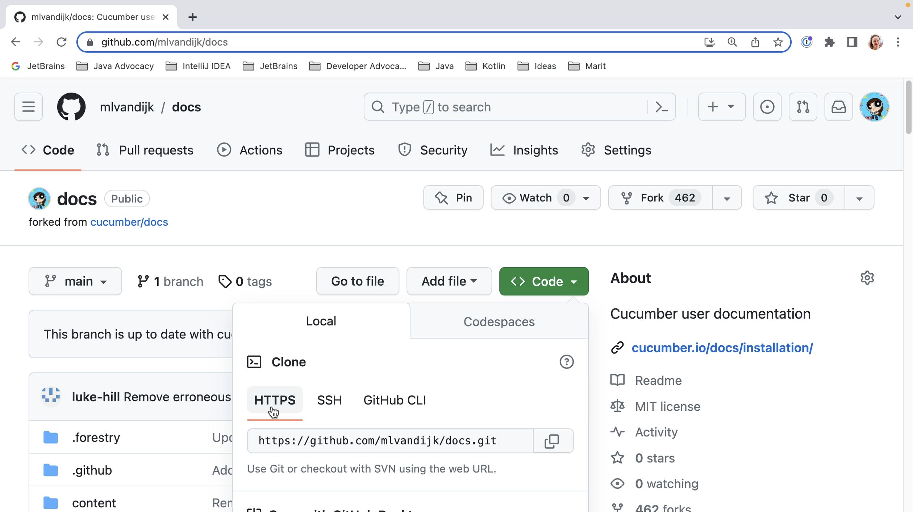
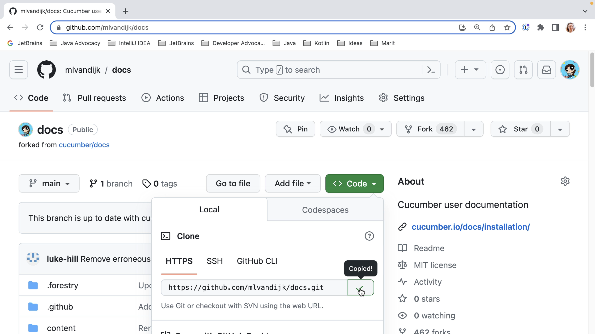
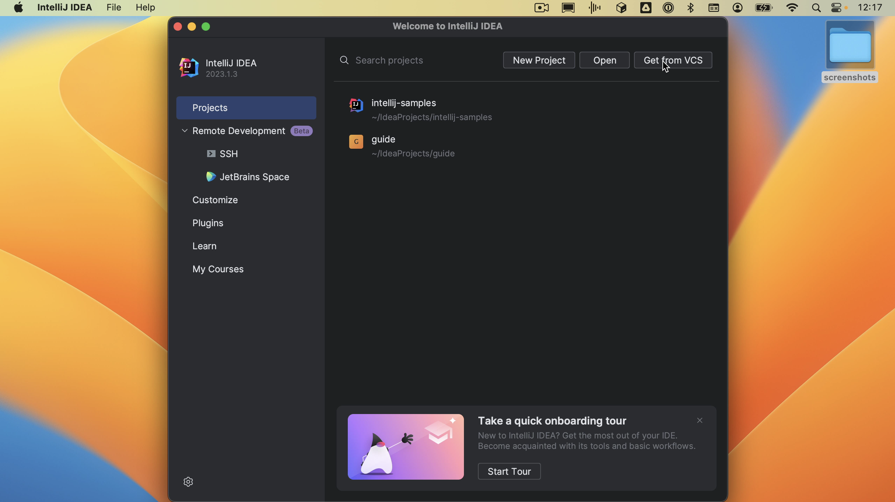
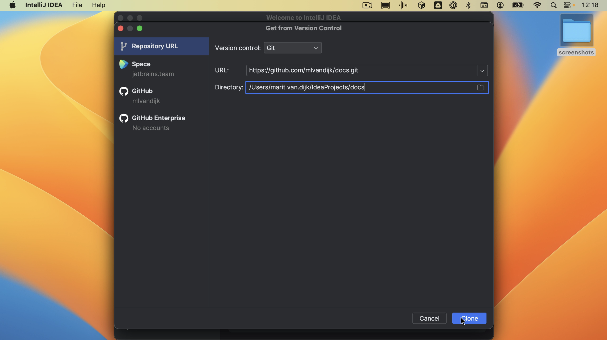
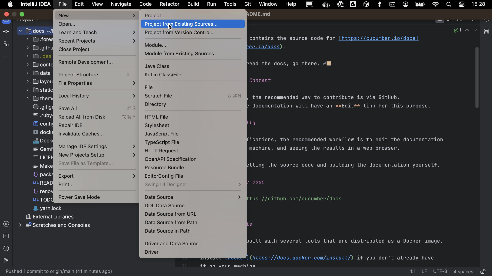

When making your first contribution, you won’t have access to push to the open source project directly. So, the first thing we will need to do is **fork** this project to our own profile. This means we create a copy of the original project on our profile.

We then need to **clone** this project to our local machine. We see that we have several options to get the code. Let's use HTTPS as that can be the simplest option. When we click the clipboard icon, the URL will be copied to our clipboard.

When we open [IntelliJ IDEA](https://www.jetbrains.com/idea/) and don’t already have a project open, we'll see the **Welcome screen**. Here we have the option to “**Get from VCS**” (version control system). 

When we click the button, the “**Get from Version Control**” dialog opens. We can paste the URL we just copied. We can select where we want to store this project on our computer; let’s stick with the default. When we select "**Clone**", IntelliJ IDEA will clone the GitHub repository to the selected directory.

If we already have a project open, we can open the “**Get from Version Control**” dialog by going to **File > New > Project from version control**.

IntelliJ IDEA will open the project on our machine.
