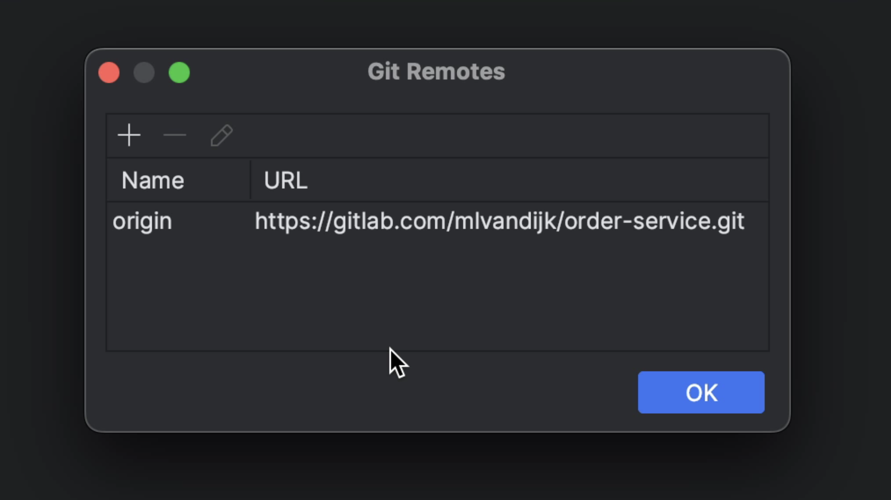
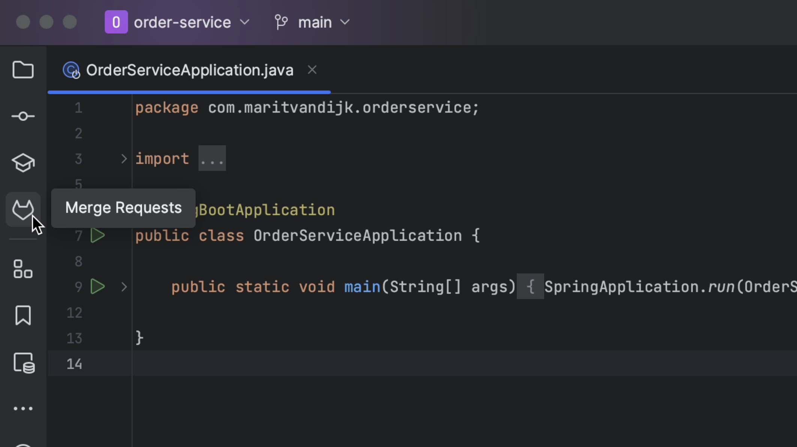
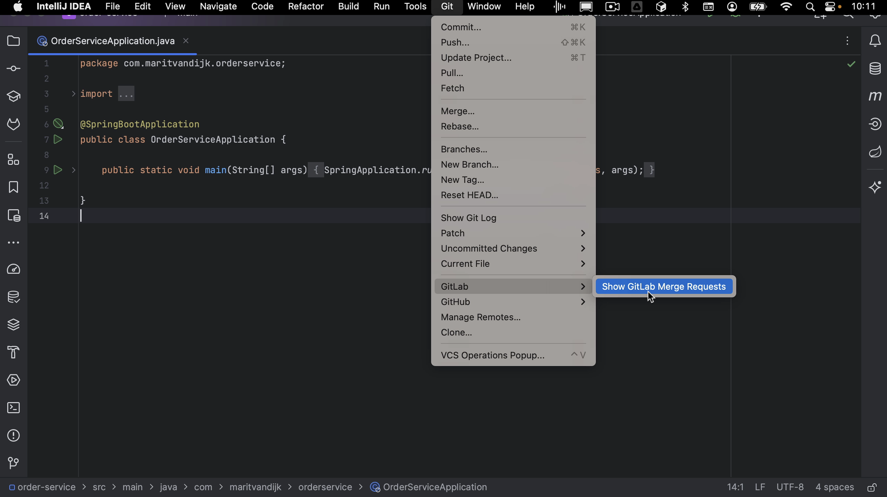

In this tutorial, we will take a look at working with GitLab Merge Requests inside IntelliJ IDEA.

When reviewing Merge Requests in a web interface, we don’t have the same support that our IDE gives us, like syntax highlighting and the context within which the code was written.

IntelliJ IDEA has support for reviewing and merging GitLab Merge Requests. These features are available if the IntelliJ IDEA project has a remote that points to GitLab.

We can open the GitLab Merge Requests using the **GitLab** logo on the left, or from the menu by going to **Git > Gitlab > Show Gitlab Merge Request**. 

