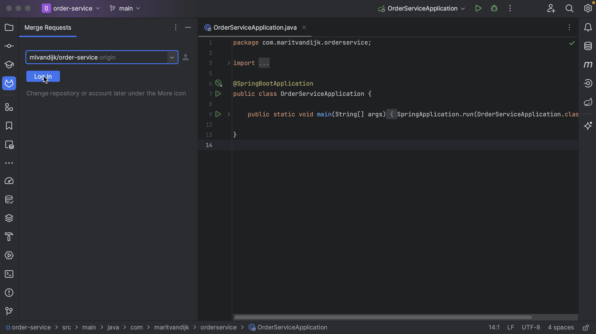
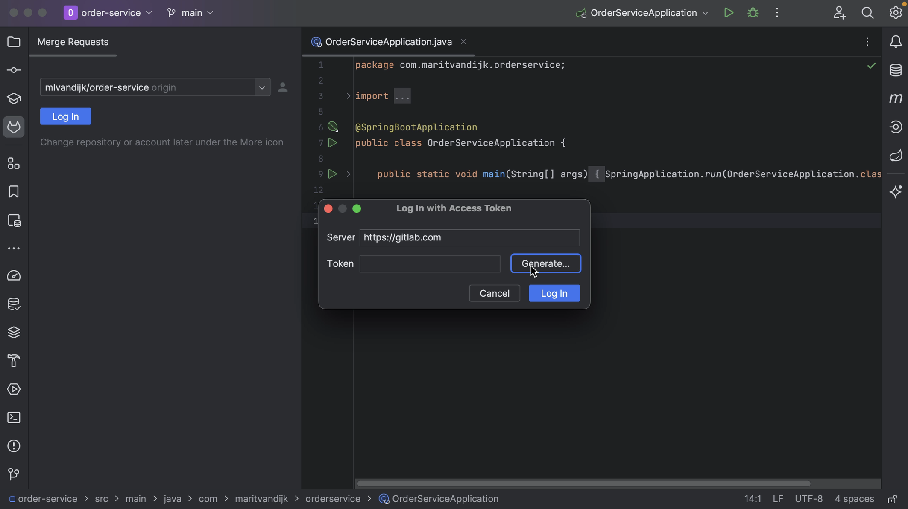
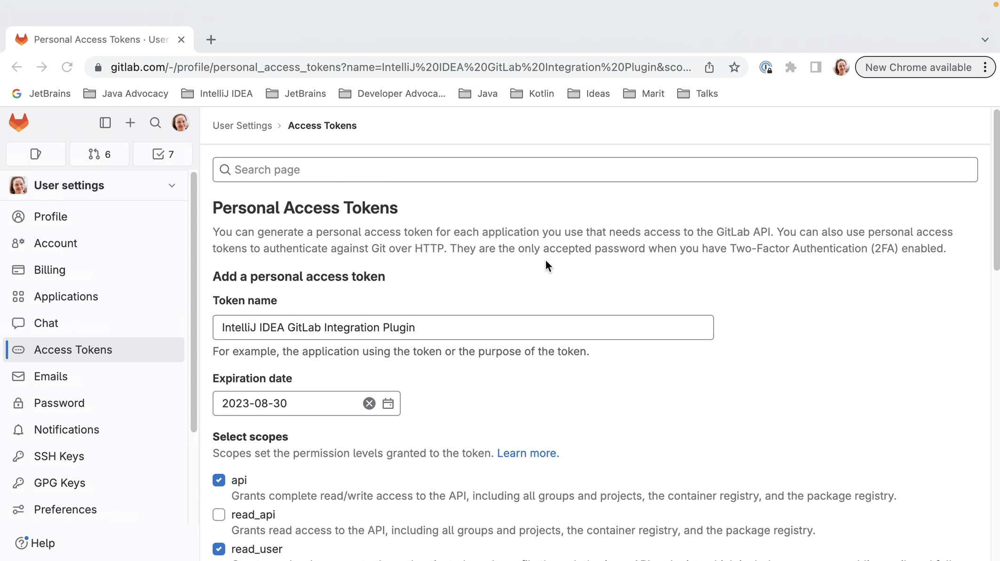
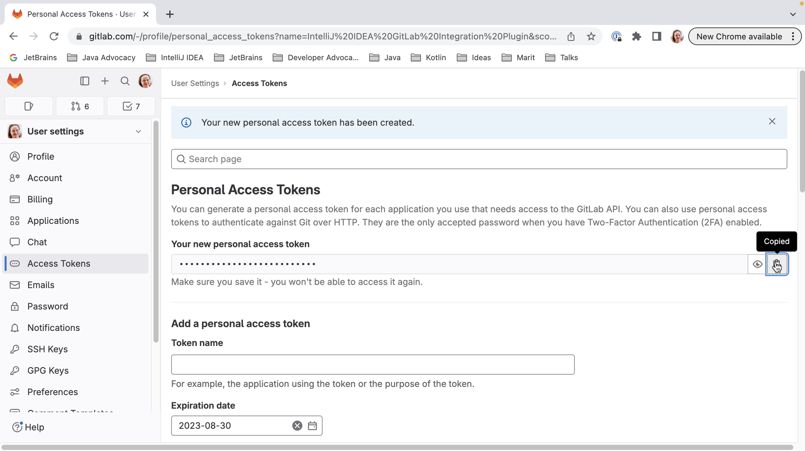
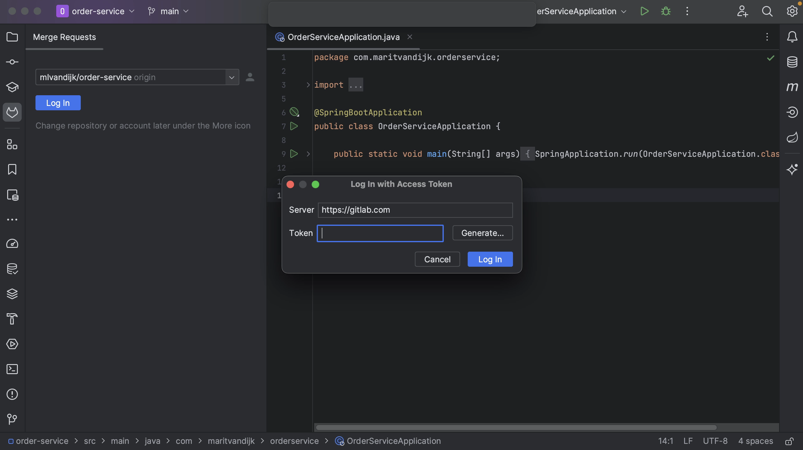
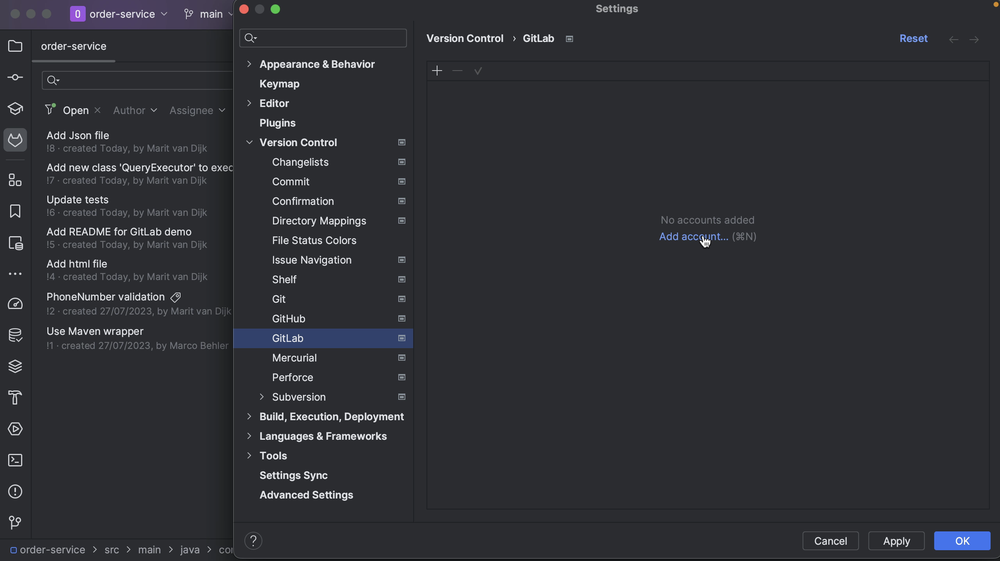
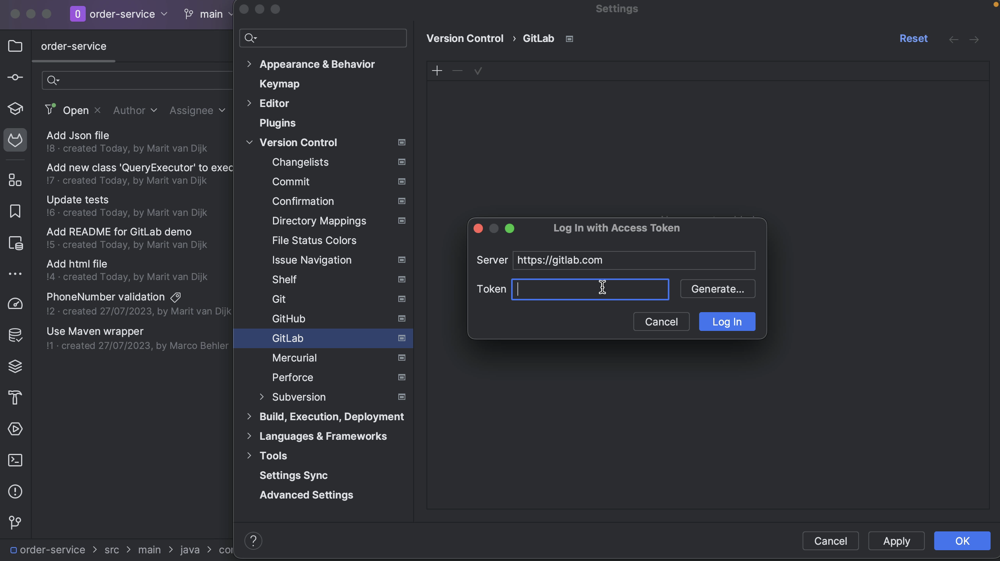
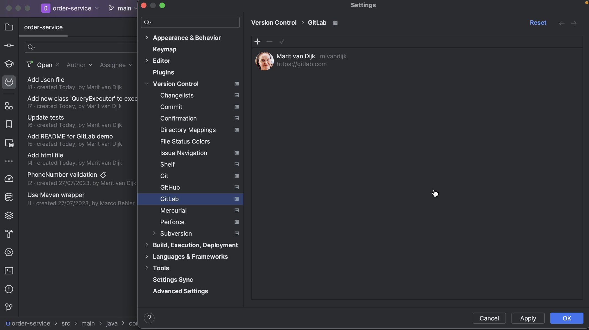

If we aren’t already logged in to GitLab via IntelliJ IDEA, the GitLab Merge Requests tool window will prompt us to **Log In**.

We can log into GitLab with a token. When we click **Generate**, this will take us to the GitLab page where a token with the right scopes can be generated for us. Click the button **Create personal access token** to create the token. When the token is generated, click the button to copy the token. 

We can copy the token into the **Token** field in the popup and click **Log In**. 

Alternatively, we can use an existing token, as long as it has the required scopes.

We can also log in to our GitLab account in the **Settings**. Open the Settings (**⌘,** on macOS | **Ctrl+Alt+S** on Windows/Linux) and go to **Version Control > GitLab**. Click **Add Account** (**⌘N** on macOS | **Alt+Insert** on Windows/Linux) to add an account if there is no account logged in, or click the + button at the top left to add an account. In the popup, add the **Server** if needed, paste the token from GitLab into the **Token** field in the popup and click **Log In**.

