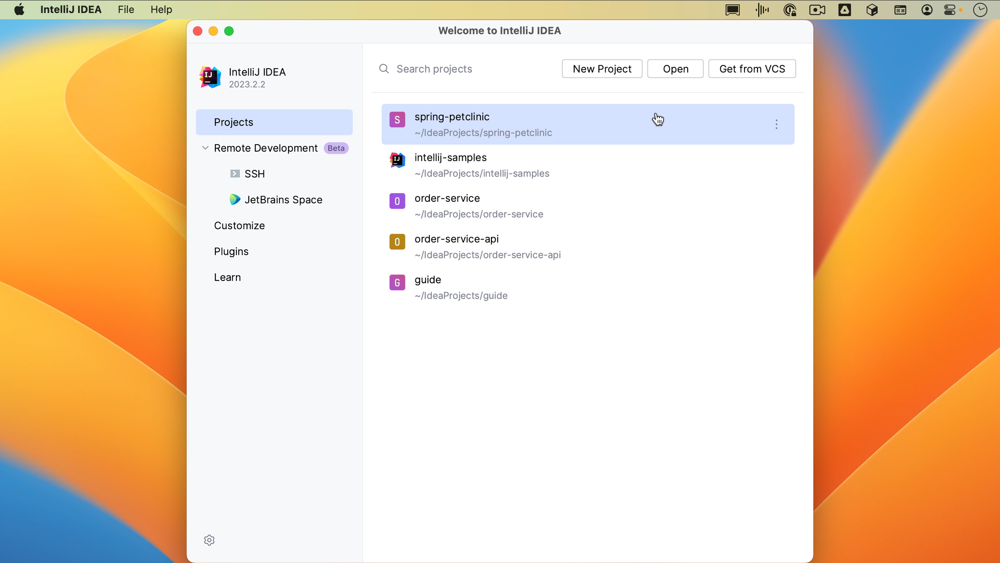
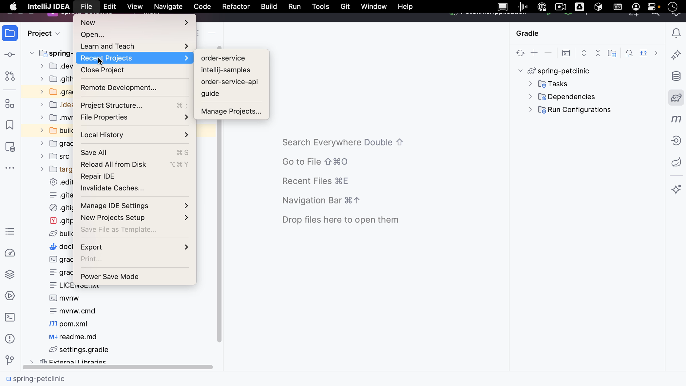
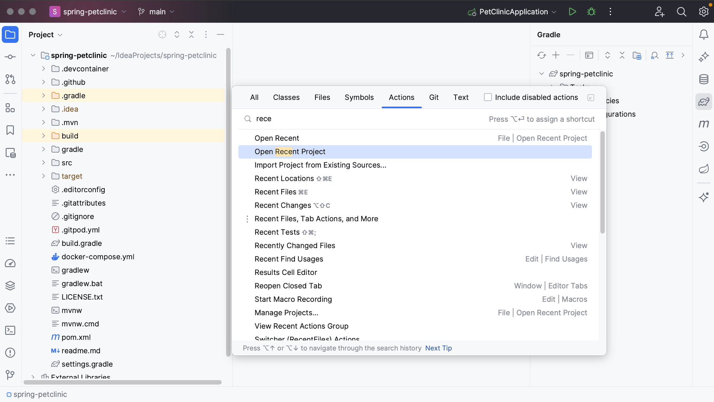
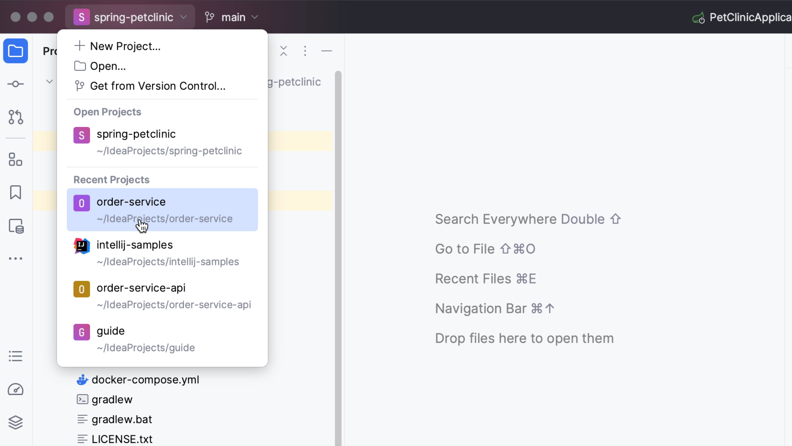

You can also open a recent project without having to find it on your file system. As you’ve seen, you can do so from the Welcome Screen by selecting it from the list of recent projects.

If you have a project open, you can open a recent project from the menu by going to **File | Recent projects** and selecting the project you want to open.

You can also use **Find Action** (**⌘⇧A** on macOS, or **Ctrl+Shift+A** on Windows/Linux) and search, for example, for “recent”.

Alternatively, you can click the name of the project on the top left, to open a list of options, including the same options that you had in the Welcome Screen, creating a new project, opening a project, and getting a project from VCS, as well as our currently open project or projects and a list of recently opened projects. Click the one you want to open.
