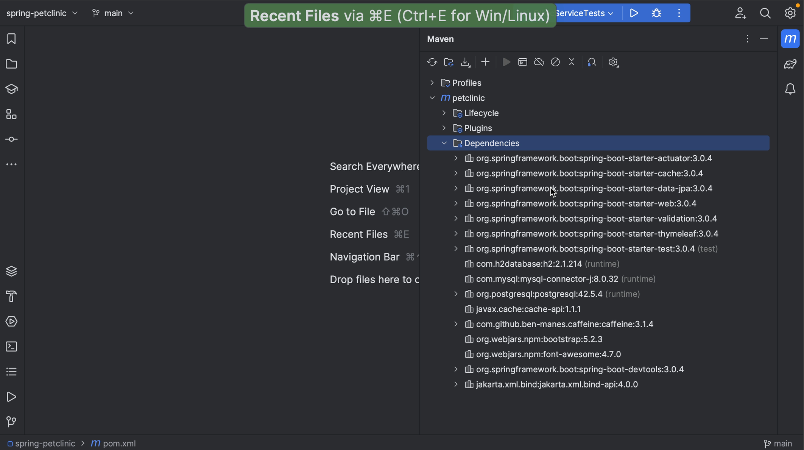
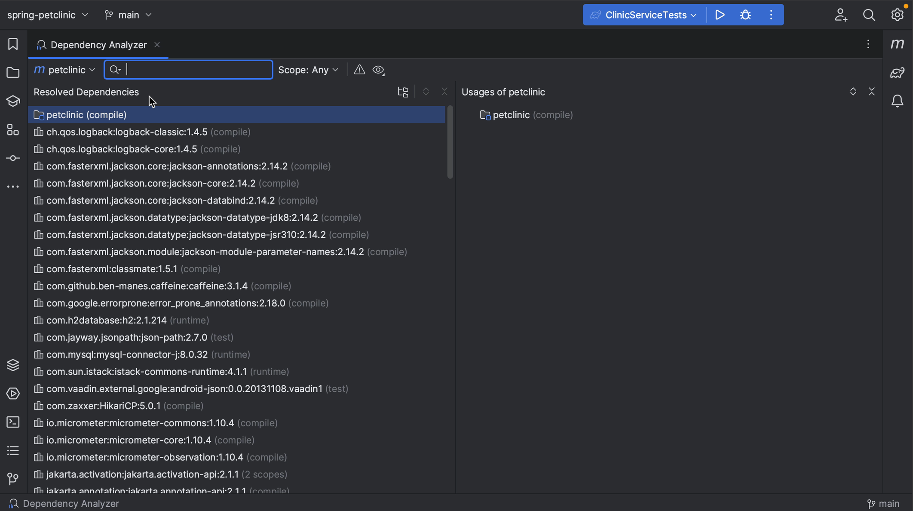
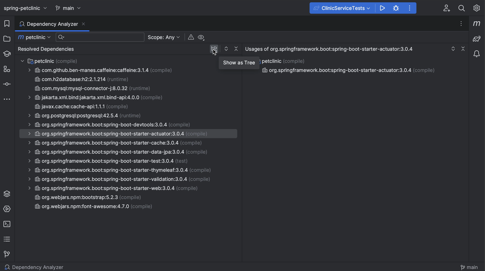
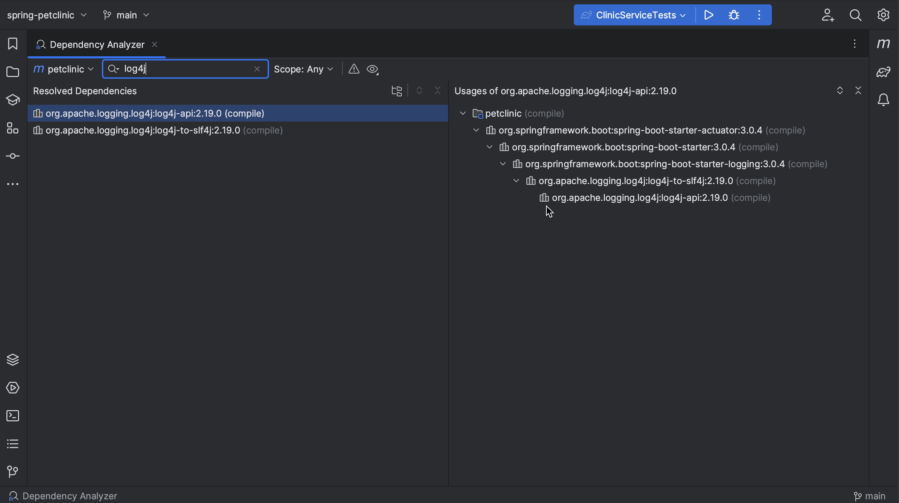
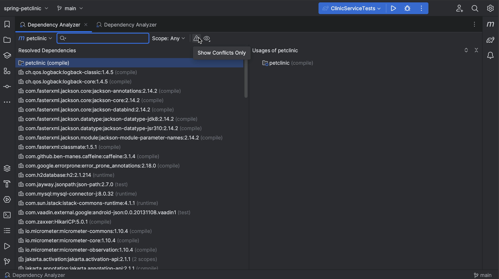
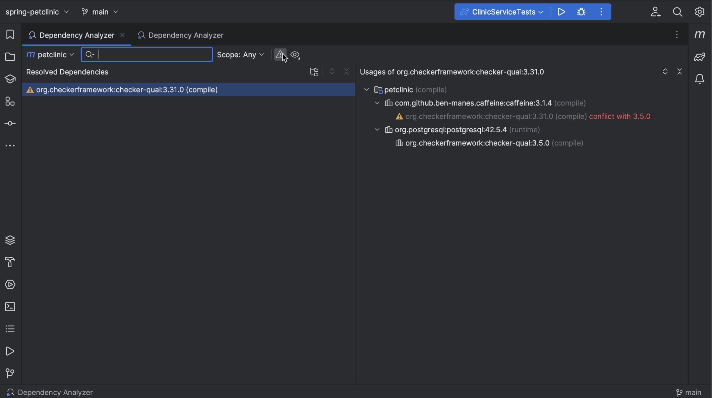
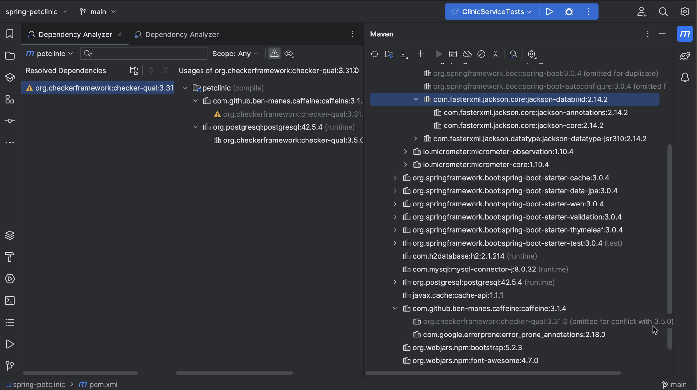
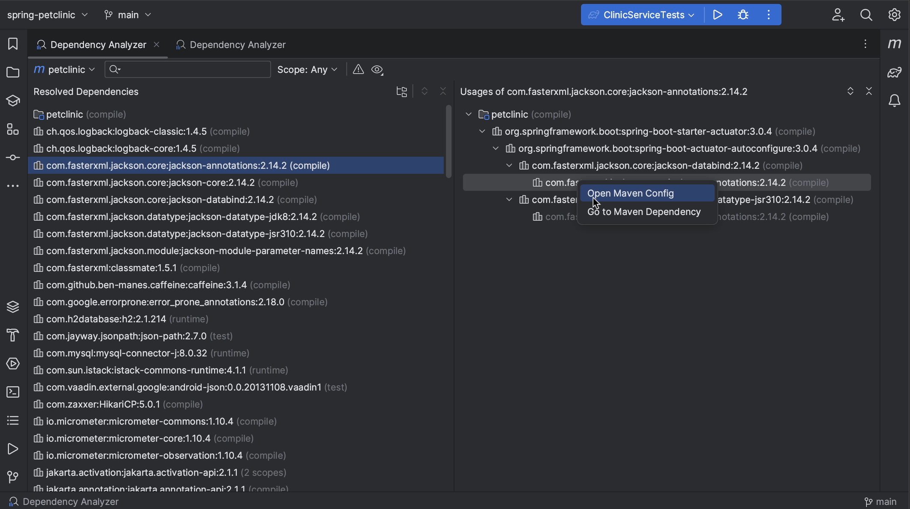

We can view our dependencies in the Maven or Gradle tool window. Here, we can expand dependencies to show their transitive dependencies, or collapse them again.

## Open the Dependency Analyzer
We can open the Dependency Analyzer from the Maven or Gradle tool window by clicking the **Analyze Dependencies…** button. This will open the Dependency Analyzer showing the Resolved Dependencies on the left and their Usages on the right.

Alternatively, we can right-click a dependency in the Maven or Gradle tool window and select **Analyze Dependencies** from the context menu. This will open the Dependency Analyzer with the dependency selected.

We can hide all tool windows (**⇧⌘F12** on macOS / **Control+Shift+F12** on Windows/Linux), so we can focus on the dependencies.

## Viewing dependencies in the Dependency Analyzer

We can view the dependencies as a tree by clicking the **Show as Tree** button and **Expand** or **Collapse** them as needed by pressing the corresponding buttons. 

We can also click the **View Options** button and toggle **Show GroupId**, to show the GroupId for dependencies or not.

## Finding a specific dependency
To see where we are getting a specific version of a particular library, we can search for that dependency. For example, when we search for "log4j" we see that we are only getting it via this spring-boot-starter, and it's a version newer than the one where log4shell was fixed.

## Finding conflicts
We might only want to look at dependencies that have conflicts. When we select the **Show Conflicts Only** button, we see only dependencies that have conflicts. In this example, we see that there is a conflict with the checker framework dependency. Fortunately, it's been resolved; we see that one version is greyed out. If we go back to the Maven tool window, we see that this version has been omitted for conflict. We can see that the version we are using is 3.5.0 which we get from postgres.

## Selecting scopes
We can also select a scope (for example, if we want to look at our test dependencies or exclude them from analysis). Since we've opened the Dependency Analyzer from the Maven tool window, we see the Maven scopes.

When we open the Dependency Analyzer from the Gradle tool window, the list of scopes will contain Gradle scopes.

## More context
For more context, we can click a specific dependency and select **Open Maven Config** to open its pom.xml or **Go to Maven Dependency** to open the location in the pom.xml where this dependency is declared.

