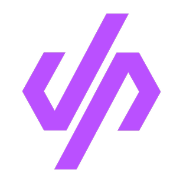

# Remote development 

Remote development is an approach that allows developers to work from their home offices or anywhere in the world. This has been a feature of the industry for a long time already, but it has really gained traction over the last few years. With this approach, developers don't work locally on their laptop or desktop, but rather they are connected to another environment. This can be in the employer’s data center, a private cloud, or a CDE (cloud development environment).

## The major benefits

Here’s how Silviu Croitoru summarizes the advantages that remote development offers:

- _**Code from anywhere on any device** – With developer workspaces hosted in the cloud, teams can work securely from any location and on any device, regardless of their physical location. This reduces costs for companies and enables the implementation of a Bring Your Own Device (BYOD) policy._
- _**Secure source code** – The source code never leaves the security of the company's cloud infrastructure. It remains in the Git repositories and Kubernetes cluster where the developer workspaces reside, avoiding the risk of source code exposure on developers' laptops._
- _**Simplified zero-trust security** – Cloud-based development environments can simplify network security and make it easier for organizations to maintain a secure remote work environment._
- _**Environment consistency** – With cloud-based development, teams no longer have to worry about "it works on my machine" issues, as the development environments are consistent and easily replicable._
- _**Developer self-service** – Standardized and replicable cloud development environments give developers more control and autonomy over their processes, reducing the need for assistance from DevOps teams._
- _**Fast onboarding for new developers** – With cloud development environments, new engineers can be up and running in just hours rather than weeks, with minimal setup and without the need for extensive application knowledge._

Source: [https://www.bunnyshell.com/blog/will-remote-development-take-over-local](https://www.bunnyshell.com/blog/will-remote-development-take-over-local/)

A variety of remote development solutions are already available.

### Amazon CodeCatalyst

[Amazon CodeCatalyst](https://codecatalyst.aws/) is an integrated service for software development teams adopting continuous integration and deployment practices into their software development process. 

### GitPod

[Gitpod](https://www.gitpod.io/) is an open-source developer platform that automates the provisioning of ready-to-code developer environments.

### DevPod

[DevPod](https://devpod.sh/) is the first and only tool for creating and managing dev environments that does not require a heavyweight server-side setup. Developers can write code in any language and run it anywhere.

While there is a lot you can play around with in CDEs, our main focus for today is the [Google Cloud Code](https://cloud.google.com/code) plugin. We are going to see how to develop cloud-native apps using Cloud Code with Kubernetes and PyCharm.

For your reference, the entire source code will be available on [GitHub](https://github.com/). 
