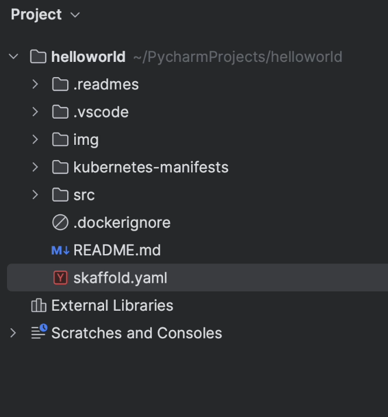

# Project Setup 

## Creating a new project

To create a new project, first click on **New Project**.

You’ll then see three new options appear on the menu bar on the left-hand side of the window.

You can run your project in Cloud Run, which is a serverless method for running Kubernetes in Google Cloud, 
or you can choose the standard Kubernetes option, which allows you to run your code locally or in a remote GKE cluster.

The Cloud Code plugin has already created some sample code in Django and Flask. In this section, we’ll be exploring the sample Django application.

However, if you’d like to maintain your own custom projects, then follow the official documentation provided by Google, which contains a detailed [step-by-step guide](https://cloud.google.com/code/docs/intellij/set-up-sample-repo).

Now, let’s go ahead and create a new project by loading **Python (Django): Hello World** as our base sample.

In the interest of simplicity, I’ll name the project **“helloworld”**.

Once you click **Create**, PyCharm will start cloning the project. 

As you can see in the image below, the **README** file is opened by default.

The image below shows the sample project structure created by the Cloud Code plugin.

`skaffold.yaml` is the schema file containing the [Skaffold](https://skaffold.dev/docs/references/yaml/) configurations.

`kubernetes-manifests` contains Kubernetes YAML files.

`src` contains the Django source code.

In this image, the center of attention is the `skaffold.yaml` file.

[Skaffold](https://skaffold.dev/) is a tool that handles the workflow for building, pushing, and deploying your application. You 
can use it to easily configure a local development workspace, streamline your inner development loop, 
and integrate with other tools such as [Kustomize](https://kustomize.io/) and [Helm](https://helm.sh/) to help manage your Kubernetes manifests.

Skaffold simplifies common operational tasks that you perform when developing with Kubernetes, letting you focus
on your code changes and allowing you to see them rapidly reflected in your cluster. It's the underlying engine that 
drives Cloud Code and a powerful tool for improving developer productivity in and of itself.

Since Skaffold is a part of Cloud Code, you can easily manage it from right in the IDE itself.

Returning to the `skaffold.yaml` file, there are two major operations happening here.

- build
- deploy

If you observe line 5, Skaffold is about to perform a build operation by creating a Docker image. It is 
therefore going to look for the Dockerfile, which resides under the `src` directory as specified in the context section on line 10.

Skaffold’s support goes well beyond Dockerfiles and also includes:

- Jib Maven
- Bazel
- Ko 
- Custom scripts
- Cloud Native Buildpacks

The good news is that you can build your Docker image using a locally installed version of Docker or you can execute the same operation in Google Cloud Build, depending on your needs.

Now, moving ahead. If you look at line 13, the **deploy** section is going to apply the Kubernetes manifest files, 
which reside in the `kubernetes-manifests` directory. 

Just as is the case with the build operation, you can have multiple deployers.

We’ve used kubectl, but you can go ahead and use the Helm deployer if you prefer.

I highly recommend following the instructions in the official [documentation](https://skaffold.dev/docs/).

The `hello.deployment.yaml` file is going to run the application with one replica running at port **8080**.

The `hello.service.yml` file is going to expose the deployment using a load balancer with the target port **8080**.

Now, let’s move ahead and have a glance at the **[Edit Configurations](https://www.jetbrains.com/help/pycharm/run-debug-configuration.html)** dialog.

The current deployment context is set to `docker-desktop`. The application will therefore be deployed in a local cluster.

You can also look at **Watch mode**, where there are two options.

- On demand
- On file save

We’ll choose **On file save** in order to build and run the application whenever there is a change in the `src` directory.

In **Advanced Settings**, you can customize the `kubeconfig` location, set the environment variables, and specify the resource deletion timeout, which is set to two minutes by default. 

You can also fine-tune the logging verbosity by changing the setting according to your needs.

**Build / Deploy** will look for the `skaffold.yaml` configuration. This will then take instructions from the YAML file to perform further processing, such as building images and deploying the K8s manifests.

Returning to the topic of build features, you can select these according to your individual requirements. For the purposes of this demonstration, we’ll build it locally in Docker Desktop.

With this, the **Edit Configuration** step is complete. All that’s left to do is to click on **Apply** and then **OK**.

Now, I am going to run the application by clicking on the **Play** icon.

You’ll now see in the console that the build process has been initiated. This will take a few seconds to complete.

As you can see, the build and deployment are complete and the port has been forwarded to the local host at port **4503**.

Let’s quickly check how it works in the browser.

Success! The application is running properly and the default landing page is visible.

However, this is just the beginning. Let’s now go ahead and create a basic TODO REST application using the [Django REST Framework](https://www.django-rest-framework.org/).

