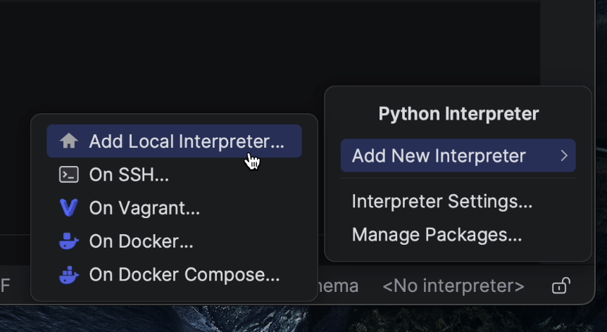
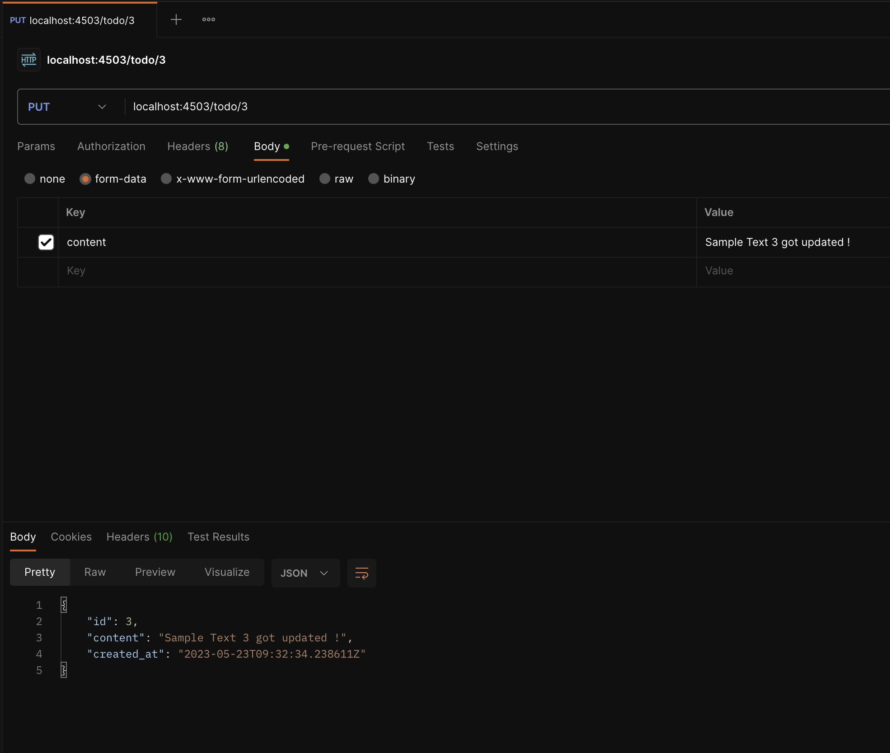

In this section, our main focus will be on writing CRUD APIs. 

## Enabling Django support 

First, we need to enable Django support in PyCharm.

To configure your [IDE](https://www.jetbrains.com/help/pycharm/configuring-project-and-ide-settings.html), select **PyCharm | Settings for macOS or File | Settings for Windows and Linux**.


Click on **Languages & Frameworks | Django**


Tick the **Enable Django Support** checkbox.

Make sure to provide the path of the Django project root and the path for the `settings.py` and `manage.py` files.


Once you’ve done this, click on **Apply** and then **OK**.

## Creating a local virtual environment

Click on the bottom right-hand section where you’ll see **No interpreter**.

Then select **Add New Interpreter | Add Local Interpreter**.



I’ll select **New** for the environment and provide the environment location. As things stand, it’s going to be created inside the project root.

I’ll choose Python3 as my base interpreter.


## Installing Python packages

Once the virtual environment is created, I’ll go ahead and install the Python packages by running the following command in the terminal:

```
pip install -r requirements.txt
```


Then, I’ll install the Django REST Framework, which is required for our CRUD operations.

Run the following command in the terminal:

```
pip install djangorestframework
```


Once the package is installed, I’ll then update my `requirements.txt` file by running the following command:  

```
pip freeze > requirements.txt
```

## Creating the app and configuring settings

 Click on **Tools | Run manage.py Task**.


Now create a new app by typing **“startapp todo”**.

This will create the necessary directory, files, views, models, etc.


Next, open the `settings.py` file, which resides under `src/helloworld`.


Make sure to add `todo` and `rest_framework` in the **INSTALLED_APPS** list.

For local development, we’ll be using the sqlite3 database. Make sure to add this section at the end.


When that’s done, open `manage.py` again and type “**migrate**”. The default Django tables will be created.


The image below shows the newly created database tables.


## Models

I’ll create a new model and name it “TodoList”. This model is going to store information in the 
content column alongside `created_at`, which adds a timestamp when a new object is created.


Once I’m done with the model, I’ll run the following command in the `manage.py` task: 
```
makemigrations todo
```
And once the migration files are created, I’ll then run the `migrate` command.

```
migrate
```


### Creating serializers

“[Serializers](https://www.django-rest-framework.org/api-guide/serializers/) allow complex data such as 
querysets and model instances to be converted to native Python data types that can 
then be easily rendered into JSON, XML, or other content types. Serializers also provide 
deserialization, which allows parsed data to be converted back into complex types after
the incoming data has first been validated.”


To create a serializer, I am first going to create a new `serializers.py` file under the TODO app.


Next I’m now going to create a `TodoSerializer` class that inherits `ModelSerializer`.

The [ModelSerializer](https://www.django-rest-framework.org/api-guide/serializers/#modelserializer) class is the same as a regular `Serializer` class, except that:
It will automatically generate a set of fields based on your model.
It will automatically generate validators for the serializer, including `unique_together` validators.
It includes simple default implementations of `.create()` and `.update()`.


### Writing Business Logic
In this section, we’re going to focus on two major APIs:

- **TodoCreateListAPIView**
- **TodoAPIView**


**TodoCreateListAPIView** inherits **[ListCreateAPIView](https://www.django-rest-framework.org/api-guide/generic-views/#listcreateapiview)**, which contains the **GET** and **POST** method handlers.

**TodoAPIView** inherits **[RetrieveUpdateDestroyAPIView](https://www.django-rest-framework.org/api-guide/generic-views/#retrieveupdatedestroyapiview)**, which 
contains the **GET**, **PUT**, **PATCH**, and **DELETE** method handlers.

If you look at lines 13–19, you’ll notice that we’ve overridden the `CreateModelMixin` `create()` method, which is responsible
for creating new model instances. We’ve now customized it to return a custom JSON response.

Next, we’ll go ahead and register the routes in the `urls.py` file:

`todo/urls.py`


`helloworld/urls.py`


Before progressing further, make sure you’ve added `db.sqlite3` to the `.dockerignore` file. This ensures it won’t be picked up 
when the image is being built, which means you’ll need to run the migration command inside the container manually.


However, for the purposes of this tutorial, we can ignore this as we are not working in a production environment. Be sure to bear this 
point in mind when working on a real project, though.

When working in a production environment you can try leveraging **[Kubernetes Jobs](https://kubernetes.io/docs/concepts/workloads/controllers/job/)** which is more suitable for this use case.

### Running applications in a local cluster

Click on the **Play** icon to execute the run process. This will start the build process and within
a few seconds the Kubernetes manifests will be deployed on the local machine, which in this case is Docker Desktop.


Once the application is up and running on port **4503**, you’ll immediately see it take effect in the browser.


The **TODO** application route is finally rendering properly. Now, let’s test out all the APIs to make sure that everything is working as expected.


I’m going to open Postman and try creating a new **TODO** item.
I’ll perform the **POST** and **GET** operations on `TodoCreateListAPIView`. 


You can see the results for yourself: The API is working fine, 
and we got the expected response. We created a few sample **TODO** items and then retrieved 
the list through the `GET` handler.


Now let’s try out `TodoAPIView`, which performs multiple operations like `GET`, `UPDATE`, and `DELETE`.

`GET/<id>`


`PUT/<ID>`



`DELETE/<ID>`


For the `DELETE` method, we don’t expect to receive any response and the status code should be **204 No Content**.

### Console logging in Cloud Code

If you want to perform a standard check of the container logs, then you can run the following command: 

```bash
kubectl get pods 
kubectl logs <pod_name>
```


The Cloud Code plugin has a feature called Kubernetes Explorer, which allows you to stream the logs without having to write anything in the terminal.

However, the plugin is not limited to Kubernetes Explorer. It also offers multiple other features, including:
* Cloud Databases
* Cloud Run
* Secret Manager
* Cloud Storage


In Kubernetes Explorer, you can seamlessly connect to local or remote clusters and easily stream or tail logs, while simultaneously performing multiple operations on Deployments, ReplicaSets, and more.


### Debugging

Just as running code within the container is a smooth process, so is debugging.

I’ll now add a breakpoint inside my code to inspect what’s happening.


If you look carefully at what follows line 16, you’ll see that we’re capturing serialized 
data that is coming in from the `POST` request.

Now, I’ll go ahead and click on the **Debug** icon.


A dialog appears informing me that the Python debug container is running and needs to map with the remote path /app.

I’ll simply click **Ok** to proceed, and we see there’s no change that needs to be made.


The debugger is now successfully connected!


Next, let’s try to create a new `TODO` item and see what happens at the breakpoint.

As soon as I triggered the post request to create a new TODO item, the debugger was triggered, as you can see from the above screenshot.


I’ll now click on **Step Into My Code**.


And there you have it! We’ve successfully captured the data passing through the serializer. That’s how Cloud Code simplifies the debugging process.

