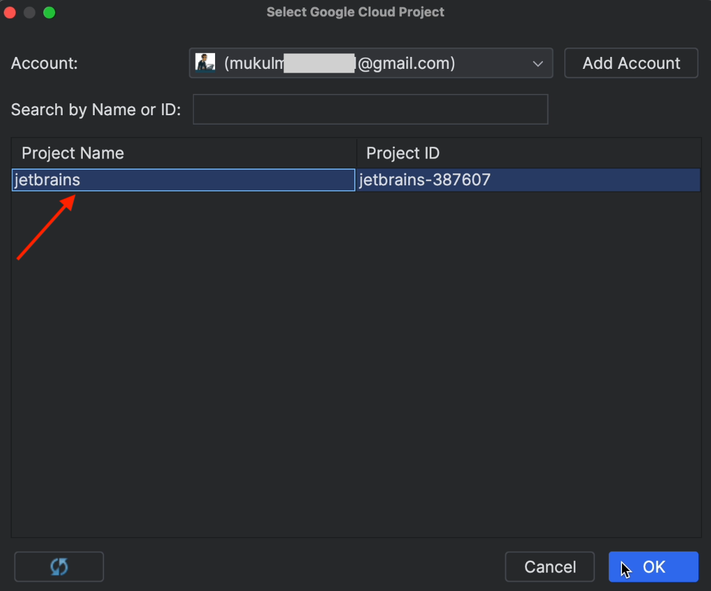
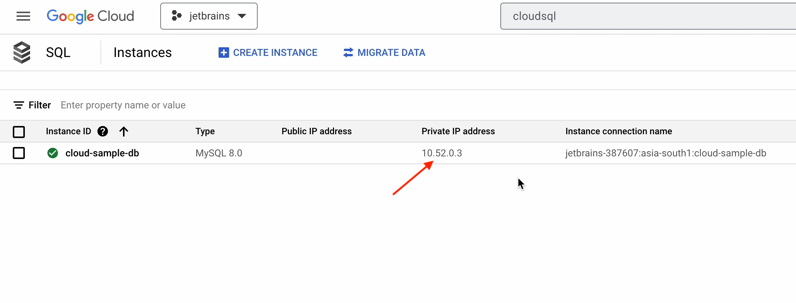
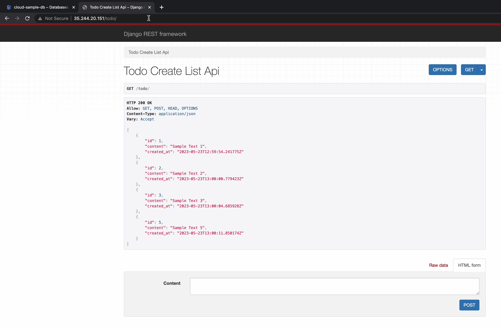
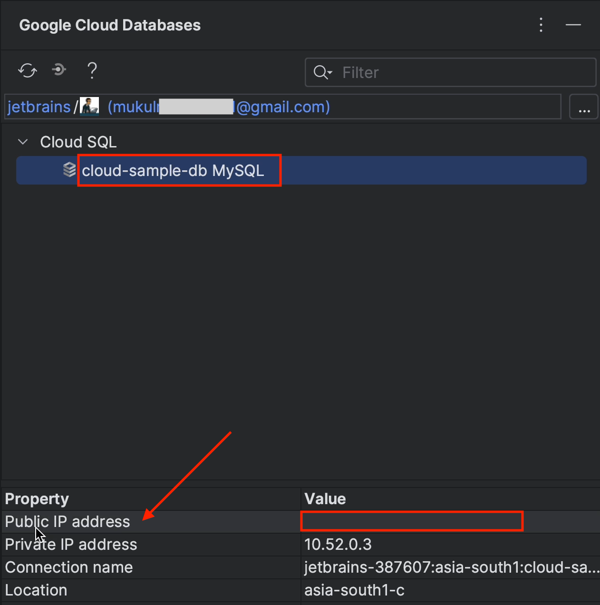
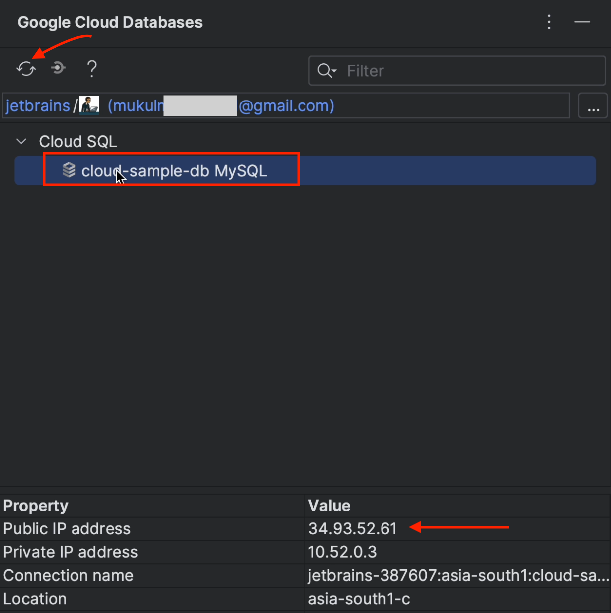
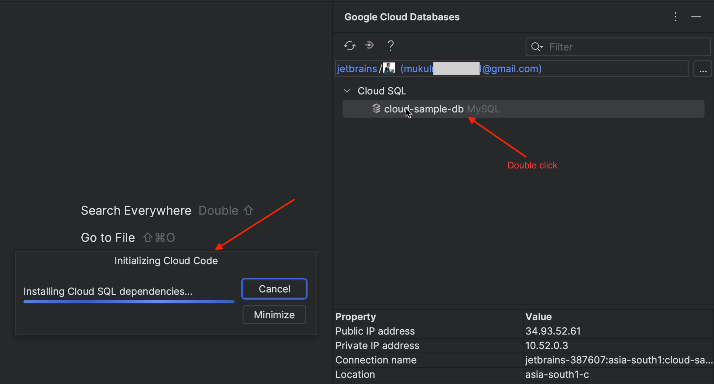
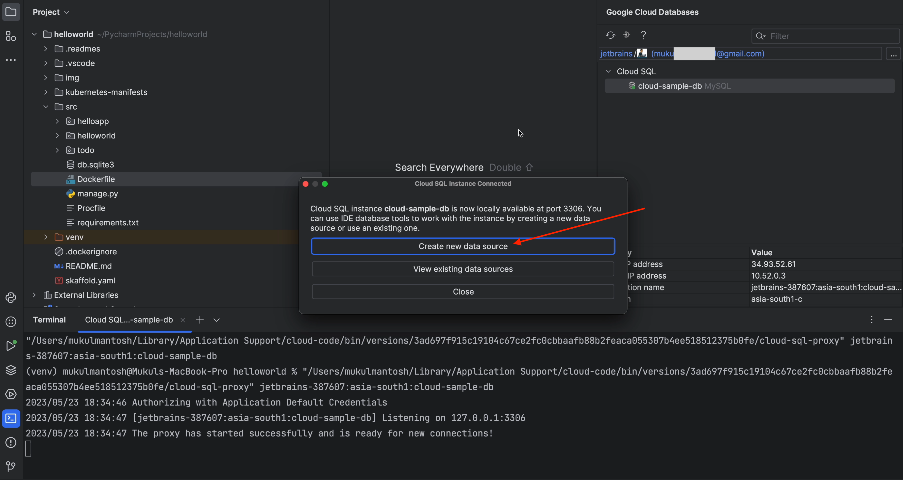

## Building and running your application


Our cluster has been successfully created. Let’s now connect to it and verify that everything is working properly.

Click on **cluster-1**.


Follow the steps below: 
* Click on **Connect**.
* Copy the command.
* Click on **Run in Cloud Shell**.

Note that you need to execute the command on your local machine as well.


A Cloud Shell will then be initialized and the command will be copied to the terminal.

After you press **Enter**, click on **Authorize**.


Next, run the following command:

```bash
kubectl get nodes
```

This will generate a list of the three nodes currently running in the GKE cluster.


Now, I’ll try to run a simple Nginx pod, just to verify that everything is working as expected.


The Nginx pod is running perfectly, so we can now move over to the PyCharm Terminal.


Now run the same command that you ran previously in the Cloud Shell in your PyCharm Terminal.

This will be initialized and create a **kubeconfig** entry for the GKE cluster.


I’m now going to run the following command:  

```bash
kubectl config get-contexts
```

This will generate a list of multiple clusters. We currently have two clusters attached: One is a 
local Kubernetes cluster running through Docker Desktop, and the other is the GKE Cluster, 
which is currently selected, as shown by the asterisk (*) .


You can now easily check the list of nodes in the cluster by running the following command:

```bash
kubectl get nodes
```


Now let’s move ahead and edit our configuration.


Click on **Choose Artifact Registry Repository**.


Now click on the three dots icon to select the Google Cloud project.


The project will be detected automatically. You just need to select **jetbrains** and then click **OK**



Click on the **Refresh** icon and the repository name will appear. You may remember that we created this earlier in Artifact Registry. 

Next, go ahead and click **OK**.


Under **Build / Deploy**, make sure to choose **Google Cloud Build**. The Docker image will now be built directly in Cloud Build instead of running locally.


Once you’ve done this, click **Apply** and then **OK**.


Now go to the Google Cloud console and search for Cloud Build.


You’ll need the API enabled to use Cloud Build in your project, so go ahead and enable it as shown below.


Now we need to obtain user access credentials via a web flow and put them in the well-known location for Application Default Credentials (ADC).


Run the following command in the terminal: 

```bash
gcloud auth application-default login
```


This is something you will often encounter when working with gcloud authentication. The 
following resource might come in handy in such situations: [stackoverflow.com/questions/53306131](https://stackoverflow.com/questions/53306131/difference-between-gcloud-auth-application-default-login-and-gcloud-auth-logi)

Here are some of the use cases discussed in the answer to the question above:

**Interacting with GCP via gcloud:**

```bash
gcloud auth login
```
This obtains your credentials and stores them in `~/.config/gcloud/`. Now you can run gcloud commands from your terminal and it will find your credentials automatically. Any code or SDK will not automatically pick up your credentials in this case.

Reference: [cloud.google.com/sdk/gcloud/reference/auth/login](https://cloud.google.com/sdk/gcloud/reference/auth/login).

**Interacting with GCP via an SDK:**
```bash
gcloud auth application-default login
```

This obtains your credentials via a web flow and stores them in _“the well-known location for Application Default Credentials”_. Now any code or SDK you run will be able to find the credentials automatically. This is a good stand-in when you want to locally test code that would normally run on a server and use a server-side credentials file.

Reference: [cloud.google.com/sdk/gcloud/reference/auth/application-default/login.](https://cloud.google.com/sdk/gcloud/reference/auth/application-default/login)

Once authenticated, you’ll receive a message like this in the terminal.


Click on the **Play** button to start the build process.


The build process has been initiated and is being executed in Google Cloud Build.


If you wish, you can also execute it locally through Docker Desktop or Minikube.

The application completed the following steps: 

* Performed build.
* Pushed image to registry.
* Deployed pods and exposed service through LoadBalancer.
* Proxied through localhost at port **4503**.


Success! The page has loaded, and we can now see how the UI is going to look:


As you can see, a Django pod is running in the default namespace. 


You can see the pod IP is private, and it's being exposed through the LoadBalancer service on IP 34.100.240.93.


You can open this IP directly in the browser or via a proxy with no difference in functionality. You’re now directly
connected with the public-facing load balancer.


If you stop the running process, then the deployment and service will be deleted and the IP released. In this 
case, if you run the application again, you’ll receive a new LoadBalancer IP.


Next, go ahead and add the line **db.sqlite3** to the **.dockerignore** file. This is because we are going to use
MySQL and I don’t want this file to be added to my image.


Make sure to copy the private IP address of the cloud database we created earlier.



Open the `settings.py` file, add the following code under **DATABASES**, and make sure to change 
the host to the private IP we just copied.


It’s essential that you consistently employ a robust password 
and avoid utilizing hardcoded text within the codebase. Instead, consider 
passing data through environment variables or utilizing services such 
as Google Cloud's Secret Manager or HashiCorp Vault.

Now, open the `requirements.txt` file and add `mysqlclient`. Make sure to add a new version to avoid 
compatibility issues, otherwise the latest version will always be selected.


For the latest version, follow the documentation at [pypi.org/project/mysqlclient](https://pypi.org/project/mysqlclient/).

Now open the Dockerfile and add the following lines to install MySQL Connector.


After you’ve made the necessary changes, re-run the application.


Once your app is up and running, you need to get inside the container and perform the database migration.

Run the following command: 

```bash
kubectl exec -it <pod_name> – sh
```


And for database migration, run this command: 

```bash
python manage.py migrate
```


As you can see, the migration is being performed successfully.


As we already mentioned, we’ve re-run the application, which means the public-facing **LoadBalancer** IP has been changed.


Our migration is now complete and the application is running fine. Now let’s test our APIs.

I’ll perform all the **CRUD** operations as follows:

* The `POST` operation.


* The `GET` operation.


* The `GET` operation by ID.


* The `PUT` operation by ID.


* The `DELETE` operation by ID.

With the `DELETE` method, we don’t receive any response, and the status code we get is **HTTP 204 No Content**.


This is how the `TODO` list is going to look in the browser:



Now, let’s go inside PyCharm and explore the features provided by the Cloud Code plugin.

Click on the **CloudSQL icon** on the right-hand sidebar.


Now click on `cloud-sample-db`. You’ll see that we don’t have a public IP address. To view the 
list of tables and the database information, we need to enable the public IP and access it externally.



Go over to CloudSQL in the Google Cloud console.

Click on `cloud-sample-db` and then on **Edit**.


Now, under **Connections**, tick the **Public IP** checkbox.


Under **Authorized Networks**: 
* Create a new network.
* Provide a CIDR notation of 0.0.0.0/0.

This will allow you to access your database from anywhere in the world. However, this
is also a fairly high security risk and leaves you vulnerable to hackers. Please follow 
the defense-in-depth approach and limit the network security to your organization's network or VPN.


Once that’s done, apply the changes. It will take a few minutes to update the configuration.

Finally, you’ll see the public IP address appear in the UI.


Now move back over to PyCharm and reload the Google Cloud database. You’ll now be able to see the public IP on your screen.



Double-click on `cloud-sample-db` to start installing the Cloud SQL dependencies.



Once your instance is connected, click on **Create new data source**.



You don’t have to configure anything here. Just make sure to download the missing driver files.


Once the driver is successfully installed, click on **Test Connection**. This is to verify that everything is working as expected.


Now click on **Schemas**, tick the **helloworld_db** checkbox, and then click on **Apply** followed by **OK**.


After a few seconds, the entire schema will be loaded. You can see in the image below that the tables have been retrieved successfully.


Double-click on the table `todo_todolist`, and you’ll see the table rows and columns appear.


## Cloud Domains

We’ll now go ahead and search for **“Cloud Domains”**. If you’re using it for the first time, be sure to enable the API.


Click on **Cloud DNS** on the left-hand sidebar.


Then click on **Create Zone**.


I’m now going to register a DNS record of the `mukul.click` domain. This domain was purchased 
from a third-party domain registrar.

Provide the necessary details as shown in the image below. You’ll need to provide your 
own domain name under the DNS name.


The DNS records have now been successfully created!

Go ahead and click on the NS version of `mukul.click`.

Note: Your NS is going to be different.


Below you can see the four DNS records which need to be updated in the third-party domain registry.


As you can see, the domain is registered with Namecheap, and I’ve already updated the DNS. Just 
for your information, DNS propagation takes around 24–48 hours, though occasionally it can be done more quickly.
 
If you purchased yours from GoDaddy or some other registrar, then the process 
will be the same, but the UI will be different.


Now go to **VPC networks**.


Under IP addresses, click on **External IP Addresses**.

First, we need to create a static public IP address that we 
are going to use with the ingress. You’ll therefore need to 
point your domain to the static external IP.


Go ahead and click on **Reserve External Static IP Address**.


This is the UI where you can create a static IP address. I’m instead going to create my static address using the CLI.


Run the following command in the terminal:

```bash
gcloud compute addresses create ingress-gke-webapp–global
```


After refreshing the page, you’ll see the newly created static IP `ingress-gke-webapp`.


Go to PyCharm and open the `hello.service.yaml` file.

* Change type to **NodePort**.
* Change port to **8080**.

Please note that to work with the ingress the service type has to be NodePort.


Under the **Project** root, create an **ingress** folder, and then create an `ingress.yml` file under it.


Click on **PyCharm | Settings**.


Under **Plugins**, click **Install for Kubernetes**.

This plugin is going to be helpful when working with Kubernetes manifests.


Pay special attention to line 7. You need to provide a custom annotation to use the public static IP that we created earlier.


Next, create a **ManagedCertificate** object. This resource specifies the domains for the SSL certificate. Wildcard domains are not supported.


Reference: [cloud.google.com/kubernetes-engine/docs/how-to/managed-certs#gcloud](https://cloud.google.com/kubernetes-engine/docs/how-to/managed-certs#gcloud)

Now you need to annotate the managed certificate in `ingress.yaml`.


Next, we’re going to create a **FrontendConfig** object. **FrontendConfig** can only be used with external ingresses.

In effect, this **FrontendConfig** redirects all requests from HTTP to HTTPS.

Reference: [Associating FrontendConfig with your Ingress](https://cloud.google.com/kubernetes-engine/docs/how-to/ingress-configuration#associating_frontendconfig_with_your_ingress)


After that, you’ll need to annotate it in the ingress file.


Now go ahead and create a new record in Cloud DNS.


Next, I’m going to create a new record for `demo.mukul.click`, and under the IPv4 address I’ll provide the public static IP address that we created earlier.

Once I’m done, I just click on **Create**.


The record has now been successfully created.


Next I’ll perform an `nslookup` to cross-verify. Everything seems to be working properly.


I’ll now go ahead and apply all the manifests created under the ingress directory. 


As you can see, the ingress and managed certificates are under provisioning, and it will 
be a couple of minutes before they’re active.


Meanwhile, you can run your application. This means that we only need to wait for the ingress and the certificate to be provisioned.


It took a reasonable amount of time for the certificate to be provisioned. For managed certificates, it will take around 60 minutes. Occasionally it may take less than 15 minutes.


Now let’s open the browser and visit `demo.mukul.click`.

Excellent! HTTPS redirect is now active.


I'll once again perform some basic CRUD operations. 


This is the `GET` request but with the newly registered domain.


Next, I’ll try to make a small modification to the `POST` request by adding an extra statement. You should be able to see this in line 18.

Previously it read “Data Received!”

Now, I’ve appended “Thank You” to it.

Finally, as soon as I save the file, the build process is triggered.


Once the build and deployment are done, go to Postman and perform the `POST` request.

I just performed the `POST` request, and you can see how the return response has been changed.

Everything is working fine.


Now, I’ll perform a `DELETE` operation, for which I’ll receive a **204 No Content** response.


And there we have it. Our full walk-through of 
working with the Google Cloud Code plugin is complete. I hope you found it helpful! 🙂

With this knowledge, you should now be able to focus on 
development while the Google Cloud Code plugin does the heavy lifting.

## Bonus: Cloud Run

[Cloud Run](https://cloud.google.com/run) is a managed compute platform that lets you run containers directly on top of Google's scalable infrastructure. You can deploy code written in any programming language on Cloud Run, provided that you can build a container image from it.


This won’t be a deep-dive tutorial, I’ll just be providing a brief overview of how Cloud Run works in general.

Let’s begin by creating a new project.


Give the project the custom name **helloworld-cloudrun**.

Select the **Python (Django): Cloud Run** sample project and click **Create**.


You can follow the instructions in the **README** file, which includes all the steps required to run the project.


Several default views have already been created, including **homepage** and **aboutpage**.


Now, let’s go ahead and try to modify the **[Run/Debug Configuration](https://www.jetbrains.com/help/pycharm/run-debug-configuration.html#services-tool-window)**.

Click on **Run | Edit Configurations**

For **Authentication**, make sure to tick the **Allow unauthenticated invocations** checkbox.


Under **Build Settings**, select **Cloud Build**.


Set **Region** to **asia-south1**.


Under **Advanced revision settings**, change **Maximum number of instances** to **3**.

Note that if you don’t downsize the instances, you might get a compute quota limit error from GCP.


Now go ahead and run the project.


You can see in the terminal that the build process has been initiated.


Just wait a couple of minutes. Once everything is done, you’ll
receive a working URL as shown on the screenshot below.


The app has been deployed, and it’s working perfectly. You should be able to see that it’s even SSL secured.


This is the response from the `aboutpage` view.


If you’d like to dig deeper, you can visit Cloud Run in your GCP console.


And that’s by no means all. Cloud Run can also capture Django logs seamlessly.


Cloud Run is a managed platform and has a wide range of functionalities. For the
best experience, I highly recommend following the instructions provided in the
official documentation published by Google. I hope you enjoyed this brief tutorial.


