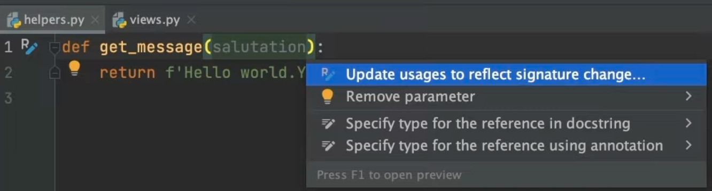
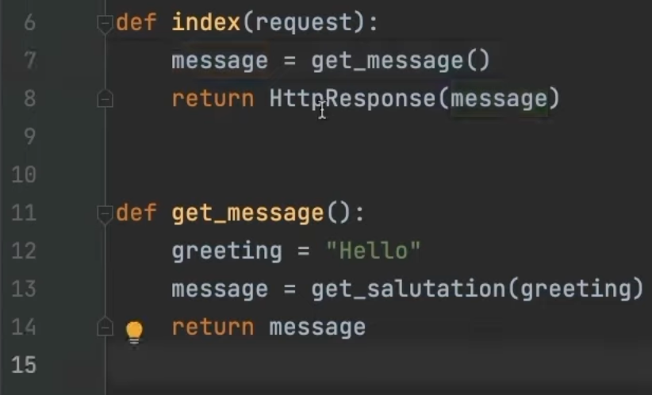

In the previous step, we saw how PyCharm can run your Python code.

In this step, we are going to talk about refactoring. Ever wish your IDE could…do your work for you?

## Change Signature
How many times does your work involve changing the signature of a given method? As easy as it can sound, changing a method signature can have a deep impact in your code and break your program in multiple places. The Change Signature refactoring helps you safely change a method signature, including changing its name; adding, removing, and reordering parameters; and assigning default values to the parameters.

Let’s start by changing its signature of a method name. We will add a new parameter here. The easiest approach is to do it inline. When you do this, PyCharm already gives you a yellow light bulb and a refactoring indication in the gutter. To access it use (**⌥⏎** | **Alt+Enter**).

The first option is **Update usages to reflect signature change...**. When we click it, PyCharm will show us the previous and current method signature, and require a default value so we won’t break our program. At this point PyCharm is using its knowledge of your project acquired during indexing to add the default value to all your current method calls.

PyCharm will update all the usages in your project so you don't have to go hunting for other places to update. Your code will still compile. 

## Rename
Renaming is another common type of refactoring. You first write your code, get everything working, and then start making names more meaningful. This is when refactoring rename comes in handy. As with signature changes, ‘Rename’ can also be done in place.

Let’s just go ahead and change this method name. We can also use (**⌥⏎** | **Alt+Enter**) to invoke the context menu.

We'll use the first option which is **Update usages to reflect signature change…**. The change is reflected in the code that calls this function. PyCharm will also find usages in other code in your project. For example, we have another file that imports this function and calls it.

## Extract Method
Inplace refactorings are great, but PyCharm can also help you with much more robust refactoring techniques such as ‘Extract Method’. The Extract Method refactoring lets you take a code fragment, group it into a method, and replace the old code with a method call.

To extract a method you can either use (**⌥⌘M** |**Ctrl+Alt+M**), or the **Refactor This** menu which is (**⌃T**| **Ctrl+Alt+Shift+T**). Let’s take this code fragment as an example. Let's select it, and invoke the ‘Refactor this’ men and choose **Extract Method**.

We can now give the new method a name and click **OK**. PyCharm will now create a function in the class with the name we gave and called it from the previous place. 

Of course, your code will still run exactly as it did before!

## Conclusion

These are three common refactoring techniques that will automate your workflow and minimize your chances of bugs. PyCharm has many more robust refactoring capabilities, so, after experimenting with these basic ones make sure to [try the others](https://www.jetbrains.com/help/pycharm/refactoring-source-code.html).

In the next step we will see how to perform basic testing in PyCharm.